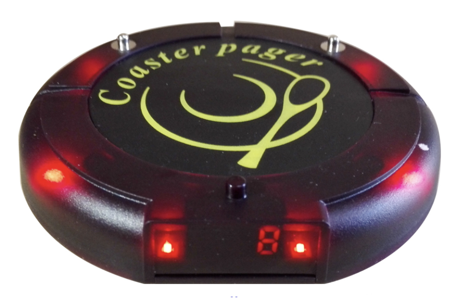

> 이는 [Advanced JavaScript](https://tylermcginnis.com/courses/advanced-javascript/) 과정의 일부입니다. 이 게시물을 원한다면 그것을 확인하십시오.

## 비디오

<iframe width="864" height="486" src="https://www.youtube.com/embed/gB-OmN1egV8" frameborder="0" allow="accelerometer; autoplay; encrypted-media; gyroscope; picture-in-picture" allowfullscreen></iframe>

## 포스트

제가 가장 좋아하는 사이트 중 하나는 [BerkshireHathaway.com](http://www.berkshirehathaway.com/)입니다. 이 사이트는 단순하고 효과적이며 1997 년에 시작한 이래로 그 업무를 잘 수행해 왔습니다. 더 놀라운 것은, 지난 20 년 동안 이 사이트가 한번도 버그를 가져본 적이 없을 가능성이 높습니다. 왜일까요? 모두 정적이니까요. 20 년 전에 출시 된 이래로 거의 동일합니다. 모든 데이터가 프론트 영역에 있으면 사이트를 쉽게 구축할 수 있습니다. 불행히도, 오늘날 대부분의 사이트는 그렇지 않습니다. 이를 보완하기 위해 앱의 외부 데이터를 가져오는 "패턴"을 개발했습니다. 대부분의 경우와 마찬가지로 이러한 패턴에는 시간이 지남에 따라 변경되는 절충점이 있습니다. 이 게시물에서는 가장 일반적인 세 가지 패턴인 `Callbacks`, `Promises`, 및 `Async/Await` 의 장단점을 정리하고 역사적 맥락에서 그 중요성과 진행에 대해 설명합니다.

먼저 데이터 수집 패턴인 `Callbacks`의 OG 를 살펴보겠습니다.

## Callbacks

> _저는 당신이 콜백에 대해 전혀 모르고 있다고 가정하겠습니다. 제가 잘못 생각하고 있다면, 그냥 스크롤을 내려 주세요._

처음 프로그램을 배울 때 함수가 기계라고 생각하는게 도움이 되었습니다. 이 기계는 원하는 모든 것을 할 수 있습니다. 입력을 받아들이고 값을 반환 할 수도 있습니다. 각 기계에는 () 버튼이 있으며,이 버튼을 사용하여 기계를 작동시킬 수 있습니다.

```javascript
function add(x, y) {
  return x + y
}

add(2, 3) // 5 - 버튼을 누르고 기계를 작동시킵니다.
```

**내가** 버튼을 누르든, **당신**이 버튼을 누르든, **아니면 다른 사람**이 누르든 상관없습니다. 좋든 싫든 버튼을 누를 때마다 기계가 작동하게 됩니다.

```javascript
function add(x, y) {
  return x + y
}

const me = add
const you = add
const someoneElse = add

me(2, 3) // 5 - 버튼을 누르고 기계를 작동시킵니다.
you(2, 3) // 5 - 버튼을 누르고 기계를 작동시킵니다.
someoneElse(2, 3) // 5 - 버튼을 누르고 기계를 작동시킵니다.
```

위의 코드에서 `add` 함수를 `me`, `you` 및 `someoneElse` 의 세 가지 변수에 할당합니다. 원래의 `add` 와 우리가 생성한 각각의 변수가 메모리상의 같은 지점을 가리키고 있음을 주목하는 것이 중요합니다. 그들은 문자 그대로 똑같은 이름을 가지고 있습니다. 그래서 우리가 `me`,`you` 또는 `someoneElse`를 호출 할 때, 마치 `add` 를 호출하는 것과 같습니다.

자 이제 `add` 기계를 다른 기계로 옮기면 어떨까요? () 버튼을 누가 누르는지는 중요하지 않습니다. 누르면 작동하죠.

```javascript
function add(x, y) {
  return x + y
}

function addFive(x, addReference) {
  return addReference(x, 5) // 15 - 버튼을 누르고 기계를 작동시킵니다.
}

addFive(10, add) // 15
```

당신의 뇌는 이걸 좀 이상하게 보았을지도 모르지만 새로운 것은 없습니다. `add`에서 "버튼을 누르는" 대신 `add`를 `addFive` 에 전달하고 `addReference` 로 이름을 바꾼 다음 "버튼 누르기" 또는 호출합니다.

여기서는 JavaScript 언어의 몇 가지 중요한 개념을 중점적으로 설명합니다. 첫째, 문자열이나 숫자를 함수의 인수로 전달할 수있는 것처럼 함수에 대한 참조를 인수로 전달할 수도 있습니다. 이 작업을 수행할 때 인수로서 전달된 기능을 `콜백` 함수라고 하며 콜백 함수를 전달하려는 함수를 `고차 함수`라고 합니다.

어휘가 중요하기 때문에 여기에 제시된 개념과 일치하도록 변수의 이름이 변경된 동일한 코드가 있습니다.

```javascript
function add(x, y) {
  return x + y
}

function higherOrderFunction(x, callback) {
  return callback(x, 5)
}

higherOrderFunction(10, add)
```

이 패턴은 어디서든지 익숙할 겁니다. JavaScript [배열 메서드](https://tylermcginnis.com/javascript-array-methods-you-should-know/)을 사용한 적이 있는 경우 콜백을 사용한 것입니다. 만약 당신이 lodash 을 써본 적이 있다면, 당신은 콜백을 사용한 적이 있습니다. jQuery 를 사용해본 적이 있다면 콜백을 사용한 적이 있습니다.

```javascript
;[1, 2, 3].map(i => i + 5)

_.filter([1, 2, 3, 4], n => n % 2 === 0)

$('#btn').on('click', () => console.log('Callbacks are everywhere'))
```

일반적으로 콜백에는 두 가지 사용 케이스가 있습니다. 첫 번째, 예제 `.map` 와 `_.filter` 예제에서 볼 수있는 것은 하나의 값을 다른 값으로 바꾸는 멋진 추상화입니다. 우리는 "이봐, 배열과 함수가 있어. 그럼 내가 준 함수를 바탕으로 새로운 가치를 얻을 수 있어".라고 말합니다. 두 번째, jQuery 예제에서 볼 수 있는 것은 특정 시간까지 함수의 실행을 지연시키는 것입니다. "이봐, 여기 이 함수가 있어. ID 가 `btn` 인 요소를 클릭할 때마다 호출해". 이 두 번째 사용 사례는 "특정 시간까지 기능 실행을 지연"하는 것입니다.

지금은 동기적인 예제만 살펴 보았습니다. 이 글의 초반부에서 이야기했듯이, 우리가 구축한 대부분의 앱에는 필요한 모든 데이터가 포함되어 있지 않습니다. 대신 사용자가 앱과 상호 작용할 때 외부 데이터를 가져와야 합니다. 우리는 방금 어떻게 콜백이 이것의 훌륭한 활용 사례가 될 수 있는지 알게 되었습니다. 왜냐하면, 콜백은 "특정 시간까지 기능의 실행을 지연시킬 수 있게" 해주기 때문입니다. 데이터 가져 오기 작업을 위해 이 문장을 어떻게 적용 할 수 있는지 보려고 상상력을 많이 사용하지는 않았습니다. 특정 시간까지 함수의 실행을 지연시키는 대신, 필요한 데이터가있을 때까지 함수의 실행을 지연시킬 수 있습니다. 아마도 가장 대중적인 예인 jQuery 의 `getJSON` 메소드가 여기 있습니다.

```javascript
// updateUI 및 showError는 신경쓰지 않아도 됩니다.
// 그들은 말하는 대로 하는 척만 합니다.

const id = 'tylermcginnis'

$.getJSON({
  url: `https://api.github.com/users/${id}`,
  success: updateUI,
  error: showError,
})
```

사용자 데이터가 있어야 앱의 UI 를 업데이트할 수 있습니다. 따라서 우리는 어떻게 해야 할까요? 우리는 이렇게 말합니다. "이봐, 여기에 객체가 있어. 요청이 성공하면 계속 진행해 `success`을 호출하여 사용자 데이터를 전달해. 그렇지 않으면 오류 개체를 전달하여 `error`를 호출해. 각 메소드가 하는 일에 대해 걱정할 필요는 없어". 이것은 비동기 요청 시 콜백 사용에 대한 완벽한 데모입니다.

---

이 시점에서 우리는 콜백이 무엇인지, 동기 및 비동기 코드 모두에서 어떻게 콜백이 유익한지를 배웠습니다. 우리가 아직 이야기하지 않은 것은 콜백의 어두운 측면입니다. 아래에서 이 코드를 살펴보십시오. 무슨 일이 일어나고 있는지 말해줄 수 있나요?

```javascript
// updateUI, showError 및 getLocationURL은 신경쓰지 않아도 됩니다.
// 그들은 말하는 대로 하는 척만 합니다.

const id = 'tylermcginnis'

$('#btn').on('click', () => {
  $.getJSON({
    url: `https://api.github.com/users/${id}`,
    success: user => {
      $.getJSON({
        url: getLocationURL(user.location.split(',')),
        success(weather) {
          updateUI({
            user,
            weather: weather.query.results,
          })
        },
        error: showError,
      })
    },
    error: showError,
  })
})
```

도움이 된다면 [여기에서 라이브 버전](https://codesandbox.io/s/v06mmo3j7l)을 사용할 수 있습니다.

몇 겹의 콜백을 추가했습니다. 먼저 ID 가 `btn` 인 요소를 클릭할 때까지는 초기 AJAX 요청을 실행하지 말아야 합니다. 버튼을 클릭하면 첫 번째 요청을 합니다. 요청이 성공하면 두 번째 요청을 합니다. 해당 요청이 성공하면 두 요청에서 얻은 데이터를 전달하는 updateUI 메서드를 호출합니다. 처음에 본 코드를 이해했는지 여부에 상관없이, 객관적으로 이전 코드보다 읽기가 훨씬 더 어렵습니다. 이것은 "콜백 지옥"이라는 주제로 우리를 안내합니다.

인간으로서 우리는 자연스럽게 순차적으로 생각합니다. 중첩 콜백 내부에 중첩 콜백이 있으면 자연스러운 사고 방식에서 벗어나게 됩니다. 버그는 소프트웨어가 읽히는 방법과 자연스럽게 생각하는 방식 사이에 연결이 끊길 때 발생합니다.

소프트웨어 문제에 대한 대부분의 솔루션과 마찬가지로 "콜백 지옥"을 사용하기 쉽게 만들기 위해 일반적으로 규정된 접근 방식은 코드를 모듈화하는 것입니다.

```javascript
function getUser(id, onSuccess, onFailure) {
  $.getJSON({
    url: `https://api.github.com/users/${id}`,
    success: onSuccess,
    error: onFailure,
  })
}

function getWeather(user, onSuccess, onFailure) {
  $.getJSON({
    url: getLocationURL(user.location.split(',')),
    success: onSuccess,
    error: onFailure,
  })
}

$('#btn').on('click', () => {
  getUser(
    'tylermcginnis',
    user => {
      getWeather(
        user,
        weather => {
          updateUI({
            user,
            weather: weather.query.results,
          })
        },
        showError
      )
    },
    showError
  )
})
```

도움이 된다면 [여기에서 라이브 버전](https://codesandbox.io/s/m587rq0lox)을 사용할 수 있습니다.

좋아요, 함수명은 무슨 일이 일어나고 있는지 이해하는 데 도움이 되지만, 객관적으로 "더 나은" 건가요? 별로요. 우리는 "콜백 지옥" 의 가독성 문제에 대해 반창고를 썼습니다. 우리가 자연스럽게 순차적으로 생각하는 문제가 여전히 존재하며, 추가 기능이 있더라도 중첩 된 콜백으로 인해 순차적 사고 방식에서 벗어날 수 있습니다.

---

콜백의 다음 문제는 [제어의 역전](https://en.wikipedia.org/wiki/Inversion_of_control)과 관련이 있습니다. 콜백을 작성할 때, 콜백을 주고있는 프로그램이 책임이 있으며 프로그램이 정상적으로 작동 할 때(예정되어 있을 때) 호출 할 것이라고 가정하고 있습니다. 근본적으로 프로그램의 제어를 다른 프로그램으로 바꾸는 것입니다. jQuery, lodash 또는 심지어 vanilla JavaScript 와 같은 라이브러리를 다루는 경우 정확한 인수로 올바른 시간에 콜백 함수가 호출된다고 가정하는 것이 안전합니다. 그러나 많은 타사 라이브러리의 경우 콜백 함수는 사용자가 상호 작용하는 방식을 나타내는 인터페이스입니다. 타사 라이브러리가 의도적이든 실수로든 간에 콜백과 상호 작용하는 방식을 깨뜨릴 수 있습니다.

```javascript
function criticalFunction() {
  // 이 함수가 호출되고 올바른 인수를 갖는 것이 중요합니다.
}

thirdPartyLib(criticalFunction)
```

당신은 `criticalFunction` 을 호출하는 사람이 아니기 때문에, 언제 어떤 인수가 호출되는지를 제어 할 수 없습니다. 대부분의 경우 문제는 아니지만 큰 문제일 때가 있습니다.

---

## Promises

당신은 예약 없이 바쁜 식당에 가본 적이 있나요? 이런 일이 일어날 때, 식당은 테이블이 열릴 때 다시 연락할 방법이 필요합니다. 역사적으로, 식탁이 준비되었을 때 그들은 단지 여러분의 이름을 부르곤 했습니다. 이 후 자연스럽게 그들은 생각이 하기 시작했습니다. 한 가지 해결책은, 여러분의 이름을 가져가는 것이 아니라, 전화번호를 받아 테이블이 열리면 문자를 보내는 것입니다. 이것은 그들이 당신을 부르는 소리를 듣지 않게 해주었지만 더 중요한 것은, 그들이 원할 때마다 광고를 통해 당신의 전화기를 표적으로 삼도록 해주었습니다. 익숙하게 들리나요? 그렇죠! 그럴지도 모르겠네요. 그것은 콜백을 위한 은유입니다! **식당에 전화번호를 주는 것은 제 3 의 서비스에 콜백 기능을 주는 것과 같습니다. 당신이 제 3 의 서비스가 그들이 언제 그리고 어떻게 그들이 그럴 것이라고 말하는지에 대한 당신의 함수를 호출할 것을 *예상*하는 것처럼 레스토랑이 당신에게 문자를 보낼 것을 *예상*합니다.** 하지만 일단 여러분의 전화번호나 콜백 기능이 그들의 손에 들어가면, 여러분은 모든 통제권을 잃게 됩니다.

고맙게도 존재하는 또 다른 솔루션이 있습니다. 설계 상 모든 제어 권한을 유지할 수 있습니다. 이전에 경험 한 적이 있을지도 모릅니다 - 그것은 그들이 당신에게 주는 작은 버저입니다. 있잖아, 이거.



전에 한번도 사용한 적이 없어도 사용법은 간단합니다. 당신의 이름이나 전화 번호를 사용하는 대신, 당신에게 이 장치를 제공합니다. 장치가 윙윙 거리고 빛나기 시작하면 테이블이 준비됩니다. 테이블이 열리기를 기다리는 동안 원하는 것은 무엇이든 할 수 있지만, 이제 어떤 것도 포기할 필요가 없습니다. 사실은 정반대입니다. **그들**은 **당신**에게 뭔가를 주어야 합니다. 제어의 역전은 없습니다.

버저는 항상 `pending`, `fulfilled` 또는 `rejected` 된 세 가지 상태 중 하나에 있습니다.

`pending`은 기본 초기 상태입니다. 그들이 당신에게 버저를 줄 때, 그것은 이 상태에 있습니다.

`fulfilled`는 버저가 깜박이고 테이블이 준비되었을 때의 상태입니다.

`rejected`는 무언가가 잘못되었을 때 버저의 상태입니다. 어쩌면 식당이 막 문을 닫을 수도 있고 밤에 식당을 빌려 놓은 사람을 잊어 버렸을 수도 있습니다.

다시 한 번 기억해야 할 중요한 점은 버저의 수신자인 당신이 모든 제어 권한을 가지고 있다는 것입니다. 버저가 `fulfilled`되면 당신은 테이블에 갈 수 있습니다. 만약 버저가 `fulfilled`되고 여러분이 그것을 무시하고 싶다면, 여러분은 그렇게 할 수도 있습니다. 만약 `rejected` 당한다면, 맛은 없지만 다른 곳에 가서 먹을 수도 있습니다.

자, 이제 여러분이 식당 버저 사용의 달인이 되었으니, 그 지식을 중요한 것에 적용해 봅시다.

**식당에 당신의 번호를 주는 것이 그들에게 콜백 기능을 주는 것과 같다면, 작은 버저을 받는 것은 "Promise"라고 불리는 것을 받는 것과 같습니다.**

언제나 그렇듯이, **왜** 그런지 부터 시작합시다. Promise 은 왜 존재할까요? 이러한 기능은 비동기식 요청을 더욱 관리하기 쉽게 만들기 위해 존재합니다. 정확히 버저와 같이, `Promise` 는 `pending`, `fulfilled` 또는 `rejected` 인 세 가지 상태 중 하나에 있을 수 있습니다. 버저와 달리, 이러한 상태는 식당의 테이블 상태를 나타내는 것이 아니라 비동기식 요청의 상태를 나타냅니다.

비동기 요청이 계속 진행 중이면 `Promise` 의 상태는 `pending` 입니다. 비동기 요청이 성공적으로 완료되면 `Promise`의 상태가 `fulfilled`로 변경됩니다. 비동기 요청이 실패하면 `Promise`의 상태가 `rejected`로 변경됩니다. 버저라는 은유는 꽤 의미가 있죠, 그렇죠?

`Promise`가 존재하는 이유와 그것이 가질 수 있는 여러 가지 상태를 이해 했으므로 이제 세 가지 질문에 대답할 필요가 있습니다.

1. 어떻게 하면 Promise 를 만들 수 있을까요?
2. Promise 의 상태를 어떻게 변경할까요?
3. Promise 의 상태가 바뀌었을 때 어떻게 할까요?

### 1) 어떻게 하면 Promise 를 만들 수 있을까요?

이것은 꽤 직관적입니다. `Promise`의 `new` 인스턴스를 만듭니다.

```javascript
const promise = new Promise()
```

### 2) Promise 의 상태를 어떻게 변경할까요?

Promise 생성자 함수는 단일 인수(콜백) 함수를 사용합니다. 이 함수는 `resolve` 및 `reject`라는 두 가지 인수를 제공합니다.

`resolve` - promise 의 상태를 해결할 수 있도록 해주는 함수.

`reject` - promise 의 상태를 거부할 수 있도록 해주는 기능.

아래 코드에서 `setTimeout`을 사용하여 2 초를 기다린 다음 `resolve`을 호출합니다. 이렇게 하면 이행할 promise 의 상태가 변경됩니다.

```javascript
const promise = new Promise((resolve, reject) => {
  setTimeout(() => {
    resolve() // 상태를 '해결됨'으로 변경합니다.
})
```

우리는 promise 를 만든 직후 약 2 초 후에 `resolve`을 호출한 후 다시 promise 를 호출함으로써 이러한 변화를 실제로 볼 수 있습니다


promise 가 <`pending`>에서 <`resolved`>로 변경됩니다.

### 3) Promise 의 상태가 바뀌었을 때 어떻게 할까요?

제 의견으로는 이것이 가장 중요한 질문입니다. promise 를 만들고 상태를 변경하는 방법을 알면 멋지지만 상태가 변경된 후에는 아무것도 하지 않으면 가치가 없습니다.

`new Promise`를 만들 때, 당신은 그저 평범한 오래된 자바스크립트 객체를 만들 뿐입니다. 이 객체는 `then` 와 `catch` 의 두 가지 메소드를 호출 할 수 있습니다. 여기 열쇠가 있습니다. promise 의 상태가 `fulfilled`로 바뀌면 `.then` 로 전달된 함수가 호출됩니다. promise 의 상태가 `rejected`로 변경되면 `.catch` 에 전달된 함수가 호출됩니다. 즉, 일단 promise 를 만든 후 비동기 요청이 성공적으로 실행되면 `.then` 함수을 전달합니다. 비동기 요청이 실패하면 `.catch` 함수를 전달합니다.

예제를 살펴 보겠습니다. `setTimeout`을 다시 사용하여 2 초 후 이행할 promise 의 상태를 변경합니다(2000 밀리초).

```javascript
function onSuccess() {
  console.log('Success!')
}

function onError() {
  console.log('💩')
}

const promise = new Promise((resolve, reject) => {
  setTimeout(() => {
    resolve()
  }, 2000)
})

promise.then(onSuccess)
promise.catch(onError)
```

위의 코드를 실행하면 약 2 초 후에 콘솔에 "성공!"이라고 표시됩니다. 다시 이런 일이 일어나는 이유는 두 가지 때문입니다. 첫째, promise 를 만들었을 때 ~ 2000 밀리 초 후에 `resolve`할 것을 요청했습니다. 이로 인해 promise 의 상태가 `fulfilled`로 변경되었습니다. 둘째, `onSuccess` 함수를 promise 의 `.then` 메소드에 전달했습니다. 이를 통해 우리는 promise 의 상태가 약 2,000 밀리초 후 `fulfilled`로 변경되었을 때 `onSuccess`를 호출하겠다는 약속을 했습니다.

자 이제 뭔가 나쁜 일이 일어난 것처럼 하고자 promise 의 상태를 `rejected`하기로 변경하고 싶었습니다. `resolve`를 호출하는 대신 `reject`를 호출합니다.

```javascript
function onSuccess() {
  console.log('Success!')
}

function onError() {
  console.log('💩')
}

const promise = new Promise((resolve, reject) => {
  setTimeout(() => {
    reject()
  }, 2000)
})

promise.then(onSuccess)
promise.catch(onError)
```

이번에는 `onSuccess` 함수가 호출되는 대신 `reject`를 호출 한 이후 `onError` 함수가 호출됩니다.

---

이제 Promise API 에 대해 알았으므로 실제 코드를 살펴 보도록하겠습니다.

이전에 본 마지막 비동기 콜백 예제를 기억하십니까?

```javascript
function getUser(id, onSuccess, onFailure) {
  $.getJSON({
    url: `https://api.github.com/users/${id}`,
    success: onSuccess,
    error: onFailure,
  })
}

function getWeather(user, onSuccess, onFailure) {
  $.getJSON({
    url: getLocationURL(user.location.split(',')),
    success: onSuccess,
    error: onFailure,
  })
}

$('#btn').on('click', () => {
  getUser(
    'tylermcginnis',
    user => {
      getWeather(
        user,
        weather => {
          updateUI({
            user,
            weather: weather.query.results,
          })
        },
        showError
      )
    },
    showError
  )
})
```

콜백 대신 Promise API 를 사용할 수 있을까요? AJAX 요청을 promise 안에 넣으면 어떻게 될까요? 요청이 어떻게 진행되는지에 따라 간단히 `resolve`하거나 `reject`할 수 있습니다. `getUser`로 시작하겠습니다.

```javascript
function getUser(id) {
  return new Promise((resolve, reject) => {
    $.getJSON({
      url: `https://api.github.com/users/${id}`,
      success: resolve,
      error: reject,
    })
  })
}
```

좋습니다. `getUser`의 매개 변수가 변경되었습니다. `id`, `onSuccess` 및 `onFailure`를 받는 대신 `id`만 받습니다. 우리는 더 이상 통제를 뒤집지 않기 때문에 다른 두 콜백 함수가 더 이상 필요하지 않습니다. 대신 Promise `resolve`와 `reject` 함수를 사용합니다. 요청이 성공하면 `resolve`가 호출되고, 오류가 있으면 `reject`를 호출됩니다.

다음은 `getWeather`를 리팩터링을 해봅시다. 우리는 여기서 같은 전략을 따를 것이다. `onSuccess` 및 `onFailure` 콜백 함수를 사용하는 대신 `resolve` 및 `reject`를 사용합니다.

```javascript
function getWeather(user) {
  return new Promise((resolve, reject) => {
    $.getJSON({
      url: getLocationURL(user.location.split(',')),
      success: resolve,
      error: reject,
    })
  })
}
```

좋아 보이네요. 이제 마지막으로 업데이트해야 할 것은 클릭 핸들러입니다. 기억하세요, 여기 우리가 원하는 흐름이 있습니다.

1. Github API 에서 사용자의 정보를 가져옵니다.
2. 사용자의 위치를 ​​ 사용하여 Yahoo Weather API 에서 날씨를 가져옵니다.
3. 사용자 정보와 날씨로 UI 를 업데이트합니다.

\#1 부터 시작해 봅시다. - Github API 에서 사용자 정보를 가져옵니다.

```javascript
$('#btn').on('click', () => {
  const userPromise = getUser('tylermcginnis')

  userPromise.then(user => {})

  userPromise.catch(showError)
})
```

두 개의 콜백 함수를 사용하는 `getUser` 대신 이제는 `.then` 및 `.catch`를 호출 할 수 있는 promise 를 반환합니다. 그것은 사용자의 정보와 함께 호출됩니다. `.catch`가 호출되면 오류와 함께 호출됩니다.

다음은 #2 를 할까요? - 사용자의 위치를 사용하여 날씨를 알아보겠습니다.

```javascript
$('#btn').on('click', () => {
  const userPromise = getUser('tylermcginnis')

  userPromise.then(user => {
    const weatherPromise = getWeather(user)
    weatherPromise.then(weather => {})

    weatherPromise.catch(showError)
  })

  userPromise.catch(showError)
})
```

우리가 #1 에서 했던 패턴과 정확히 똑같은 패턴을 따르지만 이제는 `userPromise`에서 얻은 사용자 객체를 전달하는 `getWeather`를 호출합니다.

마지막으로, #3 - 사용자 정보와 날씨로 UI 를 업데이트합니다.

```javascript
$('#btn').on('click', () => {
  const userPromise = getUser('tylermcginnis')

  userPromise.then(user => {
    const weatherPromise = getWeather(user)
    weatherPromise.then(weather => {
      updateUI({
        user,
        weather: weather.query.results,
      })
    })

    weatherPromise.catch(showError)
  })

  userPromise.catch(showError)
})
```

여기 당신이 가지고 놀 수 있는 [전체 코드](https://codesandbox.io/s/l9xrjq88p7)가 있습니다.

새로운 코드가 _더_ 좋지만 아직 개선 할 부분이 있습니다. 이러한 개선 작업을 수행하기 전에 `resolve`에서 `then`로 인수를 연결하고 전달해야 하는 두 가지 추가 기능이 있습니다.

## Chaining

`.then` 와 `.catch` 는 모두 새로운 약속을 반환합니다. 이것은 작은 세부 사항처럼 보이지만 promise 들은 체이닝할 수 있기 때문에 중요합니다. 아래 예제에서 우리 `getPromise`는 적어도 2000 밀리 초 내에 해결할 수 있는 promise 를 우리에게 돌려줍니다. 거기에서 `.then`는 promise 를 되돌릴 것이기 때문에 .catch 메소드에 의해 잡힌 `new Error` 를 던질 때까지 우리의 `.thens` 를 계속해서 묶을 수 있습니다.

```javascript
function getPromise() {
  return new Promise(resolve => {
    setTimeout(resolve, 2000)
  })
}

function logA() {
  console.log('A')
}

function logB() {
  console.log('B')
}

function logCAndThrow() {
  console.log('C')

  throw new Error()
}

function catchError() {
  console.log('Error!')
}

getPromise()
  .then(logA) // A
  .then(logB) // B
  .then(logCAndThrow) // C
  .catch(catchError) // Error!
```

좋아요, 그런데 이게 왜 그렇게 중요하죠? 콜백 섹션에서 우리가 콜백의 단점 중 하나에 대해 이야기하면서 콜백 섹션에서 자연스럽고 순차적인 사고 방식에서 벗어나도록 강요한다는 것을 기억하십시오. promise 들을 연쇄 적으로 연결하면 연쇄된 promise 들이 순차적이기 때문에 자연스러운 사고 방식에서 벗어나지 않습니다. `getPromise가 실행되면 logA가 실행되고 logB가 실행되고...`

한 가지 예를 보자면, `fetch` API 를 사용할 때 일반적인 사용 사례가 있습니다. `fetch`는 HTTP 응답으로 resolve 할 promise 를 반환합니다. 실제 JSON 을 얻으려면 `.json`을 호출해야 합니다. 체이닝으로 인해 우리는 이것에 대해 순차적으로 생각할 수 있다.

```javascript
fetch('/api/user.json')
  .then(response => response.json())
  .then(user => {
    // 이제 사용자가 시작할 준비가 되었습니다.
  })
```

이제 체이닝에 대해 알았으니 이전에 `getUser` / `getWeather` 코드를 리펙토링하여 사용해보죠.

```javascript
function getUser(id) {
  return new Promise((resolve, reject) => {
    $.getJSON({
      url: `https://api.github.com/users/${id}`,
      success: resolve,
      error: reject,
    })
  })
}

function getWeather(user) {
  return new Promise((resolve, reject) => {
    $.getJSON({
      url: getLocationURL(user.location.split(',')),
      success: resolve,
      error: reject,
    })
  })
}

$('#btn').on('click', () => {
  getUser('tylermcginnis')
    .then(getWeather)
    .then(weather => {
      // 사용자와 날씨가 모두 필요합니다.
      // 지금 우리는 단지 날씨만 가지고 있습니다.
      updateUI() // ????
    })
    .catch(showError)
})
```

훨씬 좋아 보이지만 지금은 문제가 있습니다. 그것을 발견 할 수 있습니까? 두 번째 `.then`에서 `updateUI`를 호출하려고 합니다. 문제는`updateUI`에 `user`와 `weather`를 모두 전달해야 한다는 것입니다. 어찌되었든 우리는 `getWeather`가 `user`와 `weather`둘 다 함께 해결되도록 promise 를 만들 방법을 찾아야 합니다.

여기 열쇠가 있습니다. `resolve`는 단지 함수일 뿐입니다. 전달한 모든 인수는 `.then`에 주어진 함수로 전달됩니다. 이것이 의미하는 바는 `getWeather` 내부에서 `resolve`를 호출하면 `weather`와 `user`를 전달할 수 있다는 것입니다. 그런 다음 체인의 두 번째 `.then` 메소드는 `user`와 `weather`를 인수로 받습니다.

```javascript
function getWeather(user) {
  return new Promise((resolve, reject) => {
    $.getJSON({
      url: getLocationURL(user.location.split(',')),
      success(weather) {
        resolve({ user, weather: weather.query.results })
      },
      error: reject,
    })
  })
}

$('#btn').on('click', () => {
  getUser('tylermcginnis')
    .then(getWeather)
    .then(data => {
      // 이제 데이터는 "weather" 속성과 "user" 속성을 가진 객체입니다.

      updateUI(data)
    })
    .catch(showError)
})
```

여기서 [최종 코드](https://codesandbox.io/s/9lkl75vqxw)를 가지고 놀 수 있습니다.

클릭 핸들러에서 콜백에 비해 promise 의 힘을 실제로 볼 수 있습니다.

```javascript
// Callbacks 🚫
getUser(
  'tylermcginnis',
  user => {
    getWeather(
      user,
      weather => {
        updateUI({
          user,
          weather: weather.query.results,
        })
      },
      showError
    )
  },
  showError
)

// Promises ✅
getUser('tylermcginnis')
  .then(getWeather)
  .then(data => updateUI(data))
  .catch(showError)
```

그 논리가 자연스럽게 느껴지는 이유는 그것이 우리가 사고하는 데 익숙했던 방식이기 때문입니다. `getUser 다음에는 getWeather의 데이터로 UI를 업데이트합니다.`

---

이제 우리 비동기 코드의 가독성이 크게 향상 될 것이 확실하지만, 더 나은 방법을 찾을 수 있을까요? TC39 위원회에서 JavaScript 언어에 새 기능을 추가할 수 있는 모든 권한을 당신이 가지고 있다고 가정합니다. 이 코드를 개선하기 위해 어떤 조치를 취하시겠습니까?

```javascript
$('#btn').on('click', () => {
  getUser('tylermcginnis')
    .then(getWeather)
    .then(data => updateUI(data))
    .catch(showError)
})
```

우리가 논의했듯이, 이 코드는 꽤 잘 읽힙니다. 우리의 두뇌가 작동하는 것처럼 순차적인 순서로 진행됩니다. 우리가 마주한 한 가지 문제는 첫 번째 비동기식 요청부터 마지막 `.then`까지 데이터(`users`)를 전달해야 한다는 것이었습니다. 이것은 큰 문제는 아니지만 `users`를 전달하기 위해 getWeather 함수를 변경했습니다. 동기 코드를 작성하는 것과 같은 방법으로 비동기 코드를 작성했다면 어떻게 될까요? 우리가 그렇게 했다면, 그 문제는 완전히 사라질 것이고 그것은 여전히 ​​ 순차적으로 읽혀질 것입니다. 여기에 아이디어가 있습니다.

```javascript
$('#btn').on('click', () => {
  const user = getUser('tylermcginnis')
  const weather = getWeather(user)

  updateUI({
    user,
    weather,
  })
})
```

그럼 좋겠군요. 비동기 코드는 동기 코드와 똑같은 모양입니다. 우리가 이미 이런 사고 방식을 잘 알고 있기 때문에 우리의 두뇌가 필요로하는 추가 단계가 없습니다. 슬프게도, 이것은 분명히 작동하지 않을 것입니다. 아시다시피, 위의 코드를 실행하면 `getUser`와 `getWeather`가 반환하기 때문에 `user`와 `weather` 모두 `promise`일 것입니다. 하지만 기억하세요, 우리는 TC39에 있습니다. 우리는 우리가 원하는 언어에 모든 기능을 추가 할 수 있는 권한을 가지고 있습니다. 있는 그대로, 이 코드를 동작하게 하는 것은 매우 까다로울 것입니다. 우리는 어떻게 해서든 자바스크립트 엔진에 비동기 함수 호출과 동기 함수 호출 간의 차이점을 가르쳐야 합니다. 엔진에서 더 쉽게 사용할 수 있도록 몇 가지 키워드를 코드에 추가해 보겠습니다.

먼저 주요 함수 자체에 키워드를 추가해 보겠습니다. 이것은 이 함수 내부에 비동기 함수 호출을 할 것이라는 사실을 엔진에 알릴 수 있습니다. 그러기 위해 `async`를 사용합시다.

```javascript
$("#btn").on("click", async () => {
  const user = getUser('tylermcginnis')
  const weather = getWeather(user)

  updateUI({
    user,
    weather,
  })
})
```

좋네요. 그럴 듯 합니다. 다음으로 엔진에서 호출되는 함수가 비동기이며 `promise`을 되돌리는 시점을 정확히 알 수 있도록 다른 키워드를 추가해 보겠습니다. `await`를 사용합시다. 마찬가지로, "헤이 엔진. 이 함수는 비동기이며 promise을 반환해. 니가 일반적으로 하는 것처럼 계속하는 대신에 promise의 결과 값을 ‘await’로 가져 가서 계속하기 전에 반환해줘". 새로운 `async` 및 `await` 키워드를 모두 사용할 경우, 새로운 코드는 다음과 같습니다.
 
```javascript
$("#btn").on("click", async () => {
  const user = await getUser('tylermcginnis')
  const weather = await getWeather(user.location)

  updateUI({
    user,
    weather,
  })
})
```

꽤 매끄럽군요. 우리는 비동기 코드를 동기식처럼 보이게하는 합리적인 방법을 고안했습니다. 이제 다음 단계는 실제로 TC39의 누군가에게 이것이 좋은 생각이라고 확신시키는 것입니다. 다행히도 지금쯤 짐작하셨겠지만, 이 기능은 이미 JavaScript의 일부이며 `Async/Await`라고 불리기 때문에 더 이상 설득할 필요가 없습니다.

절 믿지 않으시나요? Async/Await을 추가 한 [라이브 코드가 여기](https://codesandbox.io/s/00w10o19xn) 있습니다. 얼마든지 가지고 노세요.

---

## async 함수는 promise을 반환합니다.

이제 Async/Await의 이점을 살펴 보았으므로 알아 두어야 할 중요한 세부 정보를 살펴 보겠습니다. 첫째, 함수에 `async`를 추가 할 때 이 함수는 암시 적으로 promise을 반환합니다.

```javascript
async function getPromise(){}

const promise = getPromise()
```

`getPromise`는 문자 그대로 비어 있지만 `async` 함수이기 때문에 여전히 promise을 반환합니다.

`async` 함수가 값을 반환하는 경우, 그 값은 `promise`에도 래핑됩니다. 즉, `.then`를 사용하여 접근해야 합니다.

```javascript
async function add (x, y) {
  return x + y
}

add(2,3).then((result) => {
  console.log(result) // 5
})
```

---

## async가 없는 await는 나쁩니다.

`async`가 아닌 함수에서 `await` 키워드를 사용하려고 하면 오류가 발생합니다.


```javascript
$("#btn").on("click", () => {
  const user = await getUser('tylermcginnis') // SyntaxError : await는 예약어입니다.
  const weather = await getWeather(user.location) // SyntaxError : await는 예약어입니다.

  updateUI({
    user,
    weather,
  })
})
```

제가 그것에 대해 어떻게 생각하는지 말씀드리죠. 함수에 `async`를 추가하면 두 가지 기능이 수행됩니다. 함수 자체가 promise를 반환(또는 반환된 내용을 래핑)하고 함수 내부에서 `await`를 사용할 수 있도록 합니다.

---

## 오류 처리

당신은 우리가 약간 속였다는 걸 눈치챘을지도 모릅니다. 우리의 원래 코드에는 `.catch`를 사용하여 오류를 잡을 수있는 방법이 있었습니다. Async/Await로 전환했을 때 해당 코드는 제거되었습니다. Async / Await를 사용하면 가장 일반적인 방법은 `try/catch` 블록에 코드를 래핑하여 오류를 catch하는 것입니다.

```javascript
$("#btn").on("click", async () => {
  try {
    const user = await getUser('tylermcginnis')
    const weather = await getWeather(user.location)

    updateUI({
      user,
      weather,
    })
  } catch (e) {
    showError(e)
  }
})
```