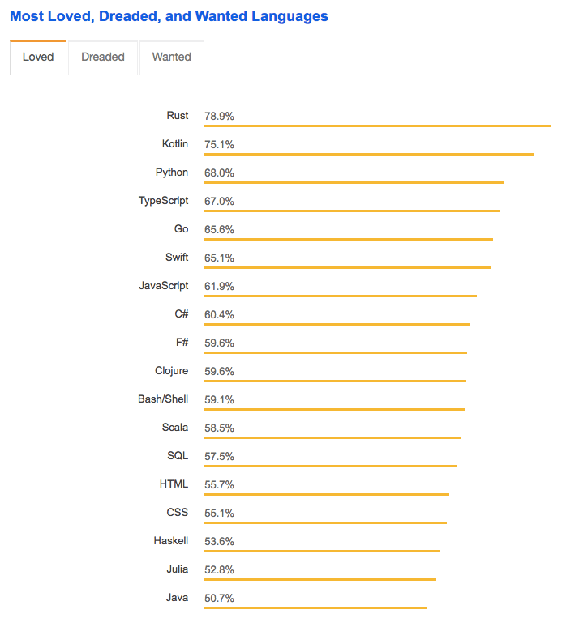
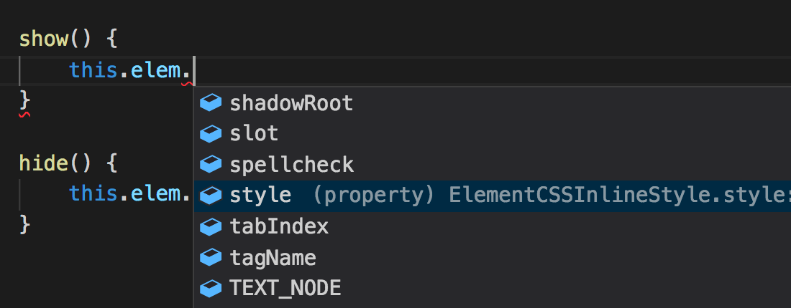

> 서두를것인가요? <a href="#typeScript_examples">_TypeScript 예제_</a> 또는 <a href="#list_of_resources">_리소스 목록_</a>으로 건너뜁니다.

자바 스크립트 개발자가 된다는 것은 항상 경계해야 한다는 약속입니다.

학습 곡선은 정확한 순간에 멈추지 않습니다. 그래서 당신은 항상 당신의 머리에 수많은 질문을 저글링하고 있습니다.

"Vue.js, React ...를 배워야합니까?"

"함수형 프로그래밍은 어떻습니까? [재미있어 보이네요!](https://snipcart.com/blog/functional-programming-paradigm-concepts)"

"서버 측 자바 스크립트는 [괜찮은가요](https://snipcart.com/blog/javascript-nodejs-backend-development)?"

## "TypeScript 를 배워야합니까?"

오늘 저는 이 마지막 질문에 대처하고 싶습니다.

우리는 최근 Snipcart 에서 [TypeScript](https://www.typescriptlang.org/) 를 사용했습니다. 우리는 Snipcart 의 다음 버전을 다시 쓰기 위해 이 도구를 사용하고 있습니다. 블로그에서 TS 로 다이빙하는 완벽한 타이밍!

이 게시물의 내용은 다음과 같습니다.

1. TypeScript 란 무엇입니까?
2. 왜 그것을 배워야합니까?
3. 언제 사용해야합니까?
4. TypeScript 학습을 어떻게 시작할 수 있습니까?

**또한 TypeScript 와 JavaScript 간의 차이점을 보여주기 위해 코드 예제를 준비했습니다.**

시작하죠!

## TypeScript 란 무엇입니까?

TypeScript 는 일반 JavaScript 로 컴파일하는 정적 형식의 JavaScript SuperSet 입니다.

즉, **비중이 큰 JavaScript 입니다** .


그러나 이것이 의미하는바를 진정으로 이해하기 위해서는 먼저 JavaScript 의 진화 과정을 다시 거꾸로 밟아야 합니다. 실제로 JS 가 의도 한 것을 기억해야 합니다.

JS 는 브라우저의 언어로 시작되었지만 당시에는 그렇게 강력하지 않았습니다. "유형"시스템이 없는 동적 언어이며 그 목적은 대규모 앱을 만드는 것이 아니었습니다.

하지만 지난 5 년에서 6 년 사이에 JavaScript 는 폭발적으로 성장했습니다. 모든 곳에서 사용되고 있습니다. 100-1000000 개의 코드 라인 프로그램에서요. 문제는 C#이나 Java 처럼 좀 더 성숙한 언어의 확장 기능이 없다는 것입니다.

일부는 결국 다음과 같이 물었습니다: JavaScript 의 **확장성**을 높이기 위해 우리가 할 수있는 일은 무엇입니까?

TypeScript 는 [Anders Hejlsberg](https://en.wikipedia.org/wiki/Anders_Hejlsberg) 와 Microsoft 의 대답이었습니다.

2012 년에 만들어졌으며 두 가지 주요 사항에 성공했습니다.

### 1. 대규모 앱 개발을 위해 누락 된 사항을 추가하십시오.

개발자를 위한 안전망을 형성하는 기능 - 코드 네비게이션, 명령문 완성, 런타임 전의 안전한 리팩토링 및 오류 검사 등 정적 유형 시스템을 사용하면 IDE 가 작성한 코드에 대해 추론 할 수 있습니다.

### 2.JavaScript 생태계에 머무르세요.

TypeScript 는 JS 의 _최상위에서 작동합니다_. 궁극적으로 코드는 JavaScript 로 유지되며 후자가 실행되는 모든 곳에서 실행됩니다. JS 개발자가 알고있는 것과 동일한 구문으로 시작하여 TypeScript 는 단순하고 깨끗한 JavaScript 로 컴파일됩니다.

## 왜 TypeScript 를 배워야합니까?

글쎄요, 그 역사는 타입 스크립트가 가치가 있다는 것을 납득시킬만큼 충분하지 않을 수도 있습니다.

하지만 절 믿으세요.

TypeScript 를 아는 것은 많은 철학적 및 기술적 이점을 가져옵니다.

먼저, JavaScript 생태계는 TypeScript 로 진화하고 있습니다. 모든 대형 프런트엔드 프레임워크가 TS 열차에서 작동되고 있으며, 전체 커뮤니티가 이를 따르고 있습니다.

[나중에 JS 커뮤니티에 기여하려면 TypeScript 지식이 필요합니다.](https://twitter.com/home?status=Sooner%20than%20later%2C%20contributing%20to%20the%20JS%20community%20will%20require%20TypeScript%20knowledge.%20https%3A%2F%2Fsnipcart.com%2Fblog%2Flearn-typescript-why-use-ts%20via%20%40snipcart%20%23typescript%20%23javascript)

여기서 배우는 걸 겁주려는 게 아닙니다. 저는 사실을 폭로하고 있을 뿐입니다. 더 빨리 습득할수록, 그 주위에 만들어진 도구들을 다룰 준비가 더 많아질 것입니다.

TypeScript 는 C # 및 Java 와 같은 강력한 형식의 언어에 대한 JavaScript 의 대답으로도 제공됩니다. JavaScript 로의 전환은 상상도 못했던 개발자들이 호기심으로 바라보기 시작했습니다.

재미있는 사실 : TypeScript 의 제작자는 그 자신이 C #의 핵심 기여자였습니다.

그러나 JavaScript 를 배우기 전에 TypeScript 에게 자신을 소개해야 한다는 말은 아닙니다. 저는 [기초부터 시작](https://snipcart.com/blog/learn-vanilla-javascript-before-using-js-frameworks)하려고 합니다.

보다 기술적인 근거에서 TypeScript 가 프로그래밍 경험에 추가 할 수있는 것은 다음과 같습니다.

- **보다 예측하기 쉬운 코드로 디버깅하기가 쉽습니다.** JavaScript 는 신뢰성이 떨어지고, 지저분해지고 버그가 발생할 때까지 사용자에게 제공하는 유연성이 뛰어납니다. TypeScript 는 런타임 전에 코드를 구성하고 모든 종류의 오류를 처리하는데 필요한 안전성을 제공합니다.
- **정적 도구로 훌륭한 도구를 사용할 수 있습니다.** 도구 : 코드 일관성 및 품질을 추가하고 개발 시간을 절약하여 개발 경험을 업그레이드하십시오. 도구는 다음과 같습니다 : TSLint, tsserver - 대부분의 TS 지원 편집기, 멋진 유형 스크립트 로더에 통합되어 있습니다.
- **현재에도 미래의 기능을 사용할 수 있습니다.** TypeScript 는 JavaScript 버전 간의 기능 갭을 자동으로 닫습니다([transpilation](https://en.wikipedia.org/wiki/Source-to-source_compiler) 사용). 기존 브라우저 및 장치에서 코드가 작동하는지 걱정하지 않고 가장 최신의 최신 기능으로 작업하는 데 집중할 수 있습니다.

  

- **성장하는 코드베이스에서 조화로운 팀 협력.** 잘 정의된 인터페이스를 통해 코드를 통합하고 구조를 적용합니다.

TypeScript 를 사용하는 개발자는 이를 매우 _좋아합니다_.

하지만 제 말을 믿지는 마세요.

<figure>
  
  <figcaption><a href="https://insights.stackoverflow.com/survey/2018/#most-loved-dreaded-and-wanted">출처</a></figcaption>
</figure>

## 언제 꼭 한번 해봐야 하나요?

특정 유형의 프로젝트가 있는데, 여기에서 나는 당신을 멈추고 물어야 만합니다.

"왜 TypeScript 를 이미 사용하지 않았습니까?"

Snipcart 는 그러한 프로젝트의 좋은 예입니다. 어쩌면 당신은 우리의 경험에서 자신을 인정할 것입니다.

우리가 JavaScript 기반 쇼핑 카트를 다시 쓰기 시작했을 때 TypeScript 가 그 일부가 될 것이라는 사실을 결코 의심하지 않았습니다. 우리의 코드베이스는 시간이 지남에 따라 동일한 수준의 유지관리성을 유지할 필요가 있었으며, 지금까지는 항상 그러하지 않았습니다.

단순한 자바스크립트에서는 불가피한 유지관리 문제로 인해 소프트웨어가 손상되고, 기존 카트에서 종종 경험했던 최악의 개발이 발생할 수 있습니다. 물론 우리는 테스트를 했지만, 모든 것을 다루고 싶을 때는 결국 시간이 많이 걸립니다.

이 증언이 생각나십니까? 아마도 TypeScript 는 여러분을 위한 해결책일 것입니다. 다음과 같은 경우에도 마찬가지입니다.

- **대규모 코드베이스의 경우** - 다시 한 번 모든 기능을 확장하는 데 사용됩니다. TypeScript 는 갑자기 디버깅의 필요성을 없애지는 않지만 일반적인 오류를 피할 수 있습니다.
- **정적 스타일의 언어에 익숙한 팀** - 이 경우 Snipcart 의 백엔드는 C#로 작성되므로 프런트엔드의 TypeScript 로 마이그레이션하는 것은 자연스러운 일입니다.
- **바벨의 대체품으로**
- **Angular 2 로 작업하는 경우** - TypeScript 는 프레임워크의 핵심 요소이므로 Angular 2 를 사용하기 전에 반드시 학습하는 것이 좋습니다.

나는 당신이 TypeScript 를 배울 가치가 있는지 여부를 결정하는 데 도움이 될 수있는 모든 것을 다했다고 생각합니다.

<div id="typeScript_examples"></div>

필연적으로 학습 곡선이 있습니다. 다른 언어에 익숙한 개발자는 JS 기반이므로 신속하게 몇 가지 단점을 발견하게 됩니다. 그러나 숙련된 JS 개발자는 학습 곡선을 벗어날 수 없습니다.

걱정하지 마십시오.이 과정을 통해 도움을 받을 수 있는 자료가 있습니다.

## TypeScript 시작 방법

더 나은 시각적 데모를 제공하기 위해 코드 편집기를 실행 해 보겠습니다. 이 예제는 TypeScript 가 JS 개발에 추가하는 기능을 보여줍니다.

### TypeScript 구성

TypeScript 를 사용하려면 원본 파일의 루트 디렉터리에 `tsconfig.json` 이 필요합니다. 좋은 출발점은 다음과 같습니다.

```json
{
  "compilerOptions": {
    "module": "commonjs",
    "target": "es6",
    "noImplicitAny": true,
    "strictNullChecks": true
  }
}
```

이 `target` 속성은 사용 가능한 JavaScript API 집합을 지정합니다. 참조할 lib 파일 목록과 함께 `lib` 속성을 사용하여 특정 기능을 활성화할 수 있습니다. 다른 컴파일러 옵션을 구성 파일에 지정하여 TypeScript 에서 `.ts` 파일을 컴파일하는 방법을 사용자가 정의할 수 있습니다.

TypeScript 를 사용하여 빠르게 실행하려면 `npm install typecript -g`를 사용하여 전역으로 설치하고 `tsc` 명령: `tsc my-code-file.ts` 을 사용하여 .ts 파일을 컴파일하십시오.

본격적인 프로젝트에 TypeScript 를 통합 할 준비가 되면 몇 가지 webpack 로더 (ts-loader, awesome-typescript-loader, fork-ts-checker-webpack-plugin)가 있습니다. 또한 TSLint 를 우리가 사용하는 tslint-config-airbnb 와 같이 미리 만들어진 구성으로 혼합하여 사용할 수도 있습니다.

### TS 예제 1 : 간단한 클래스 구문 및 타이핑

TypeScript 를 사용하면 클래스 및 완전한 타입의 멤버를 통해 OOP 접근 방식을 쉽게 적용할 수 있습니다.

```javascript
class Widget {
  elem: HTMLElement

  constructor(elem: HTMLElement) {
    this.elem = elem
  }

  show() {
    this.elem.style.display = 'block'
  }

  hide() {
    this.elem.style.display = 'none'
  }
}
```

IDE 내에서 이러한 입력은 자동 완성 기능을 제공합니다.



### TS 예제 2: Async / Await

async / await 키워드를 사용하는 코드는 비동기 작업의 새로운 표준이 되었습니다. TypeScript 를 사용하면 [타겟팅하는 자바 스크립트 버전](https://blog.mariusschulz.com/2016/12/09/typescript-2-1-async-await-for-es3-es5)을 그대로 사용할 수 있습니다 .

```javascript
class Post {/* … */}
async function getPosts(): Promise<Post[]> {
  let page = 1;
  const posts: Post[] = [];
  let data: {posts: Post[], hasMore: boolean};

  do {
    const result = await fetch('/api/posts?page=' + page);
    data = await result.json<{posts: Post[], hasMore: boolean}>();
    data.posts.forEach(post => posts.push(post));
    page += 1;
  } while (data.hasMore);

  return posts;
}
```

### TS 예제 3 : 암시적 인터페이스

Golang 의 인터페이스와 다소 비슷하지만, 같은 멤버를 제공하는 한 임의의 타입을 인터페이스로 전달할 수 있습니다 :

<div id="list_of_resources"></div>

```javascript
interface EventSource {
  addEventListener(ev: string, cb: Function);
  removeEventListener(ev: string, cb: Function);
}

function convert(em: Emitter): EventSource {
  return {
    addEventListener: (ev: string, cb: Function) => em.on(ev, cb),
    removeEventListener: (ev: string, cb: Function) => em.off(ev, cb),
  };
}
```

## 어디서 어떻게 TypeScript 를 배울 수 있습니까?

이제 TypeScript 를 사용하는 것에 대해 흥분했으므로 지식을 연마하기 위해 킬러 리소스없이 매달리게 하지 않겠습니다.

이전에 [Vanilla JS](https://github.com/snipcart/learn-vanilla-js) 에서 했던 것과 똑같은 방식으로 학습자의 킥 스타트를 위한 TypeScript 리소스 목록을 작성했습니다.

## [TypeScript 배우기 - GitHub 에서 리소스 소스 목록 열기](https://github.com/snipcart/learn-typescript)

이 목록에는 책, courses, evergreen resources, 주목할만한 기사, 커뮤니티 및 뉴스 레터 등 무료 또는 유료 Typescript 관련 콘텐츠가 포함되어 있습니다.

🔔 우리는 가능한 한 개방적이고 협력적인 상태를 유지하고 싶습니다. 그러니 주저하지 말고 fork + PR 로 소중한 것을 추가하십시오. 🔔


여기에서 가치를 찾을 수 있기를 바랍니다!

## 글을 마치며

자, 여기서 무엇을 배웠을까요?

먼저, 한 가지 점에 대해 내가 분명하다는 것을 확실히 하고 싶습니다.

JavaScript 만 시작하는 경우 지금 바로 TypeScript 로 이동할 필요가 없습니다.

[JS 구문을 익히고](https://snipcart.com/blog/javascript-beginner-intro-exercises) 언어를 먼저 느껴야합니다. 그런 다음 다시 한 번 프로젝트를 진행하면 TypeScript 에서 제공하는 기능을 묻지 않을 것입니다.

하지만 일단 그 수준에 도달하고 나면, 계속 실험을 해봐야 합니다. 여러분은 그것이 출력하는 코드 품질과 여러분의 프로젝트가 얻을 수 있는 전반적인 유지성에 빠르게 감명을 받을 것입니다. 또한 JS 프레임워크 및 커뮤니티에서 제작 한 도구를 사용하고 싶을 때 아마도 당신은 당신의 길에서 TS 를 찾을 것입니다. 준비를 하는 게 좋을 것입니다!

다시 말하지만 GitHub 목록에 리소스를 추가하는 것을 주저하지 마십시오.

TypeScript 에 대해 뭔가를 놓쳤습니까? 어쩌면 내가 방금 한 말에 동의하지 않을 수도 있고, 정말 싫을수도 있나요? 한 가지 방법이나 다른 방법으로 아래 섹션에 의견을 남기고 그것에 대해 이야기 해봅시다!
