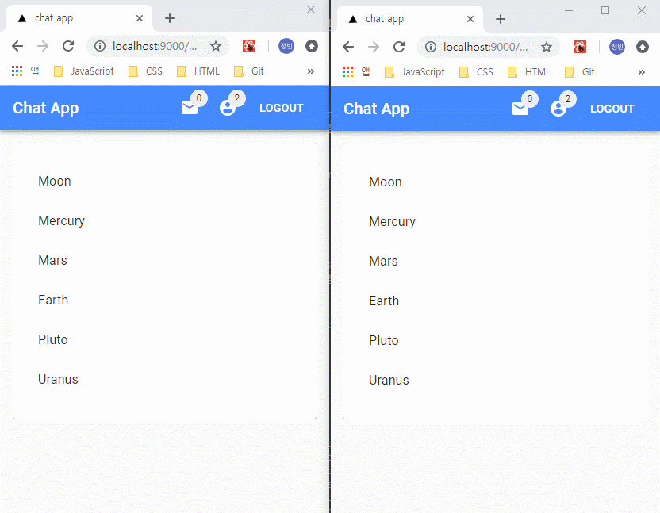
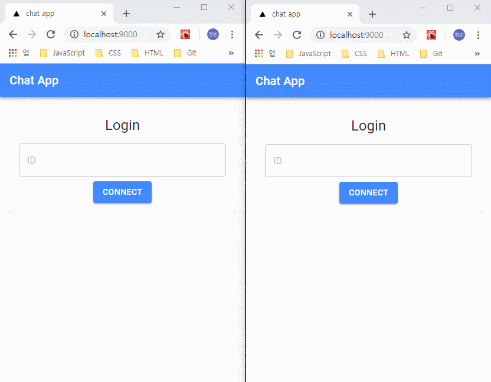
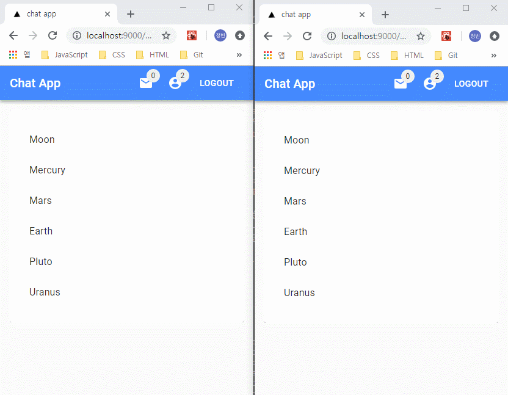
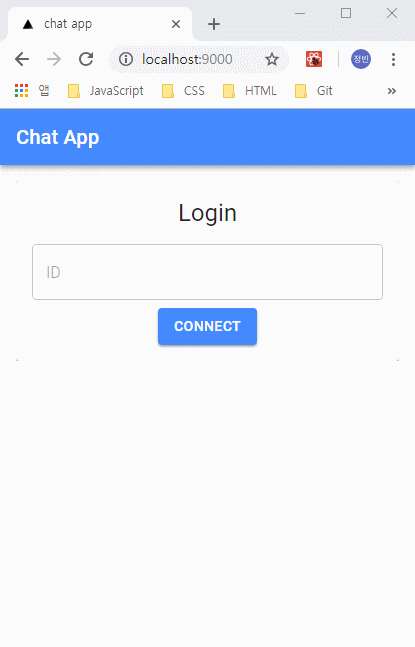
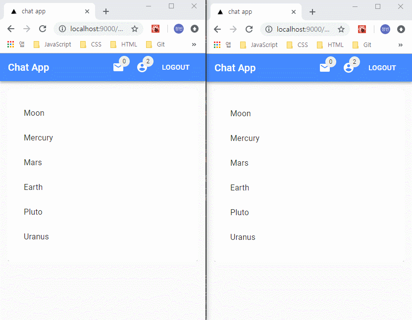
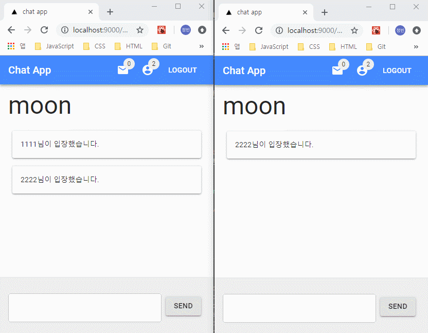
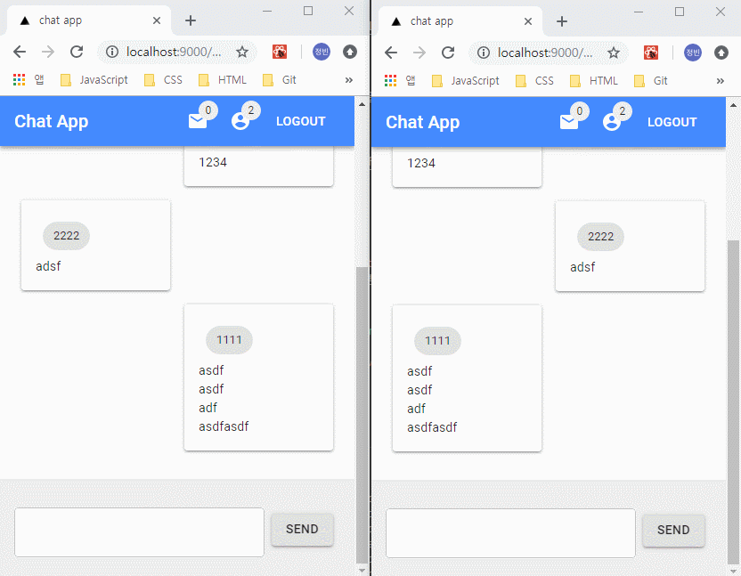

> 이번 글은 react 환경에서 `socket.io`를 활용한 채팅 앱 개발 과정에 대한 내용을 정리하려고 한다. `socket.io`의 간단한 소개 및 `Next.js`를 활용한 채팅 앱 개발을 하면서 학습했던 내용들을 간단히 정리하려 한다.

## socket.io

`socket.io`란 실시간으로 상호작용하는 웹 서비스를 만드는 기술인 `WebSocket`을 쉽게 사용할 수 있게 해주는 라이브러리이다. `WebSocket`은 사용자의 브라우저와 서버 사이의 동적인 양방향 연결 채널을 구성하는 HTML5 프로토콜이며 `WebSocket API`를 통해 서버로 메시지를 보내고 요청 없이 응답을 받아오는 것이 가능하다.

HTTP는 클라이언트에 의해 초기화되기 때문에 서버가 변경사항을 클라이언트에게 알릴 수 있는 방법이 없지만 `WebSocket`의 연결은 HTTP 통신과는 다르게 클라언트가 특정 주기를 가지고 Polling하지 않아도 변경된 사항을 시기 적절하게 전달할 수 있는 지속적이고 완전한 양방향 연결 스트림을 만들어 주는 기술이다. 하지만 일부 오래된 브라우저의 경우 지원하지 않으며 브라우저별로 지원하는 `WebSocket` 버전도 다르다. 이러한 웹브라우저 환경에서 `socket.io`는 JavaScript를 이용하여 브라우저 종류에 상관없이 실시간 웹 통신을 구현할 수 있도록 해줄 수 있다.

기본적으로 `socket.io`를 사용하기 위해서는 서버와 클라이언트가 모두 필요하기 때문에 서버 측 구현을 위한 `socket.io`와 클라이언트 측 구현을 위한 `socket.io-client`를 사용해야 한다. `socket.io-client`의 경우 기본적으로 `socket.io` 패키지에 포함되어 있으며 독립적으로 패키지 설치 후 사용도 가능하다. 서버 구성 시에는 기본적으로 `Node.js` 환경에서 실행 가능하며 다른 서버 환경에서의 구성도 지원가능하다.

그럼 이쯤에서 `socket.io`에 대한 간단한 소개를 마치며 간단한 채팅 앱 개발 과정에 대한 내용을 정리보도록 하자. 모든 앱에서 구현된 컴포넌트를 일일히 설명하기에는 양이 많기 때문에 `socket.io`를 활용한 일부 영역에 대한 코드로 요약해서 정리했다. `socket.io`를 사용한 내용은 구현한 앱의 기능을 소개하면서 간단히 설명하도록 하자.

## 기본 구조 설정

기본적은 환경은 `Next.js` 를 활용하였으며 전역 데이터 관리는 `mobx`를 활용하였다. UI 구성시에는 `material-ui`를 사용하였고 테스트 환경은 `mocha`를 활용하였다.

디렉토리 구성의 경우 [Atomic Design](http://bradfrost.com/blog/post/atomic-web-design/)를 참고하여 설계하였고 다음과 같은 구조로 설계하였다.

    .
    ├── components              # 주요 컴포넌트 폴더
    │   ├── atoms                 # 원자 단위로 설계한 컴포넌트 폴더
    │   ├── molecules             # 분자 단위로 설계한 컴포넌트 폴더
    │   ├── organisms             # 생물 단위로 설계한 컴포넌트 폴더
    │   ├── templates             # 페이지 컴포넌트를 감싸는 템플릿 컴포넌트 폴더
    │   └── wrappers              # HOC, Render Props등의 컴포넌트 폴더
    ├── lib                     # 특정 기능을 제공하는 함수 및 라이브러리 관련 폴더
    ├── mobx                    # 전역 상태 관리를 제공하는 클래스 폴더
    ├── pages                   # 라우팅 주소에 갖는 페이지 컴포넌트 폴더
    ├── static                  # 정적 리소스 관련 폴더
    ├── test                    # 단위 테스트 관련 폴더
    │   └── components            # 컴포넌트 테스트 폴더
    │       ├── atoms               # 원자 단위 컴포넌트 테스트 폴더
    │       ├── molecules           # 분자 단위 컴포넌트 테스트 폴더
    │       ├── organisms           # 생물 단위 컴포넌트 테스트 폴더
    │       ├── pages               # 페이지 컴포넌트 테스트 폴더
    │       ├── templates           # 템플릿 컴포넌트 테스트 폴더
    │       └── wrappers            # 랩핑 컴포넌트 테스트 폴더
    ├── .babelrc                # babel 설정 파일
    ├── next.config.js          # nextjs 환경 설정 파일
    └── package.json            # package 설정 파일

기본적인 앱 구성은 앱 메인 접근 시 로그인 여부를 확인하며 로그인 시 채널 목록으로 이동하게 된다. 각 채널에 입장한 사용자간의 채팅이 가능하며 현재 채팅방에 입장하지 않은 사용자를 초대할 수 있도록 구현했다.

## 공통 영역 및 로그아웃, 사용자 정보 업데이트, 초대하기

### Client

클라이언트 영역의 경우 전체 페이지 영역의 메인 레이아웃을 담당하는 공통 영역에 대한 컴포넌트를 구현하였고 `HoC` 패턴을 통해 각각의 페이지 컴포넌트를 인자로 전달받아 레이아웃 컴포넌트를 재사용할 수 있도록 구현하였다. 해당 컴포넌트에서 `mobx`로 관리되는 전역 데이터를 하위 컨포넌트에 주입하도록 설정했다.

```javascript
const withMain = Page => {
  @inject('chat')
  @observer
  class MainWrapper extends React.Component {
    static async getInitialProps(ctx) {
      return {
        ...(Page.getInitialProps ? await Page.getInitialProps(ctx) : null),
      }
    }

    componentDidMount() {
      const { chat } = this.props
      const { user, socket } = chat

      if (!user.userId || !user.socketId) {
        Router.pushRoute('/')
      }

      if (socket) {
        socket.on('logout', () => {
          chat.setUser({ userId: '', socketId: '' })
          document.location.replace('/')
        })

        socket.on('updateUsers', ({ users }) => {
          chat.setUsers(users)
        })

        socket.on('inviteRoom', data => {
          chat.setInvites(data)
        })
      }
    }

    logout = () => {
      const { socket } = this.props.chat
      socket.emit('logout')
    }

    inviteRoom = ({ sender, receiver, room }) => {
      const { socket } = this.props.chat
      socket.emit('inviteRoom', {
        sender,
        receiver,
        room,
      })
    }

    removeInvite = invite => {
      const { chat } = this.props
      chat.removeInvites(invite)
    }

    moveRoom = ({ type, room }) => {
      const { user, socket } = this.props.chat

      socket.emit(type, {
        user,
        room,
      })
    }

    render() {
      const { classes, router, chat } = this.props
      const { user, users, invites } = chat

      return (
        <Fragment>
          <Head>
            <title>chat app</title>
          </Head>
          <AppBar
            user={user}
            users={users}
            invites={invites}
            classes={classes}
            room={router.query.room}
            logout={this.logout}
            inviteRoom={this.inviteRoom}
            removeInvite={this.removeInvite}
            moveRoom={this.moveRoom}
          />
          <div className={classes.root}>
            <Page {...this.props} classes={classes} />
          </div>
        </Fragment>
      )
    }
  }

  return withStyles(styles, { name: 'MainWrapper' })(MainWrapper)
}
```

우선 컴포넌트 마운트 시 로그인 한 사용자 정보를 확인한 후 로그인 정보가 없는 경우 로그인 페이지로 이동하도록 구현했다. 이 후 사용자 정보가 확인되는 경우 수신된 소켓 정보에 따라 서버로부터 수신받는 이벤트를 처리해주도록 했다.

메인 레이아웃에 설정된 소켓 이벤트는 로그아웃, 전체 사용자 업데이트, 사용자 초대하기 기능이며 `socket.io`에서 제공하는 `on` 메서드를 통해 서버로부터 수신된 타입에 따라 클라이언트 측 함수를 실행하도록 구현했다.

서버로 송신이 필요한 이벤트의 경우 `logout`, `inviteRoom`, `moveRoom` 함수를 통해 로그아웃, 사용자 초대, 채팅방 이동에 대한 정보를 `socket.io`에서 제공하는 `emit` 메서드를 통해 요청할 수 있도록 구현하였다.







해당 기능들의 경우 모든 사용자들이 공통적으로 제공되어야 하는 기능이기 때문에 메인 레이아웃 컴포넌트에서 구현하도록 했으며 로그아웃, 사용자 정보 갱신 및 사용자 초대하기에 대한 동작을 확인할 수 있다. 그럼 이제 해당 컴포넌트로 주입되는 전역 데이터를 관리하기 위해 `mobx`로 구현된 코드를 확인해보자.

```javascript
class Chat {
  @observable
  state = {
    socket: null,
    user: {
      userId: '',
      socketId: '',
    },
    invites: [],
    users: [],
  }

  constructor(props) {
    this.state = props ? props.state : this.state
  }

  @action
  connect = (namespace = '/') => {
    this.state.socket = io(namespace)
  }

  @action
  disconnect = () => {
    this.state.socket.disconnect()
  }

  @action
  setUser = user => {
    this.state.user = user
  }

  @action
  setUsers = users => {
    this.state.users = users
  }

  @action
  setInvites = invite => {
    this.state.invites.push(invite)
    this.state.invites = this.state.invites.filter(
      (currInvite, i, self) =>
        i === self.findIndex(selfInvite => selfInvite.time === currInvite.time)
    )
  }

  @action
  removeInvites = invite => {
    const index = this.state.invites.findIndex(
      currInvite =>
        currInvite.time === invite.time &&
        currInvite.sender.socketId === invite.sender.socketId
    )

    this.state.invites.splice(index, 1)
  }

  @computed get socket() {
    return this.state.socket
  }

  @computed get user() {
    return toJS(this.state.user)
  }

  @computed get users() {
    return toJS(this.state.users)
  }

  @computed get invites() {
    return toJS(this.state.invites)
  }
}
```

`mobx`에서 구현한 `Chat` 클래스의 코드 내용이다. 전역 상태값으로는 소켓 객체와 현재 사용자 정보, 초대 목록, 전체 사용자 정보를 가지는 객체로 구성되어 있으며 `action decorator`로 설정된 함수를 통해 전역 상태 객체를 갱신하도록 구현했다. 소켓 접속 및 해제와 현재/전체 사용자 업데이트 및 초대 목록 정보를 갱신할 수 있도록 구현했다. 또한 `computed decorator`를 통해 소켓 정보 및 현재/전체 사용자, 초대 목록 정보를 반환받을 수 있도록 구현했다.

### Server

서버 영역의 경우 `Next.js` 환경에서 `socket.io`에 대한 설정이 필요하기 때문에 `express`를 활용하여 서버 구성을 재정의하였다. 이 후 `express`를 통한 서버 실행 시 해당 서버를 통해 새로운 소켓 서버를 생성해주었다.

```javascript
const express = require('express')()
const server = require('http').createServer(express)
const chatServer = require('./chat')
const next = require('next')
const mobxReact = require('mobx-react')

const routes = require('../lib/routes')
const port = parseInt(process.env.PORT, 10) || 3000
const env = process.env.NODE_ENV
const dev = env !== 'production'
const app = next({
  dir: '.',
  dev,
})

const routeHandler = routes.getRequestHandler(app)

chatServer(server)

mobxReact.useStaticRendering(true)

app
  .prepare()
  .then(() => {
    express.use(routeHandler)

    server.listen(port, err => {
      if (err) {
        throw err
      }
      console.log(`> Ready on port ${port} [${env}]`)
    })
  })
  .catch(err => {
    console.log('An error occurred, unable to start the express')
    console.log(err)
  })
```

`express`와 `next.js`를 활용하여 서버를 구현한 코드이다. 소켓 설정에 대한 파일은 따로 분리하여 구현하였고 클라이언트 측에서 설정한 `mobx` 및 라우팅 설정을 활용하기 위한 코드로 구성되어있다.

```javascript
const chatServer = server => {
  const io = require('socket.io').listen(server)
  let users = []

  io.on('connection', socket => {
    // ...
    socket.on('logout', () => {
      users = users.filter(user => user.socketId !== socket.id)
      socket.emit('logout')

      io.emit('updateUsers', {
        users,
      })
    })

    socket.on('disconnect', () => {
      users = users.filter(user => user.socketId !== socket.id)
    })

    socket.on('inviteRoom', ({ sender, receiver, room }) => {
      const time = new Date().getTime()
      io.to(receiver.socketId).emit('inviteRoom', {
        sender,
        room,
        time,
      })
    })

    // ...
  })
}

module.exports = chatServer
```

`socket.io`를 활용한 채팅 서버의 구현 코드이다. 인자로 전달받은 서버 정보를 통해 소켓 서버를 생성했다. 소켓 연결 뒤 전체 사용자 목록을 저장할 배열 변수를 초기화하며 `io.on('connection')` 함수를 통해 소켓에 접근한 사용자에 대한 이벤트를 처리하도록 구현했다.

우선 공통 영역에 설정된 로그아웃, 전체 사용자 정보 갱신, 사용자 초대하기 이벤트에 대한 내용만 정리했다. 각각의 이벤트 처리의 경우 `socket.emit`, `io.emit`, `io.to(socketId).emit` 메서드를 활용했으며 순서대로 현재 사용자, 전체 사용자, 특정 사용자에 대한 클라이언트 측 이벤트를 송신하게 된다.

## 로그인

### Client

로그인 화면의 경우 기본경로(`/`) 접속 시에 나오는 화면이며, 소켓에 접속한 정보를 가지고 있지 않는 사용자에 대해 소켓 접속을 할 수 있도록 구현되어 있다.

```javascript
class Connect extends Component {
  state = {
    form: {
      userId: '',
    },
  }

  componentDidMount() {
    const { chat } = this.props
    chat.connect()
    const { socket } = chat

    socket.on('login', ({ user }) => {
      chat.setUser(user)
      Router.pushRoute('/list')
    })

    socket.on('updateUsers', ({ users }) => {
      chat.setUsers(users)
    })
  }

  onConnect = (values, { setErrors, setSubmitting }) => {
    const { socket } = this.props.chat

    if (!socket || socket.io.readyState === 'closed') {
      setErrors({ userId: '새로고침 후 다시 접속해주세요.' })
      setSubmitting(false)
      return
    }

    socket.emit('login', {
      user: {
        userId: values.userId,
      },
    })
  }

  render() {
    return (
      <Formik
        initialValues={this.state.form}
        validationSchema={Yup.object().shape({
          userId: Yup.string()
            .min(3, '3글자 이상 입력해주세요')
            .max(10, '10글자 이하로 입력해주세요')
            .required('ID를 입력해주세요'),
        })}
        onSubmit={this.onConnect}
        render={({ submitForm, isSubmitting }) => (
          <ConnectForm submitForm={submitForm} isSubmitting={isSubmitting} />
        )}
      />
    )
  }
}

export default Connect
```

접속한 사용자에 대해 소켓 접속 정보를 설정할 수 있는 로그인 컴포넌트이다. 마운트 이후 사용자 정보와 전체 사용자 정보를 서버로부터 수신 받을 수 있도록 구현했다. 로그인 시에는 유효성 검증 확인 후 서버로 사용자 정보를 송신하도록 구현했다. 유효성 검증 로직의 경우 `formik` 라이브러리를 활용하였고 검증 항목은 필수값, 최소길이, 최대길이 값으로 설정되어있다.



로그인 동작에 대한 화면이며 유효성 검증을 완료한 후 채팅방 목록 페이지로 이동하는 것을 확인할 수 있다.

### Server

```javascript
// ...

let users = []

socket.on('login', ({ user }) => {
  if (user.userId) {
    users.push({
      userId: user.userId,
      socketId: socket.id,
    })
  }

  socket.emit('login', {
    user: {
      ...user,
      socketId: socket.id,
    },
  })

  io.emit('updateUsers', {
    users,
  })
})
// ...
```

서버 측에서 설정된 로그인 관련 소켓 이벤트의 경우 클라이인트 측으로부터 로그인 정보 수신 시 접속한 아이디 존재 여부 확인 후 전체 사용자 목록에 현재 사용자를 추가하도록 구현했다. 이 후 현재 사용자에게 사용자 아이디 및 소켓 아이디 정보를 클라이언트로 송신하며 전체 사용자에서 업데이트된 전체 사용자 정보를 송신하도록 구현했다.

## 채널 입장 & 퇴장, 메시지 전송, 이미지 전송

### Client

로그인 이후 화면은 채팅방 목록으로 구성되어 있으며 채팅방 선택 시 해당 채팅방을 이동하도록 구현했으며 같은 채팅방에 있는 사용자 간 기본적인 메시지 채팅 및 이미지 업로드 기능을 통한 이미지 전송 기능으로 구현되어 있다. 클라이언트 측에서 소켓을 설정한 영역은 채팅 기능을 제공하는 컴포넌트에 설정하였고 해당 컴포넌트에서 채널 이동 및 메시지 전송에 대한 이벤트를 제어하도록 설정했다.

```javascript
class Chat extends Component {
  state = {
    messages: [],
  }

  mounted = false

  componentDidMount() {
    const { chat, router } = this.props
    chat.connect()
    const { socket, user } = chat

    this.mounted = true

    socket.emit('join', {
      user,
      room: router.query.room,
    })

    socket.on('join', data => {
      if (this.mounted) {
        this.receiveMessage(data)
      }
    })

    socket.on('leave', data => {
      if (this.mounted) {
        this.receiveMessage(data)
      }
    })

    socket.on('resetMessages', () => {
      if (this.mounted) {
        this.resetMessages()
      }
    })

    socket.on('chat', data => {
      if (this.mounted) {
        this.receiveMessage(data)
      }
    })

    socket.on('updateUser', ({ user }) => {
      if (this.mounted) {
        chat.setUser(user)
      }
    })
  }

  componentWillUnmount() {
    const { router, chat } = this.props
    const { socket, user } = chat

    this.mounted = false

    socket.emit('leave', {
      user,
      room: router.query.room,
    })
  }

  receiveMessage = ({ messages }) => {
    const newMessages = this.state.messages.concat()
    newMessages.push(messages)
    this.setState({
      messages: newMessages,
    })
    scroll.scrollToBottom()
  }

  sendMessage = ({ type, message = '', images = [] }) => {
    const { router, chat } = this.props
    const { socket, user } = chat
    socket.emit('chat', {
      user,
      room: router.query.room,
      type,
      message,
      images,
    })
  }

  resetMessages = () => {
    this.setState({
      messages: [],
    })
  }

  render() {
    const { router, chat } = this.props
    const myself = chat.user
    const { messages } = this.state

    return (
      <Fragment>
        <Typography variant="h3" gutterBottom>
          {router.query.room}
        </Typography>
        <Messages messages={messages} myself={myself} />
        <InputArea sendMessage={this.sendMessage} />
      </Fragment>
    )
  }
}
```

컴포넌트 마운트 시에는 props로 전달받은 소켓 객체를 통해 서버 접속 여부를 확인하도록 구현되었다. 이 후 채팅방 입장 정보를 서버로 송신하며,
서버로 부터 전달받은 이벤트에 따라 채팅방 입장 및 퇴장, 채팅방 내 메시지 정보 삭제, 메시지 확인, 사용자 정보 업데이트 등에 대한 기능을 실행하도록했다.

마운트 해제 시에는 `mounted`라는 프로퍼티를 통해 컴포넌트 언마운트 이후 상태 변경을 차단하도록 설정했으며, 언마운트 시 현재 사용자에 대한 채팅방 퇴장 이벤트를 서버로 송신하도록 했다.

또한 수신받은 이벤트에 따라 전달받은 메시지 정보를 state에 업데이트, 메시지 정보를 서버로 송신해주는 함수를 호출하게 된다.







현재 컴포넌트에 설정된 기능에 따라 채팅방 입장/퇴장 및 메시지 전송을 구현한 화면이다.

### Server

```javascript
socket.on('join', ({ room, user }) => {
  socket.join(room)
  users = users.filter(currentUser => currentUser.socketId !== user.socketId)

  if (user.userId) {
    users.push({
      userId: user.userId,
      socketId: socket.id,
      room,
    })
  }

  socket.emit('updateUser', {
    user: {
      ...user,
      socketId: socket.id,
    },
  })

  io.emit('updateUsers', {
    users,
  })

  io.to(room).emit('join', {
    messages: {
      user: {
        ...user,
        socketId: socket.id,
      },
      type: 'info',
      message: `${user.userId}님이 입장했습니다.`,
      images: [],
    },
  })
})

socket.on('chat', ({ room, user, type, message, images }) => {
  io.to(room).emit('chat', {
    messages: {
      user,
      type,
      message,
      images,
    },
  })
})

socket.on('leave', ({ room, user }) => {
  users = users.map(user => {
    if (user.socketId === socket.id) {
      user.room = ''
    }
    return user
  })

  io.emit('updateUsers', {
    users,
  })

  io.to(room).emit('leave', {
    messages: {
      user,
      type: 'info',
      message: `${user.userId}님이 퇴장했습니다.`,
      images: [],
    },
  })

  socket.emit('resetMessages')
  socket.leave(room)
})
```

## 테스트

### Client

### Server

## 글을 마치며
