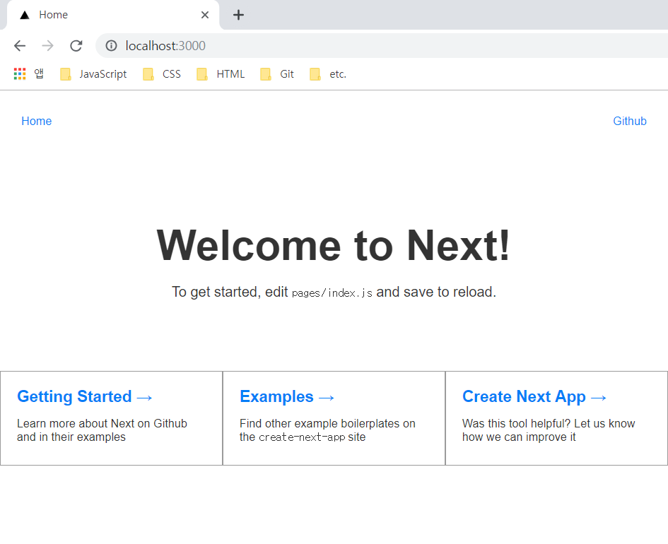

> 이번 글은 React 기반의 프레임워크인 `Next.js`의 사용법을 간단히 정리해보려 한다. `Next.js`의 간단한 환경설정부터 라우팅 처리, 전역 데이터 설정 및 서버 사이드 렌더링에 필요한 설정 등에 대한 내용을 정리하고자 한다.

## next.js

`Next.js`는 보다 쉽게 서버 측 렌더링을 가능하게 해주는 매우 인기있는 `Node.js` 프레임 워크이며 여러가지 놀라운 기능들을 제공한다. 특히 서버 렌더링의 경우 이 전에 `create-react-app` 환경에서 작업했듯이 실제 구현하기 위해서는 다소 복잡한 과정을 거치게 되는데 `Next.js` 를 활용하게 되면 보다 쉽게 서버 렌더링 환경을 구성할 수 있다. 이번 글에서는 내가 `Next.js`를 활용하면서 이해했던 내용들에 대해 간략히 정리하려고 한다. 그외에도 여러가지 많은 기능을 제공하는데 관련된 내용은 [`Docs`](https://nextjs.org/docs)를 참고하면 될 것 같다(사실 직접 사용하면서 Docs의 내용의 많이 참고했고 이 글 역시 Docs에 정리된 내용과 별반 다르지 않다).

## Setup

기본 설정의 경우 react로 구성된 프로젝트에 `next` 프레임워크를 패키지로 설치해주면 되며 명령어 설정 및 해당 프레임워크를 맞춰 디렉토리 구조와 환경설정 파일을 구성해주면 된다.

```bash
yarn add next
```

설치 후 내장된 라우팅 기능을 활용하기 위해 관련 컴포넌트는 `pages` 폴더에 설정이 필요하며 `webpack` 관련 설정은 루트 영역에 `next.config.js` 파일을 생성 후 설정해주면 된다.

이처럼 복잡한 과정은 아니지만 `Next.js`의 사용법에 따라 기본적으로 필요한 설정들이 있는데, 나의 경우 `CRA`처럼 이러한 과정들을 쉽게 설정해주는 `create-next-app`이라는 보일러플레이트를 사용하여 개발을 진행했다. 해당 보일러플레이트를 사용하지 않아도 되지만 프로젝트 시작 시 필요한 기본설정을 제공하기 때문에 사용법을 간단히 정리했다.

```bash
npm install -g create-next-app
```

해당 라이브러리의 경우 터미널 환경에서 명령어 실행을 위해 전역으로 설치해주면 된다.

```bash
create-next-app cna-sample
```

설치가 완료되면 프로젝트를 생성할 경로로 이동한 후 위와 같이 `create-next-app`이라는 명령어를 통해 프로젝트를 생성하면 된다. 위와 같이 명령어를 실행하면 해당 경로에 `cna-sample`이라는 프로젝트 디렉토리가 생성되는 것을 확인할 수 있다. 생성된 프로젝트는 `Next.js` 환경에 맞게 디렉토리 구조 및 기타 설정에 필요한 파일들이 기본적으로 구성된다.

- `package.json`

```json
// ...
{
  "scripts": {
    "dev": "next",
    "build": "next build",
    "start": "next start"
  }
}
// ...
```

`package.json` 파일에 기본적으로 설정되는 프로젝트 명령어이며 각 명령어 순으로 개발 서버 실행, 빌드, 운영서버 실행 시 사용된다. 각 명령어는 기호에 맞게 수정해주면 된다.



개발 서버를 실행하면 기본적으로 제공된 컴포넌트로 구성된 화면을 확인할 수 있다. 그럼 이제 `Next.js`에서 제공하는 몇가지 기능들을 정리해보자.

## Code Splitiing

코드 스플리팅의 경우 `import`로 선언된 모든 컴포넌트가 번들로 제공되며 별다른 설정을 추가하지 않아도 페이지 요청 시 불필요한 코드를 로드하지 않는다.

## CSS

CSS의 경우 `styled-jsx`를 기본 번들로 제공하며 렌더링 시 `style` 요소를 통해 스타일 설정이 가능하다. 다만 `styled-components`, `material-ui`, `ant-design`과 같은 다른 CSS 프레임워크를 사용하는 경우 각 페이지를 감싸는 `/pages/_document.js` 컴포넌트의 재정의를 통한 스타일 설정이 필요하다.

```javascript
function HelloWorld() {
  return (
    <div>
      Hello world
      <p>scoped!</p>
      <style jsx>{`
        p {
          color: blue;
        }
        div {
          background: red;
        }
        @media (max-width: 600px) {
          div {
            background: blue;
          }
        }
      `}</style>
      <style global jsx>{`
        body {
          background: black;
        }
      `}</style>
    </div>
  )
}

export default HelloWorld
```

## Static Resource

정적 리소스의 경우 프로젝트 루트 경로에 `static` 폴더를 통해 접근해야 한다. 그리고 코드에서는 `/static` 경로 내 파일을 참조해야 한다.

```javascript
function MyImage() {
  return 
}

export default MyImage
```

## Head

`<head>` 요소에 필요한 태그를 추가하는 경우 `next/head` 컴포넌트를 통한 설정이 필요하다.

```javascript
import Head from 'next/head'

function IndexPage() {
  return (
    <div>
      <Head>
        <title>My page title</title>
        <meta name="viewport" content="initial-scale=1.0, width=device-width" />
      </Head>
      <p>Hello world!</p>
    </div>
  )
}

export default IndexPage
```

## Fetching Data

페이지 요청 시 초기 데이터가 필요한 경우 `getInitialProps`라는 비동기 정적 메소드를 사용해야 한다. 또한 초기 페이지 요청 시 `getInitialProps`는 서버에서만 실행되며 `Link` 컴포넌트를 통해 다른 페이지로 이동하거나 라우팅 API를 사용할 때는 클라이언트에서 실행된다.

```javascript
import React from 'react'

class HelloUA extends React.Component {
  static async getInitialProps({ req }) {
    const userAgent = req ? req.headers['user-agent'] : navigator.userAgent
    return { userAgent }
  }

  render() {
    return <div>Hello World {this.props.userAgent}</div>
  }
}

export default HelloUA
```

## Custom Server

서버 실행의 경우 기본적으로 `Next.js`에서 제공하는 서버를 사용할 수 있지만 사용자에 따라 추가적인 서버 설정이 필요한 경우 직접 서버 환경을 구성할 수 있다.

```json
{
  "scripts": {
    "dev": "node server.js",
    "build": "next build",
    "start": "NODE_ENV=production node server.js"
  }
}
```

직접 정의한 사용자 정의 서버를 사용하는 경우 스크립트 명령어를 수정하도록 하자.

```javascript
const { createServer } = require('http')
const { parse } = require('url')
const next = require('next')

const dev = process.env.NODE_ENV !== 'production'
const app = next({ dev })
const handle = app.getRequestHandler()

app.prepare().then(() => {
  createServer((req, res) => {
    // Be sure to pass `true` as the second argument to `url.parse`.
    // This tells it to parse the query portion of the URL.
    const parsedUrl = parse(req.url, true)
    const { pathname, query } = parsedUrl

    if (pathname === '/a') {
      app.render(req, res, '/b', query)
    } else if (pathname === '/b') {
      app.render(req, res, '/a', query)
    } else {
      handle(req, res, parsedUrl)
    }
  }).listen(3000, err => {
    if (err) throw err
    console.log('> Ready on http://localhost:3000')
  })
})
```

사용자 정의 서버를 구성한 코드이며 직접 구현한 서버를 통해 필요한 기능을 추가하거나 라우팅 정보를 재정의할 수 있다.

## Routing

`Next.js` 환경에서는 기본적으로 `pages`에 구현된 컴포넌트 파일명에 따라 라우팅 주소가 설정된다. `/` 경로는 `pages/index.js` 파일로 연결되며 그 외에 페이지 파일명에 따라 접근 가능한 페이지 주소가 설정된다. 추가된 파일명에 맞는 페이지는 `<Link>` 컴포넌트를 통해 접근할 수 있다.

- `pages/index.js`

```javascript
import Link from 'next/link'

function Home() {
  return (
    <div>
      Click{' '}
      <Link href="/about">
        <a>here</a>
      </Link>{' '}
      to read more
    </div>
  )
}

export default Home
```

- `pages/about.js`

```javascript
function About() {
  return <p>Welcome to About!</p>
}

export default About
```

## Custom App

`Next.js`는 내부적으로 `next/app` 컴포넌트를 통해 페이지를 초기하며 필요한 경우 직접 `next/app` 컴포넌트 설정을 통해 페이지 정보를 제어 할 수 있다. 재정의 하는 경우 `/pages/_app.js` 파일을 통해 `App`을 상속받는 컴포넌트의 재정의가 필요하다.

```javascript
import React from 'react'
import App, { Container } from 'next/app'

class MyApp extends App {
  static async getInitialProps({ Component, ctx }) {
    let pageProps = {}

    if (Component.getInitialProps) {
      pageProps = await Component.getInitialProps(ctx)
    }

    return { pageProps }
  }

  render() {
    const { Component, pageProps } = this.props

    return (
      <Container>
        <Component {...pageProps} />
      </Container>
    )
  }
}

export default MyApp
```

## Custom Document

`pages` 경로의 설정된 페이지의 기본적인 마크업 구조는 `next/document` 컴포넌트의 통해 정의된다. 해당 컴포넌트의 경우 서버 측에서만 렌더링되며 초기 서버 측 렌더링에 대한 마크업을 변경하는 데 사용된다. 주로 앞서 언급한 `styled-components`와 같은 `css-in-js` 라이브러리의 서버 측 렌더링을 구현하는 경우 사용되며 `styled-jsx`의 경우 기본적으로 서버 렌더링 설정에 포함되어 있다. 기본 마크업을 재정의하려면 `/pages/\_document.js` 파일을 통해 `Document` 클래스를 재정의 할 수있는 컴포넌트가 필요하다.

```javascript
import Document, { Head, Main, NextScript } from 'next/document'

class MyDocument extends Document {
  static async getInitialProps(ctx) {
    const initialProps = await Document.getInitialProps(ctx)
    return { ...initialProps }
  }

  render() {
    return (
      <html>
        <Head>
          <style>{`body { margin: 0 } /* custom! */`}</style>
        </Head>
        <body className="custom_class">
          <Main />
          <NextScript />
        </body>
      </html>
    )
  }
}

export default MyDocument
```

## 글을 마치며

지금까지 `Next.js`의 간단한 사용법을 정리했는데 사실 지금까지 정리한 내용들은 `Next.js`에서 제공하는 `Docs`에서 제공하는 내용들을 일부 요약해서 정리한 내용이며 그 외에도 웹 검색을 통해 해당 프레임워크에 대한 사용법들을 쉅게 확인할 수 있다. 그래서인지 이번에 정리한 글 내용이 다른 포스트에 비해 다소 부족하다고 생각하지만 그래도 내 스스로 요긴하게 사용하고 있는 프레임워크의 사용법을 간단히라도 정리하고 싶었다. 매번 글을 쓰며 다짐하는 부분이지만 해당 프레임워크를 사용하면서 새롭게 배워가는 내용들이 생긴다면 글 내용을 업데이트 할 수 있도록 하자.
