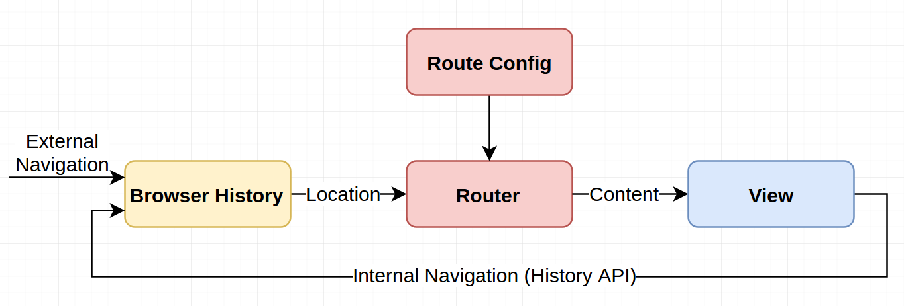
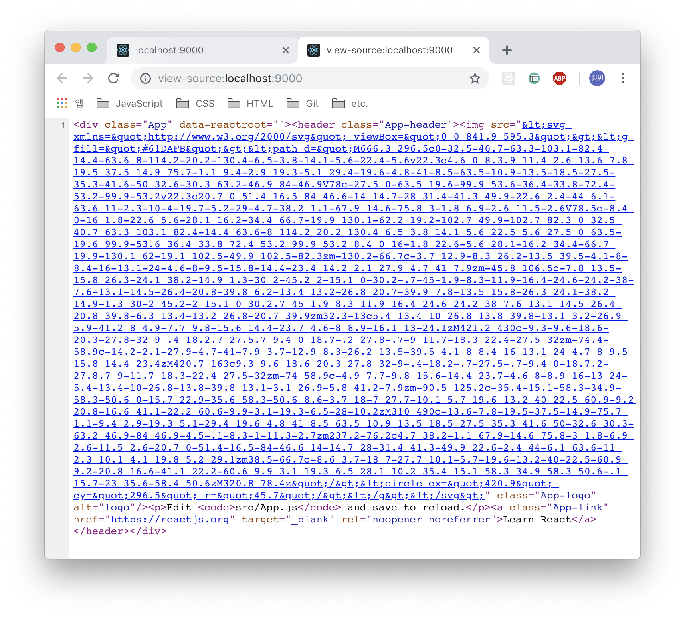

> react 를 활용한 isomorphic SPA 개발에 대한 내용을 정리한 글입니다. 이 전에 개발했던 내용들을 다시 정리하는 목적도 있고 앞으로 react 및 그와 관련된 새로운 도구들을 활용하여 프로젝트를 시작했을때 "전에는 이렇게 작업했었지.." 하는 내용을 남기고자 합니다. 단순한 개발과정뿐만 아니라 isomorphic SPA 에 개념 또한 기존에 생각했던 내용을 정리해서 스스로 이해하려고 합니다. 의식의 흐름대로 정리하는 내용이라 부족한 부분도 있을꺼 같은데, 그건 그때 그때 정리하면서 업데이트하려고 합니다.

## Isomorphic JavaScript

isomorphic 란 사전적 의미로 "_같은 모양의, 동일 구조의, 등정형(等晶形)의_" 라는 뜻은 가진 단어라고 네이버 사전에 나와있네요. 제가 생각하는 **Isomorphic JavaScript** 은 일반적으로 라우팅 기능, 정적 렌더링과 같이 주로 서버 영역에서 담당했던 기능들을 클라이언트 영역에서 처리함으로서 양쪽의 환경에서 같은 코드를 활용 할 수 있도록 하는 것이라고 생각했습니다. 이렇게 함으로써 백엔드 환경에서 처리해야 할 불필요하거나 반복적인 작업을 최소화해주는 것이죠. 프론트엔드 영역에서 작업한 환경 그대로 서버에서 사용 가능하기 때문이죠. 그걸 처리하는 언어는 JavaScript 가 될 것이구요.


"_이미 node.js 를 활용하면 충분히 JavaScript 만으로 동작이 가능한데?_"라고 말씀하실수도 있지만 앞서 말씀드렸듯이 백엔드 영역에서 기존에 처리했던 기능들을 프론트엔드에서 처리하는 것이죠. 단순히 서버 환경을 JavaScript 로 구성했다고 해서 isomorphic 해지지는 않는다고 생각합니다. 이 글에서는 백엔드 환경에서 처리했던 기능 중 하나인 라우팅 및 정적 렌더링의 기능을 프론트엔드 영역에서 처리하는 것을 중점으로 말씀드려고 합니다.

## routing

제가 벡엔드 개발 경험이 많지 않아 전문적으로 상세하기 말씀드릴 수는 없지만 일반적으로 서버에서는 요청된 주소에 따라 각 주소에 맞는 페이지를 호출해주도록 하는 작업을 하죠. 이러한 작업은 node.js 환경에서 주로 사용하는 `express` 의 라우팅 기능을 통해 처리해주었죠. 서버에서의 라우팅 설정의 경우 페이지가 몇개 없으면 상관없지만 웹 앱 규모가 커지면 커질수록 관리하기 어려워지겠죠. 이러한 작업을 이제는 서버에서 처리하지 않으려고 합니다.

그럼 이렇게 생각하시는 분들고 계실것 같습니다. "_그럼 페이지 변경 시 마다 해당 페이지에 필요한 데이터들은 어떻게 가져오지?_" 이 전에 서버 환경에서의 라우팅 설정은 새로운 페이지를 요청할 때 마다 새로고침한 후 해당 페이지에 필요한 리소스들을 전달받아 이러한 작업들을 처리해주었습니다. 하지만 Isomorphic JavaScript 에서는 그렇게 하지 않을 것입니다. `Single Page Application(SPA)` 으로 개발하면 되니까요.

## Single Page Applications(SPA)


**SPA** 라는 용어의 개념은 알고 계시는 분들이 많고 위에 언급한 내용도 있기 때문에 자세히 설명하지 않지 않으려 합니다. 처음 페이지 요청 시 필요한 정적 리소스를 가져와서 페이지 새로고침 없이 서비스를 이용할 수 있는 웹 어플리케이션을 말하지 않나 싶네요.



하나의 화면이라면 페이지 주소가 하나일텐데, 보통 웹 서비스는 하나의 페이지로 이루어져 있지 않죠. 그리고 페이지를 이동할 경우 각각의 페이지에 맞는 여러가지 주소가 필요합니다. SPA 환경에서의 라우팅 설정은 앞서 말씀드린대로 처음 페이지 요청 시 렌더링에 필요한 정적 리소스를 모두 가져오게 됩니다. 그리고 페이지 이동 시 실제로 이동하는 것으로 보여지게 하는 것이죠. 미리 가져온 리소스와 JavaScript 에서 제공하는 **History API** 를 통해서요. 페이지 주소 변경 시 변경이 필요한 영역에 대한 DOM 구조를 변경시키는 것이죠. 그리고 저는 해당 작업을 클라이언트에서 쉽게 처리해줄 수 있는 라이브러리를 사용하려고 합니다.

이미 많은 분들이 여러가지 JavaScript 프레임워크를 활용하여 SPA 개발을 하시는데, 저는 그나마 할 줄 아는데 react 뿐이여서 react 를 활용한 SPA 개발을 시작했습니다.

## Search Engine Optimization(SEO) & Server Side Rendering(SSR)

클라이언트에서 제공하는 라우팅 설정을 통해 SPA 를 개발하더라도 문제점이 있긴 합니다. **검색엔진 최적화(SEO)** 를 위해서는 웹 페이지 요청 시 해당 페이지에 맞는 정적 렌더링 정보가 필요한데 기본적인 클라이언트 환경의 SPA 개발을 통해서는 정적 렌더링이 제공되지 않습니다. 정적 렌더링을 하려면 결국 **서버 측 렌더링(SSR)** 이 필요합니다. 하지만 react 및 관련 서드파티 라이브러리를 통해 SPA 구조에서도 페이지 요청 시에 필요한 정적 렌더링 작업을 구현할 수 있습니다.


앞서 말씀드린대로 최초 페이지 로딩시에는 서버 렌더링을 통해 SEO 에 필요한 정적 데이터를 제공해주는 것이죠. 이 후 페이지 요청 시에는 클라이언트 렌더링을 통한 페이지 전환을 이루게 되구요. 이 전 웹 환경에서는 페이지 요청 시 서버 측에서 일일히 페이지 로딩을 통해 정적 렌더링 정보를 제공했지만 사용자 입장에서는 불필요한 동작이기도 했죠.

이제 사용자는 페이지 요청 시 일일히 새로고침을 당할 필요가 없습니다. 최초 한번의 페이지 새로고침만 필요할 뿐이죠. 사실 사용자는 SSR 에 크게 관심이 없을지도 모릅니다. 사용자가 서버로부터 각 페이지 필요한 데이터를 매번 확인하지 않죠. 각 페이지에 대한 데이터들은 검색엔진에서만 관심이 있을 뿐입니다. 오히려 SEO 이 필요하지 않은 경우라면 굳이 SSR 설정이 필요하지 않겠죠. 하지면 저는 Isomorphic SPA 를 개발해야 하기 때문에 SSR 작업을 진행하겠습니다. 이 글을 쓰는 주된 이유이기도 하니까요.

## create-react-app(CRA)

처음 react 로 개발 시작할때 기본 설정 및 빌드 환경 설정 등 직접 세팅하는게 여간 귀찮았는데, CRA 을 쓴 이후부터는 거의 대부분의 (사실상 전체) 프로젝트를 시작할때 CRA 를 쓰고 있습니다. CRA 를 쓰지 않고 개발환경을 설정할때는 그것대로 공부가 되긴 하는데 그러한 내용은 기회가 되면 정리하려고 합니다.

우선 CRA 를 사용하기 해당 라이브러리를 전역으로 설치해줍니다.

```bash
npm install -g create-react-app
```

그리고 프로젝트를 생성할 경로로 이동하여 이런식으로 프로젝트명을 입력해준 후 CRA 프로젝트를 만들어줍니다. 사실 SPA 를 개발하기 위한 기본환경 구성은 CRA 를 통한 프로젝트 생성 시 거의 준비가 된다고 생각합니다.

```bash
 create-react-app my-project
```

그리고 개발 서버를 실행해줍니다.

```bash
yarn start
```

이제 사용하는 브라우저를 통해 기본적으로 설정되어 있는 웹 앱 구조가 마련되는 것을 보실 수 있으실 겁니다.


- `src/index.js`

개발 서버 호출 및 빌드 시 해당 파일에 접근하도록 되어 있습니다. 현재 파일에서 `src/App.js` 컴포넌트를 렌더링 해주고 있습니다.

```javascript
import React from 'react'
import ReactDOM from 'react-dom'
import './index.css'
import App from './App'
import * as serviceWorker from './serviceWorker'

ReactDOM.render(<App />, document.getElementById('root'))

// If you want your app to work offline and load faster, you can change
// unregister() to register() below. Note this comes with some pitfalls.
// Learn more about service workers: http://bit.ly/CRA-PWA
serviceWorker.unregister()
```

- `src/App.js`

기본적으로 제공되는 프로젝트 구성입니다. 프로젝트 생성 시에는 `src/App.js` 컴포넌트 하나로만 이루어져 있습니다.

```javascript
import React, { Component } from 'react'
import logo from './logo.svg'
import './App.css'

class App extends Component {
  render() {
    return (
      <div className="App">
        <header className="App-header">
          
          <p>
            Edit <code>src/App.js</code> and save to reload.
          </p>
          <a
            className="App-link"
            href="https://reactjs.org"
            target="_blank"
            rel="noopener noreferrer"
          >
            Learn React
          </a>
        </header>
      </div>
    )
  }
}

export default App
```

- `public/index.html`

개발 서버 및 빌드 시 사용되는 메인 페이지입니다. `<div id="root" />` 요소에서 컴포넌트를 렌더링한 결과를 보여주도록 하고 있습니다.

```html
<!DOCTYPE html>
<html lang="en">
  <head>
    <meta charset="utf-8">
    <link rel="shortcut icon" href="%PUBLIC_URL%/favicon.ico">
    <meta name="viewport" content="width=device-width, initial-scale=1, shrink-to-fit=no">
    <meta name="theme-color" content="#000000">
    <!--
      manifest.json provides metadata used when your web app is added to the
      homescreen on Android. See https://developers.google.com/web/fundamentals/web-app-manifest/
    -->
    <link rel="manifest" href="%PUBLIC_URL%/manifest.json">
    <!--
      Notice the use of %PUBLIC_URL% in the tags above.
      It will be replaced with the URL of the `public` folder during the build.
      Only files inside the `public` folder can be referenced from the HTML.

      Unlike "/favicon.ico" or "favicon.ico", "%PUBLIC_URL%/favicon.ico" will
      work correctly both with client-side routing and a non-root public URL.
      Learn how to configure a non-root public URL by running `npm run build`.
    -->
    <title>React App</title>
  </head>
  <body>
    <noscript>
      You need to enable JavaScript to run this app.
    </noscript>
    <div id="root"></div>
    <!--
      This HTML file is a template.
      If you open it directly in the browser, you will see an empty page.

      You can add webfonts, meta tags, or analytics to this file.
      The build step will place the bundled scripts into the <body> tag.

      To begin the development, run `npm start` or `yarn start`.
      To create a production bundle, use `npm run build` or `yarn build`.
    -->
  </body>
</html>
```

이렣게 프로젝트 생성만으로 SPA 가 되는것은 아니지만 클라이언트 SPA 구현은 `react-router`, `react-helmet` 등 관련 서드파티 라이브러리를 통해 쉽게 개발할 수 있다고 생각합니다. 그리고 그렇게 만들어진 SPA 를 서버에서 실행할수 있게 설정해줌으로써 Isomorphic SPA 가 되는것이죠. 그럼 이제 라우팅 설정과 SSR 설정이 필요한데 저는 SSR 설정부터 진행하도록 하겠습니다.

## SSR 설정

앞서 말씀드린대로 저는 SSR 설정부터 진행하도록 하겠습니다. SSR 설정은 개인적으로 제일 작업하기 까다로운 부분이기도 하며, 나중에 작업하려면 클라이언트 영역의 구조를 수정해야 하는 경우도 생기기도 해서요. 그래서 미리 준비를 해놓으려고 합니다.

우선 앞서 실행한 프로젝트의 페이지 소스 보기를 통해 정적 렌더링이 이루어지는 확인해 보겠습니다.


보시는 바와 같이 `<div id="root"/>` 요소 내에 아무것도 없는 것을 확인하실 수 있습니다. 프론트엔드 영역에서 페이지 호출 후 DOM 렌더링 통해 화면에 보여줄 컨텐츠를 그려주기 때문이죠.

### 서버 만들기

그럼 우선 SSR 에 필요한 서버를 구축하도록 하겠습니다. 저는 서버 구성에 필요한 패키지들을 설치하도록 하겠습니다.

```bash
yarn global add cross-env nodemon

yarn add --dev express
```

설치한 패키지들을 간략히 설명드리자면 `cross-env` 는 실행환경의 운영체제에 상관없이 서버에 필요한 정보를 설정해줄 수 있는 패키지입니다. `nodemon`은 서버 코드가 수정될 경우 서버를 재시작할 수 있도록 도와주는 패키지이구요. 그리고 `express`를 서버를 구성하기 위한 라이브러리입니다.

설치 완료 후 서버 실행에 필요한 명령어를 `package.json`에 추가하도록 하겠습니다.

- package.json

```json
"scripts": {
  "start": "react-scripts start",
  "build": "react-scripts build",
  "test": "react-scripts test",
  "eject": "react-scripts eject",
  "serve": "cross-env PORT=9000 nodemon server/index.js"
}
```

그리고 서버 구성에 필요한 파일을 `server/index.js` 경로에 추가하도록 하겠습니다. 포트 설정 및 라우팅 설정 후 서버를 시작하게 해줍니다.

- server/index.js

```javascript
const express = require('express')
const app = express()
const PORT = process.env.PORT || 3000

app.all('*', (req, res) => {
  res.send('hello!')
})

app.listen(PORT, console.log(`App listening on port ${PORT}!`))
```

이제 서버를 실행하면 다음과 같은 화면을 보실수 있으실겁니다.


페이지 소스를 확인해보면 서버에서 전달받은 데이터를 문제없이 렌더링 해주고 있습니다.


### 정적 리소스 가져오기

이제 클라이언트 측 데이터들을 서버 렌더링 할 수 있도록 해당 서버에 필요한 작업을 진행하도록 하겠습니다.

우선 서버에서 사용할 정적 리소스들을 만들기 위해 프로젝트 빌드 명령어를 실행합니다.

```bash
yarn build
```

완료가 되면 build 폴더가 생성되는 것을 확인할 수 있습니다. 해당 폴더에는 현재 프로젝트에 대한 번들링 파일들을 제공합니다. 이제 번들링된 파일을 서버에서 읽을 수 있도록 `server/index.js` 파일을 수정하겠습니다.

- server/index.js

```javascript
...
app.use(express.static('build'));

app.all('*', (req, res) => {
  res.send('hello!')
})
...
```

express 에서 제공하는 static 메서드를 통해 build 된 파일을 사용할 수 있도록 하게 해줍니다.

아직 더 해야 할 작업이 있지만 우선 다시 서버를 실행해 보겠습니다. 정적 리소스만 읽어왔을 뿐인데 정상적인 페이지가 나오게 되는 것을 보실 수 있으실 겁니다.

이러한 이유는 서버에서 메인 페이지 호출 시 빌드된 파일 중 하나인 index.html 를 메인 페이지 리소스로 인식하여 렌더링하도록 설정이 되기 때문입니다.


위와 같이 페이지 소스를 보면 정적 리소스 설정만 해주었을 뿐인데 빌드된 파일 중 하나인 index.html 코드를 렌더링해주고 있습니다.

자세히 보시면 클라이언트 렌더링을 했을때와 같이 `<div id="root"/>` 요소 내에 아무것도 없는 것을 확인하실 수 있습니다. index.html 에서 호출된 스크립트를 통해 페이지를 그려주기 때문이죠.
또 다른 문제점은 정적 리소스를 통해 인덱스 페이지가 설정된 경우 해당 이후 설정한 라우팅 정보를 무시하게 되죠.

이제 메인 페이지 접근 시에도 라우팅 설정 정보에 접근할 수 있게 static 메서드 호출 시 인자를 추가하도록 하겠습니다.

- server/index.js

```javascript
app.use(express.static('build', { index: [] }))
```

두번째 인자로 정적 리소스 설정 시 인덱스 페이지 정보를 넘겨주지 않게 합니다. 해당 인자를 넘겨줌으로서 빌드된 파일 중 `index.html`를 메인 페이지에서 렌더링하지 않도록 하는 것이죠.

다시 페이지를 확인해보시면 처음 서버를 실행했을때와 같이 _"hello!"_ 라는 문자가 출력되는 화면을 보실 수 있으실겁니다. 기존에 설정했던 정적 리소스들도 문제없이 설정되었고 이제 메인 페이지도 라우터를 거치게 되었습니다.

### 컴포넌트 렌더링

그럼 이제 메인 페이지에서 react 컴포넌트를 렌더링하도록 해주면 될것 같습니다. 컴포넌트 정보를 문자열로 변경하주는 `renderToString` 및 프로젝트의 메인 컴포넌트인 `src/App.js` 파일을 import 하도록 하겠습니다. 그리고 페이지 호출 시 해당 컴포넌트의 렌더링 정보를 뿌려주도록 `server/index.js` 파일을 수정하겠습니다.

- server/index.js

```javascript
...

import App from '../src/App'
import { renderToString } from 'react-dom/server';

...

app.all('*', (req, res) => {
  res.send(renderToString(<App />))
})
```

이렇게만 해주었을때 정상적으로 동작되면 좋겠지만 node.js 환경에서는 es6 문법 및 react 에서 사용하는 jsx 문법, css 문법 등 프론트엔드 영역에서 사용되는 많은 문법들이 지원되지 않아 실행 시 오류가 발생하게 됩니다. 서버에서 해당 문법들이 정상적으로 동작할 수 있도록 하기 위해 서버 전용 빌드 설정을 추가하도록 하겠습니다.

```bash
yarn global add @babel/cli @babel/core
```

우선 babal 명령어를 사용하기 위한 패키지를 전역으로 설치해 주세요.

```bash
yarn add --dev @babel/plugin-transform-runtime @babel/preset-env @babel/preset-react babel-plugin-transform-require-ignor babel-plugin-inline-svg
```

es6 문법 지원에 필요한 babel 및 관련 플러그인 들을 패키지에 추가하도록 하겠습니다. 이제 babel 컴파일에 필요한 `babal.config.js` 파일을 만들어 주도록 하겠습니다.

- babel.config.js

```javascript
module.exports = function(api) {
  api.cache(true)
  const presets = ['@babel/preset-env', '@babel/preset-react']
  const plugins = [
    '@babel/plugin-transform-runtime',
    '@babel/plugin-proposal-class-properties',
    'babel-plugin-inline-svg',
    [
      'babel-plugin-transform-require-ignore',
      {
        extensions: ['.css'],
      },
    ],
  ]

  return {
    presets,
    plugins,
  }
}
```

`.babelrc` 파일로 프리셋 및 플러그인 설정을 해줘도 되지만 저는 `babel.config.js` 파일을 사용했습니다. 해당 파일에서 babel 사용 시 필요한 프리셋 및 플러그인을 사용할 수 있도록 설정했습니다. 현재 설정의 경우 현재 프로젝트에서 사용하는 컴포넌트에 필요한 설정만 해주었지만, 프로젝트를 개발하면서 추가 설정이 필요한 경우 상황에 맞게 추가해주면 될꺼 같네요. 보다 자세한 사용법은 babel Docs 를 참고하시면 될 것 같습니다.

이제 서버용 컴포넌트 파일을 생성하기 위한 명령어를 `package.json`에 추가하도록 하겠습니다.

- package.json

```json
"scripts": {
  "start": "react-scripts start",
  "build": "react-scripts build",
  "build:serve": "babel src --out-dir build.server --copy-files",
  "test": "react-scripts test",
  "eject": "react-scripts eject",
  "serve": "cross-env PORT=9000 nodemon server/index.js"
}
```

서버용 컴포넌트 파일을 빌드해주는 **build:serve** 명령어를 추가했습니다. `src` 폴더에 있는 컴포넌트 파일을 `build.server`에 컴파일하도록 설정했습니다. 그리고 js 파일 이외의 것들은 복사해 가지고 오도록 설정했습니다. 이 외에도 명령어 실행 시 다양한 옵션을 줄 수 있는데 자세한 내용은 babel 관련 Docs 를 참고하시면 될 것 같습니다.

이제 명령어를 실행해 보시면 `build.server` 폴더가 생성되고 폴더안에는 `src` 폴더에서 사용 중인 컴파일된 js 파일 및 css 파일 등을 확인하실 수 있으실 겁니다.

클라이언트 컴포넌트를 따로 컴파일하지 않고 서버에서 런타임 시 직접 babel 을 설정해줘도 되지만 런타임 시 직접 컴포넌트에 접근하여 코드를 변환하는 작업을 거치게 되면 불필요한 자원이 낭비된다고 볼 수 있겟죠.

사실 현재 설정한 플러그인 중에 런타임 시점에서 문법 변환을 확인하도록 해주는 플러그인을 사용하긴 하지만 미리 컴파일된 파일을 읽어오는 방법이 서버 런타임 시에 컴파일을 하는 방법보다는 성능 상 이점이 있을 것이라 생각합니다.

다만 성능 상 문제가 되지 않는 경우라면 서버에서 babel 컴파일을 해주는 것도 큰 문제가 없다고 생각합니다. 사실 서버에서 직접 처리해도록 하는 것이 구현과정에 있어서는 훨씬 간편하기도 합니다.

이제 서버에서 사용할 컴포넌트 렌더링 관련 파일을 만들도록 하겠습니다. `src/renderer.js` 파일을 생성한 후 `server/index.js`에 있던 코드 중 렌더링 관련 코드를 옮기도록 하겠습니다.

- src/renderer.js

```javascript
import React from 'react'
import { renderToString } from 'react-dom/server'
import App from './App'

const renderer = () => {
  return renderToString(<App />)
}

module.exports = renderer
```

서버에서 직접 컴포넌트 렌더링하지 않고 컴파일된 빌드 파일에 접근하기 위해 클라이언트 영역에 파일을 만들어 주었습니다. 이제 컴파일된 해당 파일을 서버에서 사용할 수 있도록 `server/index.js` 파일을 수정하도록 하겠습니다.

- server/index.js

```javascript
const express = require('express')
const fs = require('fs')
const renderer = require('../build.server/renderer')

const app = express()
const PORT = process.env.PORT || 3000

app.use(express.static('build', { index: [] }))

app.all('*', (req, res) => {
  res.send(renderer())
})

app.listen(PORT, console.log(`App listening on port ${PORT}!`))
```

서버에서 렌더링 함수를 호출하여 컴포넌트 렌더링 결과를 보여주도록 설정했습니다. 앞서 설정한 서버용 빌드 명령어를 실행한 후 다시 서버를 실행해 주세요. 서버는 정상적으로 실행이 잘됩니다. 이제 화면을 확인해 보겠습니다.


뭔가 나오긴 하는데 조금 이상합니다. 이미지는 깨져있고, 스타일도 적용되어 있지 않네요.



페이지 소스를 확인해 보니 `src/App.js` 컴포넌트의 렌더링 결과는 서버에서 잘 전달해주는 것 같습니다. 하지만 해당 컴포넌트를 감싸는 html 코드가 없네요. 당연한 결과지만 해당 컴포넌트는 html 코드 전체를 그려주지 않기 때문에 렌더링에 필요한 리소스를 가져오지 못합니다. 해당 컴포넌트를 담아낼 html 코드가 필요하니 기존에 번들링된 파일 중 index.html 파일을 읽어서 렌더링에 필요한 데이터를 가져올 수 있도록 하겠습니다.

우선 작업하기 전 패키지 하나를 설치하겠습니다.

```bash
yarn add --dev pretty
```

렌더링된 html 코드를 보기 좋게 정리해주는 패키지입니다. 굳이 설정하지 않으셔도 되지만 저는 해당 패키지를 사용하도록 하겠습니다.

먼저 서버를 수정하겠습니다.

- server/index.js

```javascript
const express = require('express')
const fs = require('fs')
const pretty = require('pretty')
const renderer = require('../build.server/renderer')

const app = express()
const PORT = process.env.PORT || 3000
const indexHTML = fs.readFileSync('build/index.html', 'utf8')

app.use(express.static('build', { index: [] }))

app.all('*', (req, res) => {
  const html = renderer(indexHTML)
  res.send(pretty(html))
})

app.listen(PORT, console.log(`App listening on port ${PORT}!`))
```

파일을 읽기 위한 `fs` 및 앞서 설치한 `pretty` 패키지를 임포트했습니다. `fs` 는 node.js 에서 제공하는 기본 기능이기 때문에 따로 설치하지 않으셔도 됩니다.

이제 페이지가 호출되면 `readFileSync` 함수를 통해 동기적으로 index.html 파일을 읽어온 뒤 `renderer` 함수에 읽어온 index.html 의 문자열 정보를 넘겨주게 했습니다. 그리고 반환된 결과값을 예쁘게 포장한 뒤 출력하도록 헸습니다. 이제 `src/renderer.js` 코드를 수정하도록 하겠습니다.

- src/renderer.js

```javascript
import React from 'react'
import { renderToString } from 'react-dom/server'
import App from './App'

const renderer = html => {
  const app = renderToString(<App />)
  return html.replace('<div id="root"></div>', `<div id="root">${app}</div>`)
}

module.exports = renderer
```

인자로 html 코드를 받게 수정했습니다. html 코드를 받게되면 컴포넌트 렌더링 문자열을 비어있는 `<div id="root"/>` 요소안에 적용한 결과를 돌려주게 했습니다. 이 전에 클라이언트에서만 담당했던 렌더링 작업을 서버에서도 해주도록 했습니다.

다시 화면을 확인해보도록 하죠.


이제야 원하던 화면을 볼 수 있게 된거 같습니다. 페이지 소스도 확인해 보겠습니다.


페이지 소스에서도 컴포넌트의 렌더링 데이터를 정상적으로 출력해주고 있습니다. 아직 클라이언트 측 라우팅 설정 및 비동기 데이터 설정 등 할 일이 많지만 지금까지 작업한 프로젝트를 바탕으로 Isomorphic SPA 를 구현하기 위한 기본적인 환경 설정을 마련한 것 같습니다.

## 다음 과제

지금까지 기본적인 Isomorphic SPA 의 개념 및 CRA 를 활용한 SSR 기본적인 구현에 대한 내용을 소개해 드렸습니다. 아직 부족한 내용도 많고 설명을 제대로 못드린 부분도 있다고 생각합니다. 그래도 처음 개발을 시작하시는 분들에게 조금이라도 도움이 되었으면 하는 바람입니다.

다음 2 부에서는 라우팅 설정 및 비동기 데이터에 대한 SSR 설정에 대해 소개하도록 하겠습니다.
