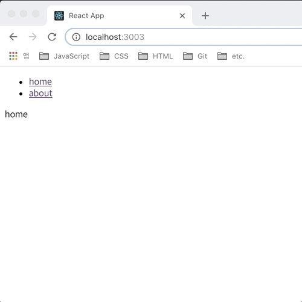
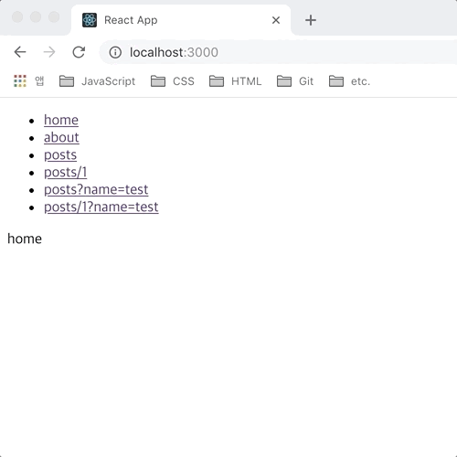
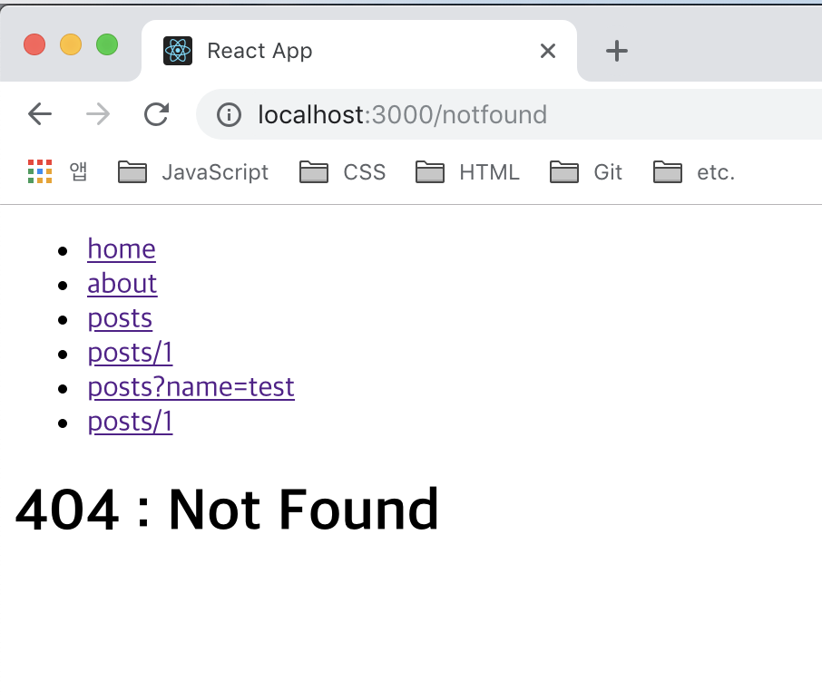
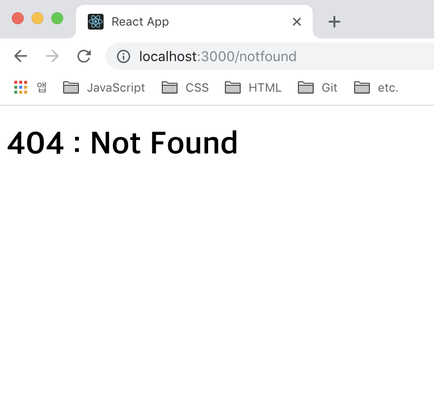
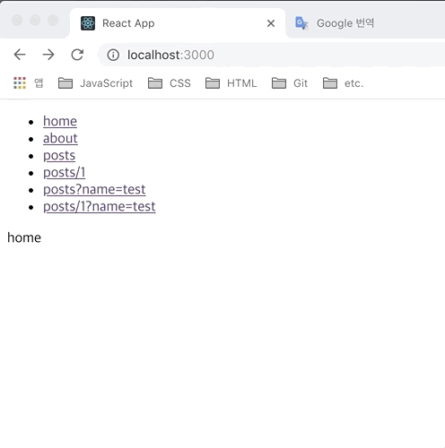

> react 를 활용한 isomorphic SPA 개발에 대한 내용을 정리한 글입니다. 이 전 글에 이어 라우팅 설정 내용을 정리했습니다.

이 전 작업한 글에서 기본적인 Isomorphic SPA 설정은 해주었지만 미처 작업하지 못한 내용들이 많이 있습니다. 그 중에서 저는 라우팅 설정부터 먼저 진행하려고 합니다.

이 후 작업 내용을 보시면 이해하실 수 있으시겠지만 라우팅 설정과 관련된 서드파티 라이브러리를 통해 기본적인 라우팅 설정 및 코드 스플리팅, 비동기 데이터에 대한 정적 데이터 렌더링까지 처리하기 위해서입니다.

React 개발 환경에서 라우팅 설정을 지원해주는 여러가지 라이브러리가 있는데 그 중에서 저는 `react-router-dom`을 활용하도록 하겠습니다.


`react-router-dom`은 `react-router`라는 라이브러리에서 DOM 바인딩과 관련된 라우팅 설정 기능만 간추린 라이브러리로 보시면 될 것 같습니다.

`react-router`는 React 에서 공식적으로 제공하는 라이브러리는 아니지만 이 전부터 React 환경의 SPA 개발 시에 많은 분들이 사용해왔던 라우팅 설정에 필요한 패키지입니다.

버전이 업데이트되면서 `react-router` 내에서 필요한 기능에 따라 `react-router-dom` 뿐만 아니라 `react-router-native`, `react-router-config` 등의 라이브러리가 제공되는데 저는 `react-react-dom`을 활용해보도록 하겠습니다.

`react-react-dom` 대한 자세한 사용법은 해당 [링크](https://reacttraining.com/react-router/web/guides/quick-start)를 통해 살펴보시면 좋을 것 같습니다.

그럼 해당 패키지를 사용하기 위해 설치부터 진행하도록 하겠습니다.

```bash
yarn add --dev react-router-dom
```

## Client Routing

우선 클라이언트 영역의 컴포넌트 라우팅 설정을 위해 기본적인 프로젝트 구조를 살짝 변경하도록 하겠습니다.

우선 클라이언트 영역에서 사용했던 기본 컴포넌트를 렌더링 시 라우팅 정보를 전달받을 수 있도록 `react-router-dom`에서 제공하는 `BrowserRouter` 컴포넌트로 감싸도록 합니다.

- `src/index.js`

```javascript
...
import { BrowserRouter } from 'react-router-dom'

ReactDOM.render(
  <BrowserRouter>
    <App />
  </BrowserRouter>,
  document.getElementById('root')
)
...
```

이후 기존에 사용했던 기본 컴포넌트를 라우팅 처리를 담당하는 메인 컴포넌트로 사용할 수 있도록 수정하도록 하겠습니다.

- `src/App.js`

```javascript
import React, { Component } from 'react'
import { Switch, Route, Link } from 'react-router-dom'
import Home from './components/Home'
import About from './components/About'

class App extends Component {
  render() {
    return (
      <div>
        <ul>
          <li>
            <Link to="/">home</Link>
          </li>
          <li>
            <Link to="/about">about</Link>
          </li>
        </ul>
        <Switch>
          <Route exact path="/" component={Home} />
          <Route path="/about" component={About} />
        </Switch>
      </div>
    )
  }
}

export default App
```

기본 프로젝트 생성 시 만들어진 코드들은 사용하지 않기 때문에 지우도록 하겠습니다. 대신 라우팅 설정을 위한 링크 및 라우팅 정보에 맞게 컴포넌트 렌더링을 처리할 수 있도록 컴포넌트를 수정했습니다.

`Link` 컴포넌트를 통해 링크 클릭 시 `Route` 컴포넌트에서 해당 라우팅 정보를 읽어 `Switch` 영역 내에서 라우팅 정보와 연결된 컴포넌트를 렌더링 할 수 있도록 수정했습니다.

이제 `Route` 컴포넌트에 전달할 `Home`, `About` 컴포넌트를 만들어 주면 될 것 같습니다.

이 후 `src/components` 폴더를 생성하고 해당 경로에 라우팅 주소와 연결할 컴포넌트를 만들도록 하겠습니다.

- `src/components/Home.jsx`

```javascript
import React from 'react'

const Home = () => {
  return <div>home</div>
}

export default Home
```

- `src/components/About.jsx`

```javascript
import React from 'react'

const About = () => {
  return <div>about</div>
}

export default About
```

라우팅을 통해 연결되는 컴포넌트에서 아직까지 특별히 처리해줄 기능은 없기 때문에 기본적인 구조로 생성했습니다.

우선 지금까지 작업한 클라이언트 라우팅 설정이 잘 동작하는지 확인해보기 위해 개발 서버를 실행해도록 하겠습니다.

```bash
yarn start
```



실행 후 화면에서 상딘 링크 클릭 시 라우팅 정보에 맞게 컴포넌트가 정상적으로 렌더링되는 것을 확인하실 수 있으실 겁니다.

### Parameters

라우팅 설정을 통한 페이지 렌더링 시 라우팅 내 매개변수를 활용하여 동일한 컴포넌트에서 여려가지 기능을 처리해 줄 수도 있습니다. 우선 매개변수 처리를 위한 컴포넌트를 생성하고 라우팅 목록에 추가하도록 하겠습니다.

- `src/App.js`

```javascript
import React, { Component } from 'react'
import { Switch, Route, Link } from 'react-router-dom'
import Home from './components/Home'
import About from './components/About'
import Posts from './components/Posts'

class App extends Component {
  render() {
    return (
      <div>
        <ul>
          <li>
            <Link to="/">home</Link>
          </li>
          <li>
            <Link to="/about">about</Link>
          </li>
          <li>
            <Link to="/posts">posts</Link>
          </li>
          <li>
            <Link to="/posts/1">posts/1</Link>
          </li>
          <li>
            <Link to="/posts?name=test">posts?name=test</Link>
          </li>
          <li>
            <Link to="/posts/1?name=test">posts/1</Link>
          </li>
        </ul>
        <Switch>
          <Route exact path="/" component={Home} />
          <Route path="/about" component={About} />
          <Route path="/posts/:id" component={Posts} />
          <Route path="/posts" component={Posts} />
        </Switch>
      </div>
    )
  }
}
```

라우팅 설정 목록에 `/posts` 주소를 활용하는 링크들과 해당 주소를 처리하기 윈한 컴포넌트 영역을 추가했습니다. 첫 번째는 `post/:id` 라는 형식으로 url 매개변수 정보를 받을 수 있도록 하였고, 두 번째는 url 매개변수를 받지 않는 기본 영역을 추가했습니다.

중요한 점은, 같은 url 정보를 가지는 라우팅 컴포넌트들을 여러개 설정할 경우 기본 라우팅 정보를 갖는 컴포넌트를 제일 나중에 설정해줘야 합니다. 라우팅 호출 시 `Switch` 컴포넌트 내에서 라우팅 목록을 순회하면서 라우팅 컴포넌트를 호출하게 되는데 url 매개변수를 갖는 라우팅 정보가 기본 라우팅 컴포넌트에 먼저 접근하게 되면 기본 컴포넌트를 호출하기 때문이죠.

query 매개변수의 경우 이 전에는 `react-router` 내에서 자체적으로 관련 기능을 제공해주었는데, 현재는 관련 기능을 제공하지 않기 때문에 해당 컴포넌트에서 query 매개변수를 확인해주도록 하겠습니다.
저는 query 문자열을 객체로 변경해주는 라이브러리를 사용하도록 하겠습니다.

```bash
yarn add --dev query-string
```

- `src/components/Posts.jsx`

```javascript
import React from 'react'
import queryString from 'query-string'

const Posts = ({ location, match }) => {
  return (
    <div>
      <div>{JSON.stringify(match)}</div>
      <div>{JSON.stringify(queryString.parse(location.search))}</div>
    </div>
  )
}

export default Posts
```

query 매개변수 관련 라이브러리 설치 후, url 매개변수 및 query 매개변수를 확인하기 위한 컴포넌트를 만들었습니다. 어떠한 매개변수들이 호출되는지 확인하기 위한 작업만 간단히 설정해주었습니다.

그럼 지금까지 작업한 내용을 확인해보도록 하겠습니다.



각 링크에 설정된 url, query 매개변수 정보가 어떻게 설정되어 있는지 보여주고 있습니다. 잘 동작하네요!

### 404 Page, Redirect

#### 404


SPA 뿐만 아니라 기본적인 웹 환경에서 사용자는 잘못된 주소를 입력하게 되는 경우가 생깁니다. 보통의 웹사이트에서 이런 경우에는 잘못된 주소로 접근했다는 안내 페이지를 보여주게 됩니다.

현재 프로젝트에서는 잘못된 주소 접근에 대한 별다른 처리를 해주지 않았기 때문에 잘못된 주소 입력 시 아무런 페이지도 호출하지 않습니다. 바꿔 말하면, 어떤 주소를 호출했을 때 해당 주소를 라우팅 목록 내에서 찾을 수 없을 경우 스위칭 영역에서 아무런 컴포넌트도 렌더링 해주지 않기 때문이죠. 이제 해당 라우팅 목록에서 찾을 수 없는 주소가 입력되었을때 특정 페이지로 연결되도록 작업을 진행하도록 하겠습니다.

- `src/App.js`

```javascript
...
import NotFound from './components/NotFound'

class App extends Component {
  render() {
    return (
      <div>
        ...
        <Switch>
          <Route exact path="/" component={Home} />
          <Route path="/about" component={About} />
          <Route path="/posts/:id" component={Posts} />
          <Route path="/posts" component={Posts} />
          <Route path="*" component={NotFound} />
        </Switch>
      </div>
    )
  }
}
```

스위치 영역 맨 하단에 `NotFound` 라는 컴포넌트를 주입받는 라우트 컴포넌트를 추가했습니다. 경로 설정은 모든 주소를 받을 수 있도록 설정했습니다.

이 전에 라우팅 매개변수 설정 시 설명드린대로 스위치 컴포넌트에서는 선언된 순서대로 라우트 컴포넌트에 접근하기 때문에 모든 경로를 전달받는 라우  팅 영역에 대한 컴포넌트는 맨 하단에 설정해줘야 합니다.

최상단에 설정할 경우 모든 경로를 처리해주기 때문에 이 후 설정해 놓은 라우팅 컴포넌트에 접근하지 않게 되겠죠. 요청한 주소가 상단에 설정한 라우팅 컴포넌트에 해당하지 않는 경우, 요청한 주소는 잘못된 주소가 된다고 볼 수 있겠죠.

- `src/component/NotFound.jsx`

```javascript
import React from 'react'

const NotFound = () => {
  return (
    <div>
      <h1>404 : Not Found</h1>
    </div>
  )
}

export default NotFound
```

요청한 주소를 찾을 수 없다는 안내 메시지를 표시하는 컴포넌트를 추가 했습니다. 이제 잘못된 주소를 요청한 후 화면을 확인해 보도록 하겠습니다.



`/notfound` 라는 주소를 호출한 경우 스위치 영역에서 404 페이지 관련 컴포넌트를 렌더링 해주고 있습니다. 의도한대로 정상적으로 동작하지만 상단 링크 영역이 노출되는게 개인적으로 맘이 들지 않네요. 제 개인적인 경험에 의하면 보통의 404 페이지 UI 는 정상적인 페이지에서 공통적으로 사용하는 영역들이 포함되어 있지 않아서요. 404 페이지에 포함된 상단 링크 영역을 제거하고 싶네요.

말이 나온김에, 404 페이지를 포함한 라우팅 컴포넌트에 포함된 상단 네비게이션 링크 영역 분리 및 스위치 영역에 설정된 라우트 컴포넌트 목록도 분리하도록 하겠습니다. 이 후 작업할 코트 스플리팅 및 비동기 데이터 처리를 진행 시 코드 관리를 편하게 하기 위해서이기도 합니다.

- `src/App.js`

```javascript
import React, { Component } from 'react'
import { Switch, Route } from 'react-router-dom'
import routes from './lib/routes'

class App extends Component {
  render() {
    return (
      <div>
        <Switch>
          {routes.map((route, i) => (
            <Route key={i} {...route} />
          ))}
        </Switch>
      </div>
    )
  }
}

export default App
```

메인 컴포넌트에 설정되어 있던 링크 목록 및 라우트 목록을 분리했습니다. 우선 스위치 컴포넌트 내 라우트 컴포넌트를 적접 호출하는 대신 라우팅 목록을 배열에 추가하여 각각의 요소에서 라우트 컴포넌트에 필요한 props 를 주입받도록 수정했습니다. 링크 영역의 경우 라우팅 컴포넌트에서 직접 호출해 주도록 하겠습니다.

- `src/lib/routes.js`

```javascript
import Home from '../components/Home';
import About from '../components/About';
import Posts from '../components/Posts';
import NotFound from '../components/NotFound';

const Routes = [
  {
    path: '/',
    exact: true,
    component: Home
  },
  {
    path: '/about',
    component: About
  },
  {
    path: '/posts/:id',
    component: Posts,
  },
  {
    path: '/posts',
    component: Posts,
  {
    path: '*',
    component: NotFound
  }
];

export default Routes;
```

라우팅 목록 배열을 반환해주는 파일을 추가했습니다. 직접 라우트 컴포넌트 반환하는 대신 라우트 컴포넌트에 전달할 props 객체 리터럴 요소를 갖도록 설정했습니다.

- `src/components/withLayout.jsx`

```javascript
import React, { Component } from 'react'
import { Link } from 'react-router-dom'

const withLayout = Page => {
  return class Layout extends Component {
    render() {
      return (
        <div>
          <ul>
            <li>
              <Link to="/">home</Link>
            </li>
            <li>
              <Link to="/about">about</Link>
            </li>
            <li>
              <Link to="/posts">posts</Link>
            </li>
            <li>
              <Link to="/posts/1">posts/1</Link>
            </li>
            <li>
              <Link to="/posts?name=test">posts?name=test</Link>
            </li>
            <li>
              <Link to="/posts/1?name=test">posts/1?name=test</Link>
            </li>
          </ul>
          <Page {...this.props} />
        </div>
      )
    }
  }
}

export default withLayout
```

라우트 페이지에서 사용할 공통 영역을 갖는 레이아웃 HOC 입니다. 404 페이지를 제외한 라우트 컴포넌트에서 직접 호출해서 사용하면 될 것 같습니다.

- `src/components/Home.jsx`

```javascript
import React, { Component } from 'react'
import withLayout from './withLayout'

const Home = () => {
  return <div>home</div>
}

export default withLayout(Home)
```

레아아웃 HOC 를 통해 컴포넌트 반환하도록 설정했습니다. `About`, `Posts` 컴포넌트도 위와 같이 수정해주시면 됩니다. 수정이 완료되면 앞서 확인했던 `/notfound` 주소를 호출해서 화면을 확인해보도록 하겠습니다.



원하는 대로 공통 영역을 포함하지 않는 404 페이지가 호출되고 있습니다. 공통 영역을 포함하고자 한다면 레아아웃 HOC 를 통해 라우트 컴포넌트를 반환하거나 직접 컴포넌트 내부에 링크를 연결하여 정상적인 페이지로 접근할 수 있도록 하는 것도 하나의 방법이 될 것 같습니다.

#### Redirect


잘못된 링크의 경우, 앞서 구현한 404 페이지를 호출하게 되지만 특정 주소가 호출되었을때 기존 라우트 목록 중 하나로 리디렉션 해주는 것도 하나의 방법이 될 수 있겠죠. 해당 작업을 진행해보도록 하겠습니다.

- `src/lib/routes.js`

```javascript
...
import Redirect from '../components/Redirect';

const Routes = [
  ...
  {
    path: '/post',
    component: Redirect
  },
  {
    path: '*',
    component: NotFound
  }
];
```

라우트 목록 배열에 `Redirect` 컴포넌트 목록을 추가했습니다. 기존에 설정되어 있던 `/posts` 주소대신 `/post` 라는 주소로 접근이 된다면 리디렉션 컴포넌트를 호출하도록 설정했습니다.

- `src/components/Redirect.jsx`

```javascript
import React from 'react'
import { Redirect } from 'react-router-dom'

const RedirectRoute = () => {
  return <Redirect from="/post" to="/posts" />
}

export default RedirectRoute
```

라우트 접근 시 `Redirect` 컴포넌트를 통해 `/post` 로 접근된 주소를 `/posts`로 리디렉션해주도록 하고 있습니다. 현재 링크 설정의 경우 정적으로 구현되어 있지만, 여러 주소에 대한 리디렉션 처리가 필요할 경우 props 를 통해 전달받은 라우팅 정보를 활용해 주면 되겠죠.

이제 `/post` 주소로 접근 시 `/posts`로 페이지가 이동이 되는지 확인해 보도록 하겠습니다.



원하는대로 페이지를 리디렉션 해주고 있네요. 잘못된 주소뿐만 아니라 인증이 필요한 페이지에 경우 인증 정보 유무에 따른 리디렉션 처리도 해줄 수 있게 작업해줄 수 있을 것 같습니다.

## Server Routing

지금까지 클라이언트 영역에서만 라우팅 처리를 했는데, 이제 클라이언트에 설정한 라우팅 정보를 서버에서 활용할 수 있도록 작업을 진행하겠습니다.

## 다음 과제

지금까지 Isomorphic SPA 의 라우팅 구현에 대한 내용을 소개해 드렸습니다. 다음 3 부에서는 코트 스플리팅에 대해 소개하도록 하겠습니다.
