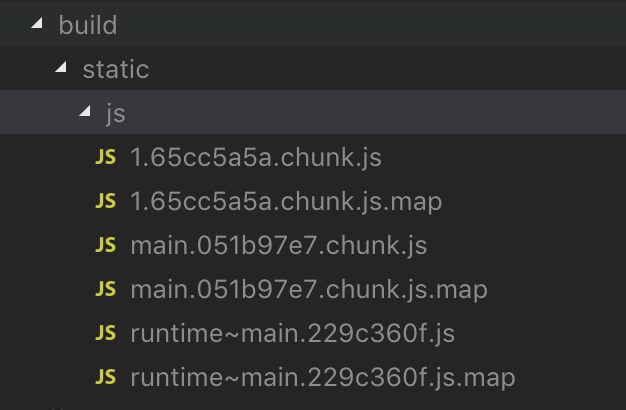
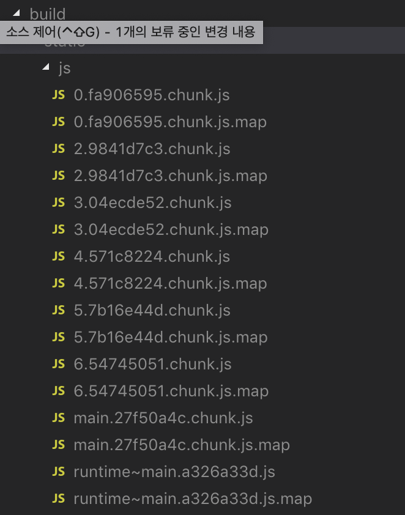

> react 를 활용한 isomorphic SPA 개발에 대한 내용을 정리한 글이다. 이 번 글은 코드 스플리팅에 관한 내용이다. 이 번 포스팅을 포함한 SPA와 관련된 글 내용은 정리하는데 오래 걸리지 않는 내용이지만 다른 프로젝트에 대한 내용을 준비 중이라 글 작성이 늦어지는 것 같다. 최대한 빨리 정리해보도록 하자. 앞서 작성한 글대로 의식의 흐름대로 정리하는 내용이라 부족한 부분도 있을꺼 같은데, 그건 그때 그때 정리하면서 업데이트하려고 한다. 잘 모르는 부분은 모른다고 남겨놓자. 다른 사람에게 설명하기 보다는 스스로의 학습 내용을 정리하는 글이기 때문에 편한 말투로 작성했다.

우선 코드 스플리팅에 대해 간단히 정리하고 넘어가도록 하자. 앞서 설명한 대로 SPA 환경에서 페이지 호출 시 해당 앱과 관련된 모든 리소스를 호출하게 된다. 이는 페이지 호출 시 해당 라우팅과 관련없는 페이지의 리소스도 요청한다는 의미가 된다. 앱 규모가 작으면 상관없겠지만 규모가 큰 앱의 경우 불필요한 리소스 요청으로 인해 페이지 로딩 속도에 영향을 줄 수 있다. 코드 스플리팅은 페이지 요청 시 사용자가 요청한 라우팅 페이지와 관련된 코드만 분리해서 요청하도록 하는 방법으로 이해하면 될 것 같다.

해당 기법의 경우 특정 라이브러리의 도움 없이 구현이 가능하지만 관련 라이브러리를 활용하도록 하자. React 개발 환경에서 코드 스플리팅을 지원해주는 여러가지 라이브러리가 있는데 그 중에서 `react-loadable`을 활용했다. 사실 직접 구현이 가능하다면 라이브러리를 사용하지 않고 직접 구현하는게 여러모로 개발 경험을 키우는데 도움이 된다고 생각하기 때문에 나중에 꼭 시간을 내서 기본 원리를 완벽히 이해한 후, 관련 내용을 정리해보자. 이 번 글은 직접 구현한 내용을 정리하기 전까지는 코드 스플리팅 구현을 도와주는 `react-loadable` 라이브러리 설멍 및 사용법을 안내하는 글이 될 것 같다

## react-loadable


`react-loadable` 은 앞서 설명한 코드 스플리팅 구현을 쉽게 도와주는 라이브러리라고 보면 된다. 컴포넌트 및 라우터 기반의 스플리팅을 제공하며 클라이언트 및 서버 사이드 렌더링 환경에 대한 구현 기능도 제공한다. 이 외에도 아직 파악하지 못한 코드 스플리팅과 관련된 기능들을 많이 제공해준다. 자세한 사용법은 해당 라이브러리의 [문서](https://github.com/jamiebuilds/react-loadable)를 확인해보고 익힐 수 있도록 하자.

이 글에서는 기본적인 코드 스플리팅 구현에 대한 내용만 정리하고자 한다. 우선 클라이언트 영역 내 코드 스플리팅 방법에 대해 알아보자.

## Client

- `src/lib/routes.js`

```javascript
import React from 'react'
import Loadable from 'react-loadable'

const loading = () => {
  return <div>loading...</div>
}

const Routes = [
  {
    path: '/',
    exact: true,
    component: Loadable({
      loader: () => import('../components/Home'),
      loading,
    }),
  },
  {
    path: '/about',
    component: Loadable({
      loader: () => import('../components/About'),
      loading,
    }),
  },
  {
    path: '/posts/:id',
    component: Loadable({
      loader: () => import('../components/Posts'),
      loading,
    }),
  },
  {
    path: '/posts',
    component: Loadable({
      loader: () => import('../components/Posts'),
      loading,
    }),
  },
  {
    path: '/post',
    component: Loadable({
      loader: () => import('../components/Redirect'),
      loading,
    }),
  },
  {
    path: '*',
    component: Loadable({
      loader: () => import('../components/NotFound'),
      loading,
    }),
  },
]

export default Routes
```

우선 라우팅 컴포넌트를 호출하는 코드를 수정하자. 기존에는 기본적인 import 문법으로 컴포넌트를 호출하여 `react-router-dom` 에서 제공하는 `Route` 컴포넌트의 매개변수로 컴포넌트를 넘겨주었다. 코드 스플리팅 적용을 위해 `react-loadable` 라이브러리를 `Loadable`이라는 이름으로 설정한 뒤, 함수 호출 형식으로 `Route` 컴포넌트에 반환 값을 넘겨주도록 했다. 함수 인자로는 es6 문법에서 제공되는 dynamic import 구문을 통해 라우팅 정보에 맞는 컴포넌트 및 import 되기 전, 로딩 시점의 컴포넌트를 적용하도록 설정했다.

사실 클라이언트 영역에서의 코트 스플리팅 설정을 모두 완료했다. 정말 간단하게 설정을 완료했다. 앞서 다짐한대로 라이브러리를 사용하지 않고 직접 구현한 뒤 관련 내용을 나중에 정리할 수 있도록 해보자. 그럼 구현을 완료했으니 실행 결과를 확인해보자.

- 코드 스플리팅 적용 전

적용 전 페이지 요청 시 리소스 요청 내용을 확인해보자. 코드 스플리팅과 관련된 JS 파일에 대한 요청 목록만 확인해 보도록 했다. 그리고 페이지 요청 시 캐시 정보를 제거한 뒤 호출하도록 했다.


최초 페이지 호출 시 모든 컴포넌트의 리소스를 가져오기 때문에 페이지 호출 뒤 다른 페이지로 이동하더라도 이동한 주소와 관련된 추가적인 리소스를 호출해 주지 않고 있다.

뭐 당연한 얘기지만 클라이언트 환경에서 실제 페이지를 이동하기 위해 서버에 라우팅 정보를 호출해주지 않기 때문에 추가 리소스를 호출하지 않는게 지극히 당연한 결과이다.

다만 현재 구현해 놓은 SPA의 경우 전체 리소스 크기가 많지 않아 성능상 문제가 일어나지 않겠지만 앱 구조가 커지고 라우팅 영역이 늘어나며, 그에 따른 css, 이미지 파일 등 UI와 관련된 리소스를 최초 페이지 접근 시 전부 가져오게 된다면 페이지 로딩 속도에 영향을 줄 수 있게 된다.



`build` 명령 실행 후 번들링 된 js 파일 목록이다. CRA 환경의 webpack 환경에서는 라우팅에 필요한 컴포넌트를 하나의 chunk 파일에 번들링하게 된다. `[id].[chunkHasn].chunk.js`의 이름을 갖는 chunk 파일에 컴포넌트와 관련된 리소스를 번들링하게 된다.

기본적인 webpack 환경에서도 코드 스플리팅 기능을 제공하지만 이와 관련된 부분은 나중에 정리하도록 하자. 그리고 chunk 파일 생성 규칙 뿐만 아니라 CRA 내 webpack 설정도 수정 가능하지만 프로젝트를 `eject` 하거나 `react-app-rewired`를 활용해야 하기 때문에 이와 관련된 내용은 따로 포스팅하도록 하겠다.

생성된 chunk 파일은 브라우저에서 호출 시 빌드 시 설정도니 호출 규칙에 의해 매칭되는 부분으로 확인되는데 이 부분은 조금 헷갈린다. 좀 더 확실히 이해한 후 관련 내용 정리하도록 자

- 코드 스플리팅 적용 후




페이지 로딩 시 화면 우측

### 나중에 정리할 일

- `src/index.js`

```javascript
import React from 'react'
import ReactDOM from 'react-dom'
import App from './App'
import * as serviceWorker from './serviceWorker'
import { BrowserRouter } from 'react-router-dom'
import Loadable from 'react-loadable'

Loadable.preloadReady().then(() => {
  ReactDOM.render(
    <BrowserRouter>
      <App />
    </BrowserRouter>,
    document.getElementById('root')
  )
})
```

`react-lo` 우선 `src/index.js`

## Server

### 나중에 정리할 일

## 다음 과제

지금까지 Isomorphic SPA 의 코트 스플리팅 구현에 대한 내용을 정리했다. 다음은 비동기 데이터에 대한 SSR설정에 대해 정리해 보도록 하자.
