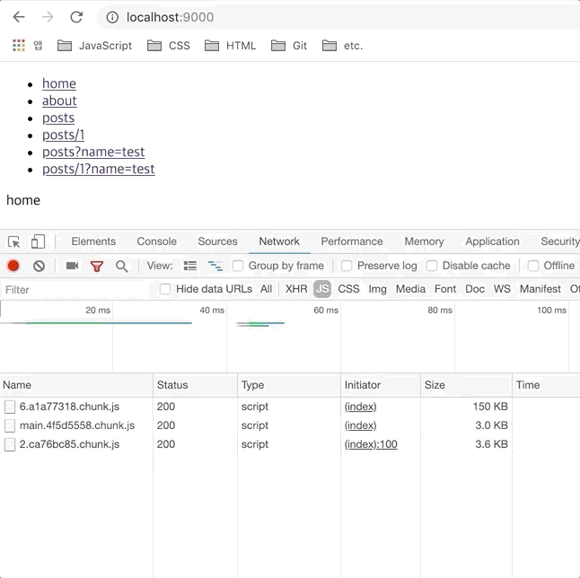
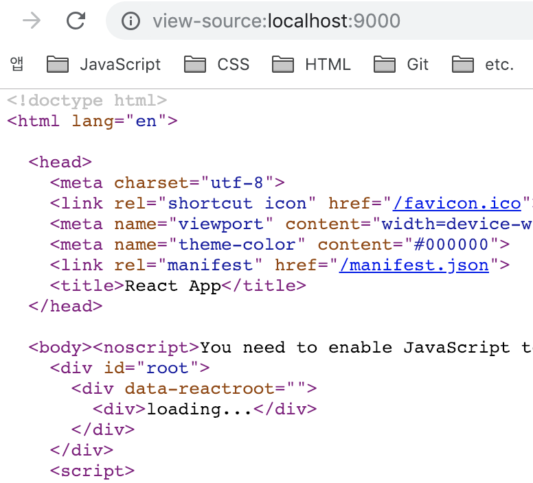
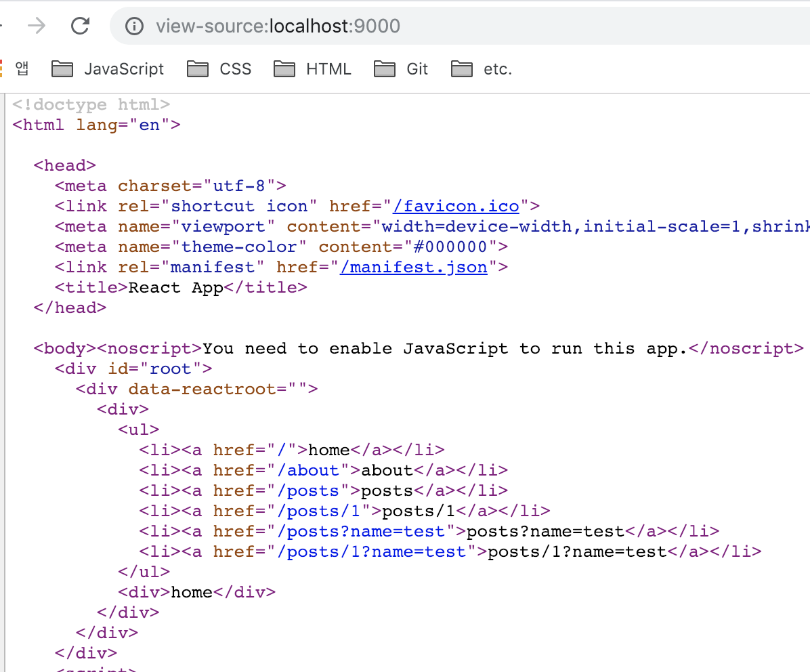
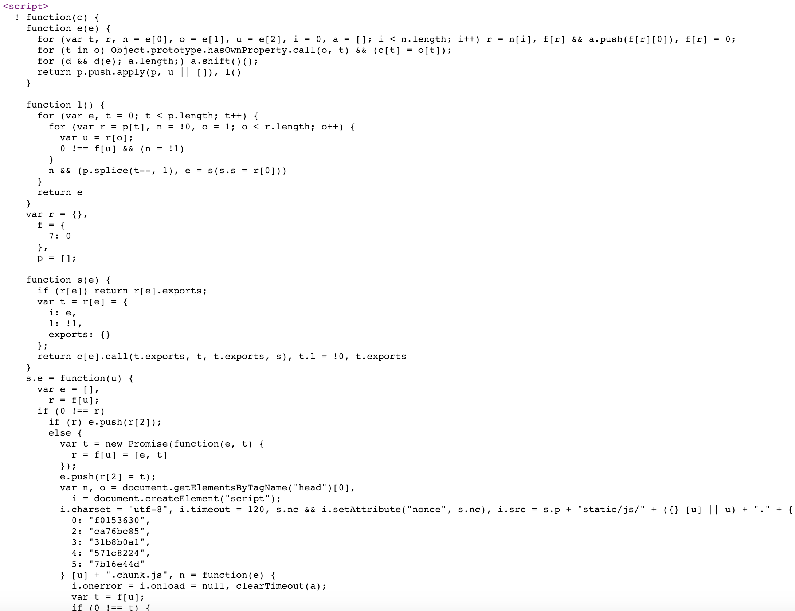
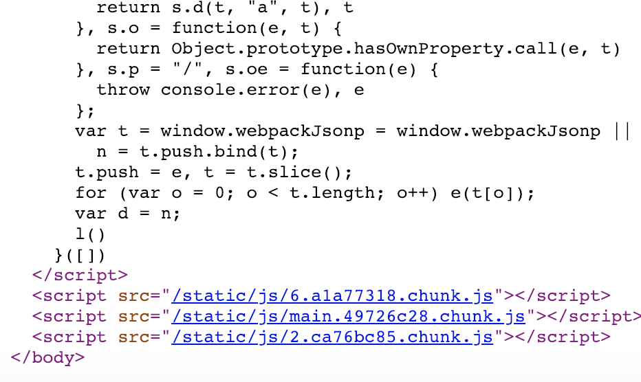

> react 를 활용한 isomorphic SPA 개발에 대한 내용을 정리한 글이다. 이 번 글은 코드 스플리팅에 관한 내용이다. 이 번 포스팅을 포함한 SPA와 관련된 글 내용은 정리하는데 오래 걸리지 않는 내용이지만 다른 프로젝트에 대한 내용을 준비 중이라 글 작성이 늦어지는 것 같다. 최대한 빨리 정리해보도록 하자. 앞서 작성한 글대로 의식의 흐름대로 정리하는 내용이라 부족한 부분도 있을꺼 같은데, 그건 그때 그때 정리하면서 업데이트하려고 한다. 잘 모르는 부분은 모른다고 남겨놓자. 다른 사람에게 설명하기 보다는 스스로의 학습 내용을 정리하는 글이기 때문에 편한 말투로 작성했다.

우선 코드 스플리팅에 대해 간단히 정리하고 넘어가도록 하자. 앞서 설명한 대로 SPA 환경에서 페이지 호출 시 해당 앱과 관련된 모든 리소스를 호출하게 된다. 이는 페이지 호출 시 해당 라우팅과 관련없는 페이지의 리소스도 요청한다는 의미가 된다. 앱 규모가 작으면 상관없겠지만 규모가 큰 앱의 경우 불필요한 리소스 요청으로 인해 페이지 로딩 속도에 영향을 줄 수 있다. 코드 스플리팅은 페이지 요청 시 사용자가 요청한 라우팅 페이지와 관련된 코드만 분리해서 요청하도록 하는 방법으로 이해하면 될 것 같다.

해당 기법의 경우 특정 라이브러리의 도움 없이 구현이 가능하지만 관련 라이브러리를 활용하도록 하자. React 개발 환경에서 코드 스플리팅을 지원해주는 여러가지 라이브러리가 있는데 그 중에서 `react-loadable`을 활용했다. 사실 직접 구현이 가능하다면 라이브러리를 사용하지 않고 직접 구현하는게 여러모로 개발 경험을 키우는데 도움이 된다고 생각하기 때문에 나중에 꼭 시간을 내서 기본 원리를 완벽히 이해한 후, 관련 내용을 정리해보자. 이 번 글은 직접 구현한 내용을 정리하기 전까지는 코드 스플리팅 구현을 도와주는 `react-loadable` 라이브러리 설멍 및 사용법을 안내하는 글이 될 것 같다

## react-loadable


`react-loadable` 은 앞서 설명한 코드 스플리팅 구현을 쉽게 도와주는 라이브러리라고 보면 된다. 컴포넌트 및 라우터 기반의 스플리팅을 제공하며 클라이언트 및 서버 사이드 렌더링 환경에 대한 구현 기능도 제공한다. 이 외에도 아직 파악하지 못한 코드 스플리팅과 관련된 기능들을 많이 제공해준다. 자세한 사용법은 해당 라이브러리의 [문서](https://github.com/jamiebuilds/react-loadable)를 확인해보고 익힐 수 있도록 하자.

이 글에서는 기본적인 코드 스플리팅 구현에 대한 내용만 정리하고자 한다. 우선 클라이언트 영역 내 코드 스플리팅 방법에 대해 알아보자.

## Client

- `src/lib/routes.js`

```javascript
import React from 'react'
import Loadable from 'react-loadable'

const loading = () => {
  return <div>loading...</div>
}

const Routes = [
  {
    path: '/',
    exact: true,
    component: Loadable({
      loader: () => import('../components/Home'),
      loading,
    }),
  },
  {
    path: '/about',
    component: Loadable({
      loader: () => import('../components/About'),
      loading,
    }),
  },
  {
    path: '/posts/:id',
    component: Loadable({
      loader: () => import('../components/Posts'),
      loading,
    }),
  },
  {
    path: '/posts',
    component: Loadable({
      loader: () => import('../components/Posts'),
      loading,
    }),
  },
  {
    path: '/post',
    component: Loadable({
      loader: () => import('../components/Redirect'),
      loading,
    }),
  },
  {
    path: '*',
    component: Loadable({
      loader: () => import('../components/NotFound'),
      loading,
    }),
  },
]

export default Routes
```

우선 라우팅 컴포넌트를 호출하는 코드를 수정하자. 기존에는 기본적인 import 문법으로 컴포넌트를 호출하여 `react-router-dom` 에서 제공하는 `Route` 컴포넌트의 매개변수로 컴포넌트를 넘겨주었다. 코드 스플리팅 적용을 위해 `react-loadable` 라이브러리를 `Loadable`이라는 이름으로 설정한 뒤, 함수 호출 형식으로 `Route` 컴포넌트에 반환 값을 넘겨주도록 했다. 함수 인자로는 es6 문법에서 제공되는 dynamic import 구문을 통해 라우팅 정보에 맞는 컴포넌트 및 import 되기 전, 로딩 시점의 컴포넌트를 적용하도록 설정했다.

사실 클라이언트 영역에서의 코트 스플리팅 설정을 모두 완료했다. 정말 간단하게 설정을 완료했다. 앞서 다짐한대로 라이브러리를 사용하지 않고 직접 구현한 뒤 관련 내용을 나중에 정리할 수 있도록 해보자. 그럼 구현을 완료했으니 실행 결과를 확인해보자.

- 코드 스플리팅 적용 전

적용 전 페이지 요청 시 리소스 요청 내용을 확인해보자. 코드 스플리팅과 관련된 JS 파일에 대한 요청 목록만 확인해 보도록 했다. 그리고 페이지 요청 시 캐시 정보를 제거한 뒤 호출하도록 했다.


최초 페이지 호출 시 모든 컴포넌트의 리소스를 가져오기 때문에 페이지 호출 뒤 다른 페이지로 이동하더라도 이동한 주소와 관련된 추가적인 리소스를 호출해 주지 않고 있다.

뭐 당연한 얘기지만 클라이언트 환경에서 실제 페이지를 이동하기 위해 서버에 라우팅 정보를 호출해주지 않기 때문에 추가 리소스를 호출하지 않는게 지극히 당연한 결과이다.

다만 현재 구현해 놓은 SPA의 경우 전체 리소스 크기가 많지 않아 성능상 문제가 일어나지 않겠지만 앱 구조가 커지고 라우팅 영역이 늘어나며, 그에 따른 css, 이미지 파일 등 UI와 관련된 리소스를 최초 페이지 접근 시 전부 가져오게 된다면 페이지 로딩 속도에 영향을 줄 수 있게 된다.


`build` 명령 실행 후 번들링 된 js 파일 목록이다. CRA 환경의 webpack 환경에서는 라우팅에 필요한 컴포넌트를 하나의 chunk 파일에 번들링하게 된다. `[id].[chunkHasn].chunk.js`의 이름을 갖는 chunk 파일에 컴포넌트와 관련된 리소스를 번들링하게 된다.

기본적인 webpack 환경에서도 코드 스플리팅 기능을 제공하지만 이와 관련된 부분은 나중에 정리하도록 하자. 그리고 chunk 파일 생성 규칙 뿐만 아니라 CRA 내 webpack 설정도 수정 가능하지만 프로젝트를 `eject` 하거나 `react-app-rewired`를 활용해야 하기 때문에 이와 관련된 내용은 따로 포스팅하도록 하자.

생성된 chunk 파일은 브라우저에서 호출 시 빌드 시 설정도니 호출 규칙에 의해 매칭되는 부분으로 확인되는데 이 부분은 조금 헷갈린다. 좀 더 확실히 이해한 후 관련 내용 정리해보자.

- 코드 스플리팅 적용 후


최초 페이지 로딩 후 다른 페이지 호출 시 해당 라우팅 영역에 대한 컴포넌트 리소스를 호출해주고 있다. 최초 호출하는 번들링 파일의 용량도 살짝 줄어든 것을 확인할 수 있다.


빌드된 js 파일을 확인해보니 이 전과 다르게 번들링된 파일 개수가 늘어난 것을 확인할 수 있다. 각 라우팅 영역별로 코드 스플리팅이 이루어진 것을 확인할 수 있다. 현재 테스트하는 앱의 크기가 크지 않아 현재로서는 코드 스플리팅에 대한 이점을 느끼지 못하지만 앱 규모가 커지고 라우팅 영역이 늘어날 경우 큰 이점을 느낄 수 있을 것이라 생각한다.

## Server

이제 서버 측 코드 스플리팅을 설정해보자. 서버 측도 어렵지 않게 설정할 수 있다. 우선 서버에서 코드 스플리팅을 도와줄 수 있도록 해주는 babel 플러그인을 설정하자.

- `babel.config.js`

```javascript
module.exports = function(api) {
  api.cache(true)
  const presets = ['@babel/preset-env', '@babel/preset-react']
  const plugins = [
    '@babel/plugin-transform-runtime',
    '@babel/plugin-proposal-class-properties',
    'babel-plugin-inline-svg',
    [
      'babel-plugin-transform-require-ignore',
      {
        extensions: ['.css'],
      },
    ],
    '@babel/syntax-dynamic-import',
    'dynamic-import-node',
    'react-loadable/babel',
  ]

  return {
    presets,
    plugins,
  }
}
```

서버 환경에서는 동적 import 구문이 허용되지 않기 때문에 해당 구문을 처리해줄 수 있도록 `babel` 플러그인과 코드 스플리팅 설정을 위해 `react-loadable/babel` 플러그인을 추가했다.

- `server/index.js`

```javascript
const express = require('express');
const fs = require('fs');
const pretty = require('pretty');
const renderer = require('../build.server/lib/renderer');
const Loadable = require('react-loadable');

...

Loadable.preloadAll().then(() => {
  app.listen(PORT, console.log(`App listening on port ${PORT}!`));
});
```

`react-loadable` 라이브러리를 추가한 뒤 서버 실행 시 동적으로 추가되는 컴포넌트 영역을 감지하기 위해 `preloadAll` promise 를 거친 후 서버를 실행하도록 설정했다.

서버 측 코드 스플리팅 설정도 완료했다. 제일 기본적인 설정만 해준 상태이며 경우에 따라 추가적인 설정이 필요한데 이 부분은 뒤에 정리하자. 우선 설정이 완료되었으니 결과를 확인해보자.

- 코드 스플리팅 적용 전



우선 클라이언트 영역에서만 코드 스플리팅이 적용된 환경에서 서버 실행 결과를 확인했다. 보이는대로 따로 서버 측 설정을 하지 않아도 정상적으로 코드 스플리팅이 적용된 것 같다.



페이지 소스를 확인해보니 서버에서 로딩 시점에서의 페이지 정보를 넘겨주고 있다. 서버 측 코드 스플리팅 설정을 하지 않아 동적으로 import되는 컴포넌트 정보를 확인하지 못하게 된다.

- 코드 스플리팅 적용 후



서버 측 설정을 마친 후 다시 확인해 보니 정상적인 렌더링 정보를 서버에서 넘겨주고 있다.



서버측 영역에서 라우팅 별 모듈이 실제 번들링 파일과 맵핑되는 과정을 좀 더 확인해보자. 우선 코드 스플리팅 설정과 상관없이 클라이언트 영역에서 라우팅을 설정할 경우 빌드 시점에서 `index.html` 파일 내부에 라우팅 영역에 해당하는 모듈로 번들링 파일을 매핑해주는 코드가 들어가게 된다. 위에 보이는 것처림 페이지 소소를 통하거나 빌드한 디렉토리의 `index.html` 파일을 보면 확인할 수 있다.

바꿔 생각하면 서버 영역에서 페이지 호출 시 해당 코드를 통해 각 라우팅 정보에 맞는 번들링 파일을 비동기적으로 호출한다고 볼 수 있다. 그럼 서버 측에서 페이지 호출 시점에 동기적으로 요총헌 패아자의 번들 파일을 확인하려면 어떻게 해야 할까? 그 방법을 확인해 보자

### 어떤 모듈이 로드되고 있는지 선언하기

우선 클라이언트에서 라우팅 호출 시 어떤 컴포넌트가 호출되는지 서버 측에 전달해줘야 한다.

```javascript
...
{
  path: '/',
  exact: true,
  component: Loadable({
    loader: () => import('../components/Home'),
    modules: ['../components/Home'],
    webpack: () => [require.resolveWeak('../components/Home')],
    loading,
  }),
},
...
```

위와 같이 `Loadable` 함수 호출 시 인자값에 로드하려는 컴포넌트 정보를 설정해 주는 두 가지 옵션 opts.modules 및 opts.webpack이 있다. 그러니 실제로 위와 같이 작업하지 않았다. 왜냐하면 위와 같은 설정은 `react-loadable`애서 제공하는 `babel` 플러그인에 포함되어 있다.

```json
{
  "plugins": ["react-loadable/babel"]
}
```

위와 같이 `babel` 플러그인만 설정해주면 된다. 같은 설정을 `babel.config.js`에 추가해 주었기 때문에 각 모듈에 맞는 정보를 서버에서 확인할 수 있다.

### 어떤 동적 모듈이 렌더링되었는지 찾아내기

다음으로 서버 요청이 들어올 때 실제로 렌더링 된 모듈을 찾는 방법이다. 이를 위해 라우팅 호출 시 렌더링된 모듈을 수집할 수 있도록 `Loadable.Capture` 컴포넌트를 활용한다

```javascript
import Loadable from 'react-loadable';

const renderer = async ({ req, html }) => {
  ...
  let modules = [];

  const app = renderToString(
    <Loadable.Capture report={moduleName => modules.push(moduleName)}>
      <StaticRouter location={req.url} context={context}>
        <App />
      </StaticRouter>
    </Loadable.Capture>
  );

  console.log(modules)
  ...
};
```

위와 같이 `Loadable.Capture` 컴포넌트를 `StaticRouter` 컴포넌트 위에 랩핑하도록 하자. props에는 현재 라우팅에 대한 모듈명을 추가해주는 콜백함수를 넘겨주었다. 서버를 실행 후 페이지 접근 시 해당 모듈명을 확인 할 수 있다. 기본 경로를 확인할 경우 `['../components/Home']` 이 콘솔에 출력되는 것을 확인할 수 있다.

### 로드된 모듈을 번들 파일에 매핑 시키기

위 작업을 선행해야 앞서 설명한대로 서버 호출 시 동기적으로 번들 파일을 페이지에서 호출해 줄 수 있다. 이 부분은 webpack 플러그인 설정이 필요한 부분이라 `react-app-rewired` 라이브러리를 활용해보자.

```bash
yarn add --dev react-app-rewired
```

해당 패키지는 CRA 프로젝트를 eject 하지 않고 webpack 설정을 수정할 수 있도록 도와주는 라이브러리이다. 해당 라이브러리를 설치한 후 `package.json`의 명령어 부분을 수정해 주자. 그리고 root 영역에 `config-overrides.js` 를 만들어준다.

- `package.json`

```json
{
  // ...
  "scripts": {
    "start": "react-app-rewired start",
    "build": "react-app-rewired build",
    "build:serve": "babel src --out-dir build.server --copy-files",
    "test": "react-app-rewired test",
    "eject": "react-app-rewired eject",
    "serve": "yarn build && yarn build:serve && cross-env PORT=9000 nodemon server/index.js"
  }
  // ...
}
```

- `config-overrides.js`

```javascript
const { ReactLoadablePlugin } = require('react-loadable/webpack')

module.exports = function override(config, env) {
  //do stuff with the webpack config...

  config.plugins = [
    ...config.plugins,
    new ReactLoadablePlugin({
      filename: './build/react-loadable.json',
    }),
  ]

  return config
}
```

`ReactLoadablePlugin`을 webpack 플러그인 설정에 추가한 뒤, webpack에서 제공되는 번들 정보를 저장할 수 있는 json 파일를 만들어 주도록 설정해 주었다.

- `src/lib/renderer.js`

```javascript
import Loadable from 'react-loadable'
import { getBundles } from 'react-loadable/webpack'
import stats from '../../build/react-loadable.json'

app.get('/', (req, res) => {
  // ...
  let modules = []

  const app = renderToString(
    <Loadable.Capture report={moduleName => modules.push(moduleName)}>
      <StaticRouter location={req.url} context={context}>
        <App />
      </StaticRouter>
    </Loadable.Capture>
  )

  let bundles = getBundles(stats, modules)

  // ...
})
```

이 후 렌더링 시 webpack 플러그인을 통해 생성한 번들 정보를 가지는 파일과 `react-lodable`에서 제공하는 `getBundle` 함수를 활용해 라우팅 영역의 해당하는 번들 파일과 메인 번들 파일 목록을 가져온다.

이제 가져온 번들 목록을 `<script/>` 태그로 렌더링 해주자.

- `src/lib/renderer.js`

```javascript
const renderer = async ({ req, html }) => {
  // ...
  return {
    html: html
      .replace('<div id="root"></div>', `<div id="root">${app}</div>`)
      .replace(
        '</body>',
        `${bundles
          .filter(bundle => !bundle.file.includes('.map'))
          .map(bundle => `<script src="${bundle.publicPath}"></script>`)
          .join('\n')}
        </body>`
      ),
    context,
  }
}
```

`</body>` 문자열을 찾은 후, 그 앞에 번들 파일을 추가해주도록 한다. 가져온 번들 파일에는 소스맵 관련 파일도 들어가 있기 때문에 소스맵 파일을 제외한 번들 파일만 렌더링하도록 했다. 수정을 완료 했으니 결과를 확인해보자.



메인 번들 파일 뒤에 요청한 페이지에 대한 번들 파일 경로가 추가된 것을 확인할 수 있다.

## 다음 과제

지금까지 Isomorphic SPA 의 코트 스플리팅 구현에 대한 내용을 정리했다. 다음은 비동기 데이터에 대한 SSR 설정에 대해 정리해 보도록 하자.
