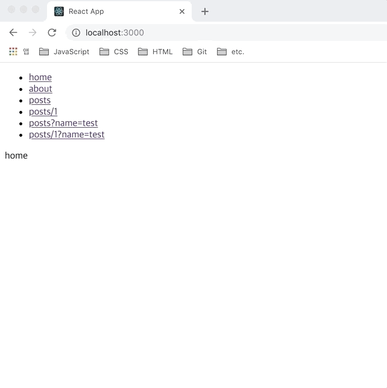
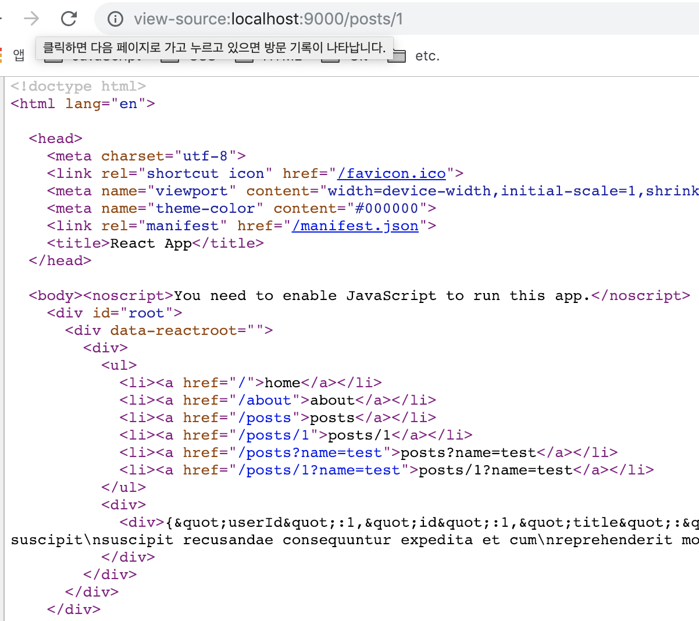
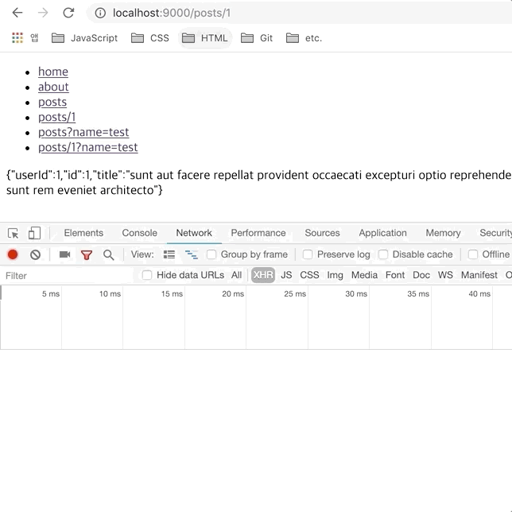
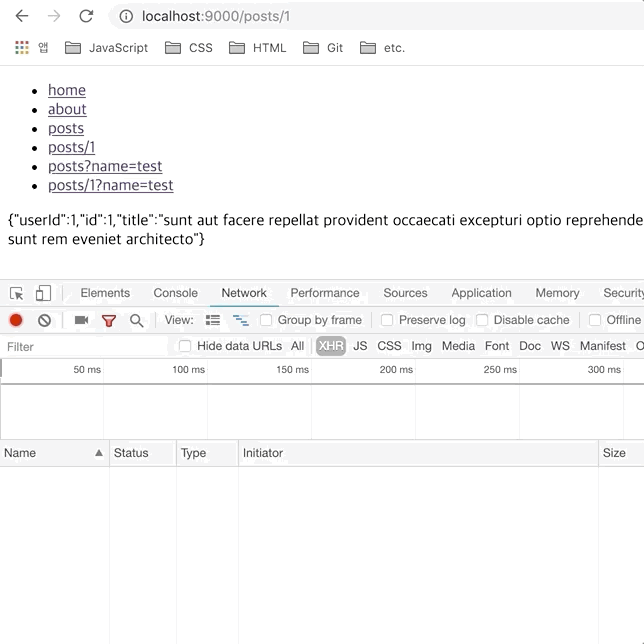

> 이번 파트는 비동기 데이터 요청에 대한 SSR 설정에 대한 내용을 정리했다. SPA 환경에서 비동기로 응답받은 데이터를 서버와 클라이언트 영역에서 어떻게 처리했는지에 대한 내용을 정리했다. 이번 글 역시 스스로의 학습 내용을 정리하는 글이기 때문에 편한 말투로 작성했다.

## AJAX

우선 프론트엔드 영역에서의 비동기 처리를 통한 데이터의 활용은 매우 중요한 영역이 되었다. 흔히 `AJAX(Asynchronous JavaScript And XML)`로 표현되며 사전적 의미로는 비동기 자바스크립트와 XML을 말한다. 간단히 요약하자면 서버와 통신하기 위해 `XMLHttpRequest`객체를 사용하는 것을 말하며 JSON, XML, HTML, 일반 텍스트 형식 등을 포함한 다양한 포맷을 주고 받을 수 있다.

무엇보다 가장 중요한 장점은 페이지 전체를 새로고침하지 않고서도 수행 되는 **비동기성**이다. 이 기능을 통해 서버 렌더링을 거치지 않고 클라이언트 렌더링을 통해 데이터를 전달받고 화면의 일부 영역을 새로 구성할 수 있으며 이는 프론트엔드의 개발에 있어 매우 중요한 기능이라 할 수 있다.

이렇게 비동기로 요청하고 응답받은 데이터를 SPA 환경의 프로젝트에서 어떻게 활용할 수 있는지 정리했다.

## Client

우선 비동기 통신을 위한 라이브러리 설치 및 비동기 요청을 처리하기 위한 파일을 하나 만들자. 이 파일은 클라이언트뿐만 아니라 서버 실행 시에도 사용하게 된다.

```bash
yarn add --dev axios
```

비동기 통신과 관련하여 `axios`라는 라이브러러를 사용했다. 앞서 언급한 `XMLHttpRequest`를 활용하거나 `Fetch API`를 사용하여 비동기 통신을 처리해줘도 되지만 이를 좀 더 쉽게 활용하기 위해 라이브러리의 도움을 받기로 했다.

- `src/lib/loadData.js`

```javascript
import axios from 'axios'

export default async path => {
  const res = await axios.get(`https://jsonplaceholder.typicode.com${path}`)
  return res.data
}
```

`lib` 폴더에 `loadData.js`라는 파일을 만들고 비동기 요청을 위한 함수를 만들었다. 해당 함수는 비동기 요청에 필요한 api 주소의 일부를 인수로 전달받은 후 GET 방식을 통한 응답 데이터를 반환하게 된다. 비동기 처리방식이기 때문에 `async` 함수로 구현되어 있다. 비동기 통신의 경우 예외처리를 위해 `try/catch`을 활용해주는 경우도 있지만 이 번 예제에서는 따로 처리하지 않았다.

- `src/components/Posts.jsx`

```javascript
import React, { Component } from 'react'
import withLayout from './withLayout'
import loadData from '../lib/loadData'

class Posts extends Component {
  state = {
    data: null,
  }

  async componentDidMount() {
    const { url } = this.props.match
    const data = await loadData(url)

    this.setState({
      data,
    })
  }

  render() {
    const { data } = this.state

    return <div>{JSON.stringify(data)}</div>
  }
}

export default withLayout(Posts)
```

비동기 통신 함수를 사용하기 위해 `Posts.jsx` 파일을 수정했다. 우선 이 전에 라우터 매개변수를 확인하기 위한 코드는 지운 후 `componentDidMount` 함수 호출 시 `loadData` 함수를 호출하도록 수정했다. 비동기로 응답받은 데이터는 `state`에 설정한뒤 `render` 함수 호출 시 해당 데이터를 화면에 그려주도록 수정했다.

클라이언트 영역의 비동기 데이터 처리는 이 정도면 완료된 것 같다. 개발 서버를 실행한 후 화면을 확인해보자.



페이지 이동 시 전달받은 url를 바탕으로 비동기로 전달받은 데이터를 화면에 그려준다. 클라이언트 환경에서의 비동기 통신은 완료되었으니 서버 환경에서의 비동기 통신 방법에 대해 확인해보자.

## Server

앞서 구현한 `loadData` 함수를 서버측에서 실행하기 위해 `routes.js` 파일의 코드를 수정한다.

- `src/lib/routes.js`

```javascript
// ...
import loadData from './loadData'

const Routes = [
  // ...
  {
    path: '/posts/:id',
    component: Loadable({
      loader: () => import('../components/Posts'),
      loading,
    }),
    loadData: async path => await loadData(path),
  },
  {
    path: '/posts',
    component: Loadable({
      loader: () => import('../components/Posts'),
      loading,
    }),
    loadData: async path => await loadData(path),
  },
  // ...
]
```

`Posts` 컴포넌트를 전달받는 `Route` 컴포넌트에 `loadData` 함수를 props로 추가했다. 서버 환경에서 `renderer` 함수 호출 시 현재 라우터 목록에서 `loadData` 함수를 props 전달받는 페이지를 찾은 후 해당 컴포넌트로 데이터를 전달할 수 있도록 하기 위함이다.

직접 서버 환경에서 url에 따라 비동기 통신을 해줘도 되지만 그럴 경우 서버측의 관리 포인트가 늘어난 불필요한 작업이 될 수도 있기 때문에 `routes.js` 파일을 활용할 수 있도록 했다.

- `src/lib/renderer.js`

```javascript
// ...
import { StaticRouter, matchPath } from 'react-router-dom'
import routes from './routes'

const renderer = async ({ req, html }) => {
  const currentRoute = routes.find(route => matchPath(req.url, route)) || {}
  const data = currentRoute.loadData
    ? await currentRoute.loadData(req.url)
    : await Promise.resolve(null)

  const context = { data }
  let modules = []

  const app = renderToString(
    <Loadable.Capture report={moduleName => modules.push(moduleName)}>
      <StaticRouter location={req.url} context={context}>
        <App />
      </StaticRouter>
    </Loadable.Capture>
  )

  let bundles = getBundles(stats, modules)

  return {
    html: html
      .replace('<div id="root"></div>', `<div id="root">${app}</div>`)
      .replace(
        '</body>',
        `${bundles
          .filter(bundle => !bundle.file.includes('.map'))
          .map(bundle => `<script src="${bundle.publicPath}"></script>`)
          .join('\n')}
        </body>`
      ),
    context,
  }
}
```

요청받은 url에 매치되는 컴포넌트를 찾을 수 있도록 `react-router-dom`에서 제공하는 `matchPath` 함수를 추가했다. 그리고 라우터 목록을 확인하기 위해 `routes.js`를 가져오도록 했다.

이 후 `renderer` 함수 호출 시 요청받은 url과 라우터 목록을 통해 현재 페이지에 전달할 비동기 데이터를 가져오도록 설정했다. 응답받은 데이터는 `context` 객체의 프로퍼티로 추가한 뒤 `StaticRouter`의 props로 전달하도록 했다.

- `src/components/Posts.jsx`

```javascript
class Posts extends Component {
  constructor(props) {
    super(props)
    const { staticContext } = this.props
    this.state = {
      data: staticContext ? staticContext.data : {},
    }
  }

  async componentDidMount() {
    const { url } = this.props.match
    const data = await loadData(url)

    this.setState({
      data,
    })
  }

  // ...
}
```

이제 서버에서 `Posts` 컴포넌트 호출 시 생성자 함수에서 props를 통해 전달받은 비동기 데이터 값을 확인한 후 state에 할당하도록 수정했다. 이후 클라이언트에서 `Posts` 컴포넌트 호출 시에는 props로 데이터를 전달받지 않기 때문에 이 전과 같이 `componentDidMount` 에서 데이터를 응답받도록 했다.

이제 서버 환경에서의 비동기 데이터 처리도 구현했으니 운영 서버 실행 후 페이지 소스를 확인해보자.



서버 요청 시에도 정상적으로 비동기 데이터를 화면에 그려주고 있다. 실제 실행화면도 문제없이 동작하는지 확인해보자



문제없이 동작은 하는데 조금 신경쓰이는 부분이 있다. 우선 서버 측에서 전달받은 비동기 데이터를 렌더링한 뒤 이후 클라이언트 측 컴포넌트에서 비동기 데이터를 다시 요청하기 때문에 불필요한 비동기 요청이 생기고 있다. 또한 서버에서 렌더링 된 영역을 클라이언트에서 다시 렌더링하기 때문에 해당 영역이 깜박이는 현상이 발생한다. 이 부분을 해결하기 위해 클라이언트 측 컴포넌트에서 서버에서 전달받은 비동기 데이터를 확인할 수 있도록 수정해보자.

- `src/lib/renderer.js`

```javascript
// ...
import serialize from 'serialize-javascript'

const renderer = async ({ req, html }) => {
  // ...

  return {
    html: html
      .replace(
        '<div id="root"></div>',
        `<div id="root">${app}</div>
        <script>window.__ROUTE_DATA__ = ${serialize(data)}</script>`
      )
      .replace(
        '</body>',
        `${bundles
          .filter(bundle => !bundle.file.includes('.map'))
          .map(bundle => `<script src="${bundle.publicPath}"></script>`)
          .join('\n')}
        </body>`
      ),
    context,
  }
}
```

서버 측에서 렌더링한 이후 클라이언트 컴포넌트에서 비동기 데이터를 확인해기 위해 `window.__ROUTE_DATA__`라는 전역 객체를 만들어줬다. `JSON.stringify` 함수를 활용해 객체를 만들수도 있지만 데이터 종류에 따라 에러가 날 수도 있기 때문에 `serialize-javascript` 라이브러리를 활용했다. 이제 `window` 에 추가된 `__ROUTE_DATA__` 데이터를 클라이언트 영역에서 확인하도록 수정해보자.

- `src/components/Posts.jsx`

```javascript
class Posts extends Component {
  constructor(props) {
    super(props)
    const { staticContext } = this.props
    this.state = {
      data: staticContext ? staticContext.data : {},
    }
  }

  async componentDidMount() {
    const { url } = this.props.match
    let data

    if (window.__ROUTE_DATA__) {
      data = window.__ROUTE_DATA__
      window.__ROUTE_DATA__ = null
    } else {
      data = await loadData(url)
    }
    this.setState({
      data,
    })
  }

  // ...
}
```

`componentDidMount` 호출 시 `__ROUTE_DATA__` 객체 여부에 대한 비동기 요청 조건을 추가했다. 서버에서 생성한 `__ROUTE_DATA__`가 있는 경우 해당 객체를 `state`에 설정한 뒤 객체를 초기화하도록 했다. 이 후 페이지 이동 시에는 서버에서 렌더링을 하지 않기 때문에 비동기 요청 함수를 요청하도록 수정했다.

이제 수정한 내용이 정상적으로 반영되는지 화면을 확인해보자.



페이지 요청 시 서버 렌더링 후 클라이언트 컴포넌트에서는 서버 측에서 생성한 `__ROUTE_DATA__` 데이터를 렌더링하기 때문에 불필요한 비동기 요청과 그에 따른 렌더링 영역이 깜박이는 현상도 수정했다.

## 다음 과제

지금까지 SPA 개발환경에서 비동기 데이터를 처리하는 방법에 대한 내용들을 정리했다. 다음은 전역 상태 관리 라이브러리(`redux-thunk`, `redux-saga`, `mobx`)를 SPA 환경에서 활용하는 방법에 대한 내용을 정리하고자 한다.
