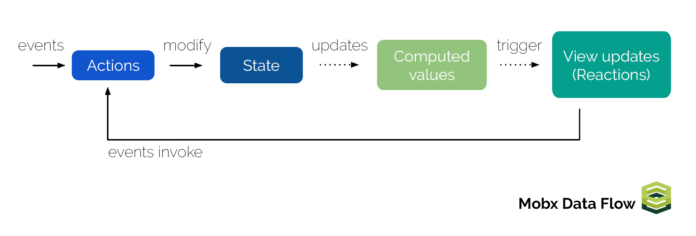

> 이번 파트는 전역 상태 관리 라이브러리인 `redux`와 `mobx` 를 활용한 내용을 정리했다. SPA 환경에서 전역 상태로 관리되는 데이터를 서버와 클라이언트 영역에서 어떻게 처리했는지에 대한 내용을 정리했다. 이번 글 역시 스스로의 학습 내용을 정리하는 글이기 때문에 편한 말투로 작성했다.

## redux & mobx

`redux` 와 `mobx`는 JavaScript 개발 환경에서 대표적으로 사용되는 상태 관리 라이브러리이다. 말 그대로 JavaScript 환경에서는 어디든지 사용할 수 있기 때문에 VanillaJS 환경뿐만 아니라 특정 프레임워크 및 라이브러리로 구성된 프로젝트에 상관없이 사용 가능하다.

그래서 react 뿐만 아니라 vue.js, angular 등의 환경에서도 사용 가능한 걸로 알고 있는데, 이번 글에는 `redux`와 `mobx`의 간략한 개념정리 및 react 환경에서 `redux`와 `mobx`를 어떻게 활용했는지에 대한 내용만 정리하려 한다. 나 또한 `redux`와 `mobx`를 완벽히 다룬다고 생각하지 않으며 react 이외에 환경에서는 사용해보지 않아 설명할 내용도 없긴 하지만 나중에 공부해 보도록 하자

우선 react의 경우 컴포넌트 간 데이터 전달 시 부모로부터 자식 요소의 단방향 데이터 흐름을 강제한다. 이러한 구조는 순차적인 흐름으로써 사람이 갖고 있는 자연스러운 사고방식이기 때문에 데이터의 흐름을 쉽게 파악할 수 있고 관리하기도 편하다고 생각한다. 최근에는 `Context API`라는 기능을 통해 기본적인 데이터 흐름을 벗어나 전역 상태를 관리할 수 있지만 내가 아직 많이 사용해보지 않았기 때문에 이 번 글에서는 따로 설명하지 않겠다.

아무튼 이러한 단방향 데이터 흐름의 경우 앱의 규모가 커지고 컴포넌트의 양이 늘어날 경우, 컴포넌트에서 사용하지 않는 데이터를 전달받는다든가 아니면 전역 데이터를 특정 부모 컴포넌트에 의존해야만 하는 경우도 생기게 된다. 결국 불필요하게 전달받는 데이터가 많아지면 데이터 구조가 복잡해지며 결국 컴포넌트의 상태를 관리하기가 힘들어지게 된다.


이렇게 단향방 데이터의 흐름에서 벌어질 수 있는 단점을 보완하기 위해 위와 같이 상태 관리 라이브러리를 활용하여 컴포넌트의 종속되지 않고 데이터를 관리해 준다고 보면 될 것 같다(위 사진에는 `redux`만 설명되어 있지만 `mobx`도 같은 맥락으로 이해하면 된다).


위와 같이 `redux`를 활용하면 흔히 `store`라고 표현하는 단 하나의 데이터 저장소를 통해 컴포넌트의 종속되지 않고 데이터를 전달하기 위해 `action`과 `reducer`로 표현되는 개념들을 활용하여 상태를 관리해준다. 그림과 같이 상태값을 업데이트하기 위해 컴포넌트에서 `action` 을 요청한 뒤 `reducer` 에서 상태값을 변경한 후 `store` 에 넘겨주게 되면 업데이트된 상태값을 통해 컴포넌트가 갱신되는 구조이다. 다만 이러한 개념을 이해하고 기본 설정부터 컴포넌트에 상태값을 연결하기 위해 `redux`에서 제공하는 기능들을 이해하는 과정이 복잡하다고 생각하며 나 역시 이러한 부분을 이해하기가 쉽지 않았다.



`mobx`의 경우 `redux`와 비슷한 흐름으로 데이터를 관리한다고 볼 수 있지만 기본 설정 및 상태를 접근하는 방식에서 차이가 있다. 우선 객체지향적인 설계를 지원하기 때문에 `Classes` 문법을 활용하여 생각보다 쉽게 설계와 구현이 가능했고, 컴포넌트와 상태값을 연결하기 위한 설정을 `Decorator` 문법을 활용하여 `redux`를 사용할때 보다 복잡한 과정을 거치지 않는다. 무엇보다 `observer`, `observable`이라는 개념을 통해 컴포넌트에서 요청하는 `action`에 따라 상태값의 변경하는 과정을 이해하는데 있어 `redux` 보다 좀 쉬웠다.

사실 `redux`와 `mobx`를 좀 더 이해한 후 자세히 설명하고 싶지만 현재로서는 개인적인 지식이 아직 많이 부족하기 때문에 이쯤에서 정리하려고 한다. 나중에 시간이 되면 정리하도록 하고 `redux` 와 `mobx`를 어떻게 활용했는지 정리해보자.

## react-redux


앞서 설명한대로 `redux`는 JavaScript 환경에서 사용 가능하지만 react 개발 환경에서 좀 더 쉽게 사용할 수 있도록 `react-redux`라는 라이브러리를 사용했다. 그리고 `action` 구현을 쉽게 설정할 수 있는 `redux-actions` 라이브러리를 사용했다. 우선 관련 라이브러리를 설치하자.

```bash
yarn add --dev redux react-redux redux-actions
```

이제 `redux`를 활용하여 간단한 카운터를 만들어보려 한다. 우선 컴포넌트에서 요청에 필요한 `action` 과 `reducer`를 구현하도록 하자.

- `src/redux/reducers/counter.js`

```javascript
import { handleActions, createAction } from 'redux-actions'

const INCREMENT = 'INCREMENT'
const DECREMENT = 'DECREMENT'

export const increment = createAction(INCREMENT)
export const decrement = createAction(DECREMENT)

const initialState = {
  count: 1,
}

export default handleActions(
  {
    [INCREMENT]: state => ({ count: state.count + 1 }),
    [DECREMENT]: state => ({ count: state.count - 1 }),
  },
  initialState
)
```

우선 `redux-actions`에서 제공하는 `createAction` 함수를 통해 `increment`, `decrement`라는 `action`를 생성했다. 컴포넌트에서 요청한 `action`의 종류에 따라 기본 객체 프로퍼티인 `count` 값을 가감하도록 설정했다. 만들어진 `action` 은`createAction` 호출 시 인자로 넘겨받은 타입에 맞춰 `handleActions` 함수를 통해 상태값을 변경하도록 했다.

- `src/redux/reducers/index.js`

```javascript
import { combineReducers } from 'redux'
import counter from './counter'
export default combineReducers({
  counter,
})
```

생성된 `reducer`를 `store`에 전달하기 위한 파일을 생성했다. `combineReducers`라는 함수를 통해 `reducer`를 전달하도록 했다.

- `src/redux/store.js`

```javascript
import { createStore } from 'redux'
import reducers from './reducers'

export default () => {
  return createStore(reducers)
}
```

`reducer`를 통해 갱신된 데이터를 컴포넌트에 전달하는 `store`를 생생했다. 이제 생성된 `store`를 클라이언트 영역에서 전달받기 위한 작업을 진행해보자

### Client

- `src/index.js`

```javascript
// ...
import { Provider } from 'react-redux'
import store from './redux/store'

ReactDOM.render(
  <BrowserRouter>
    <Provider store={store()}>
      <App />
    </Provider>
  </BrowserRouter>,
  document.getElementById('root')
)
```

`react-redux` 에서 제공하는 `Provider` 컴포넌트를 통해 `store`로터 전달받은 상태 괸리 객체를 최상위 컴포넌트인 `App`에 전달하도록 했다. 이제 `App` 컴포넌트를 통해 설정된 전역 데이터를 활용하기 위한 컴포넌트 작업을 진행해보자.

- `src/components/Counter.jsx`

```javascript
import React, { Component } from 'react'
import { connect } from 'react-redux'
import { bindActionCreators } from 'redux'
import * as counterActions from '../redux/reducers/counter'

class Counter extends Component {
  render() {
    const { counter, CounterActions } = this.props

    return (
      <div>
        <h1>{counter.count}</h1>
        <button
          onClick={() => {
            CounterActions.increment()
          }}
        >
          +
        </button>
        <button
          onClick={() => {
            CounterActions.decrement()
          }}
        >
          -
        </button>
      </div>
    )
  }
}

export default connect(
  state => ({
    counter: state.counter,
  }),
  dispatch => ({
    CounterActions: bindActionCreators(counterActions, dispatch),
  })
)(Counter)
```

전달받은 카운터 데이터를 활용할 수 있도록 `Counter`라는 새로운 컴포넌트를 만들었다. `react-redux` 에서 제공하는 `connect` 함수를 통해 `store`로부터 전달받은 `counter` 객체와 해당 객체에 `action`을 요청할 수 있도록 `redux`에서 제공하는 `bindActionCreators` 함수를 통해 `CounterActions`이라는 새로운 객체를 `HoC` 패턴을 활용해 해당 컴포넌트의 주입했다.

컴포넌트 구조는 전달받은 `counter` 객체를 확인하기 위한 요소와 증가/감소 버튼으로 구성되었고 버튼 클릭 시 `CounterActions` 에 설정된 `action`을 호출하도록 했다. 이제 만들어진 컴포넌트를 사용하기 위해 `Home`, `About` 컴포넌트를 수정해보자.

- `src/components/Home.jsx`

```javascript
import React from 'react'
import withLayout from './withLayout'
import Counter from './Counter'

const Home = () => {
  return (
    <div>
      <h1>home</h1>
      <Counter />
    </div>
  )
}

export default withLayout(Home)
```

- `src/components/About.jsx`

```javascript
import React from 'react'
import withLayout from './withLayout'
import Counter from './Counter'

const About = () => {
  return (
    <div>
      <h1>About</h1>
      <Counter />
    </div>
  )
}

export default withLayout(About)
```

`Home`, `About` 컴포넌트 내부에 `Counter` 컴포넌트를 호출하도록 수정했다. 렌더링 시 컴포넌트를 호출하는 것 이외에 특별한 작업을 하지 않았다. 이제 화면을 동작시켜 결과를 확인해보자.


`action` 요청 후 업데이트되는 상태값을 컴포넌트에 종속되지 않고 정상적으로 전달받는 것을 확인했다. 이제 서버 영역에서도 `store`로부터 데이터를 전달받기 위한 작업을 진행해보자.

### Server

서버 렌더링 시에는 `store` 로부터 초기 전역 상태값을 전달받기 위한 작업이 필요하다. 해당 작업을 진행하기 위해 `renderer.js` 파일을 수정해보자.

- `src/lib/renderer.js`

```javascript
// ...
import { Provider } from 'react-redux'
import store from '../redux/store'

const renderer = async ({ req, html }) => {
  // ...

  const app = renderToString(
    <Loadable.Capture report={moduleName => modules.push(moduleName)}>
      <StaticRouter location={req.url} context={context}>
        <Provider store={store()}>
          <App />
        </Provider>
      </StaticRouter>
    </Loadable.Capture>
  )

  // ...
}

module.exports = renderer
```

이 전에 클라이언트 영역에서 구현했던 것처럼 서버측에서도 `Provider` 컴포넌트를 통해 `store` 로터 전달받은 상태 괸리 객체를 최상위 컴포넌트인 `App`에 전달하도록 했다. 서버 측에서 필요한 구현은 끝났으니 실행 결과를 확인해보자.


서버 실행 후 페이지 소스를 확인해보니 정상적으로 서버 렌더링 시 전달받은 데이터를 화면에 그려주고 있다.

지금까지 활용한 예제는 동기적인 데이터이기 때문에 클라이언트 및 서버 영역에서의 `redux` 설정 방법은 생각보다 간단했다. 이제 이 전에 다룬 비동기 데이터를 `redux`를 활용하여 처리하는 방법에 대한 내용을 정리해보자.

## redux-thunk


`redux`를 사용하는 경우 전역 상태를 관리할때 동기적인 데이터의 경우 기본적인 기능을 통해 활용할 수 있지만 비동기 데이터를 처리하기 위해서는 미들웨어가 필요하다. 그러한 미들웨어 중 하나가 `redux-thunk`이며 이를 통해 `action` 호출 시 동기적으로 전달되는 객체를 함수 또는 `Promises`로 감싼뒤 비동기적으로 반환하게 해줄 수 있게 도와준다.

우선 `redux-thunk`를 설치하고 미들웨어를 연결하기 위한 작업을 진행하도록 하자.

```bash
yarn add --dev redux-thunk
```

- `src/redux/store.js`

```javascript
import { createStore, applyMiddleware } from 'redux'
import reducers from './reducers'
import ReduxThunk from 'redux-thunk'

export default () => {
  return createStore(reducers, applyMiddleware(ReduxThunk))
}
```

`redux`에서 제공하는 `applyMiddleware`라는 함수를 통해 `store` 생성 시 `redux-thunk`를 사용할 수 있도록 수정했다. 이제 비동기 액션을 처리하기 위한 `reducer`를 만들어보자.

- `src/redux/reducers/post.js`

```javascript
import { handleActions, createAction } from 'redux-actions'
import axios from 'axios'

const GET_POST_LOADING = 'GET_POST_LOADING'
const GET_POST_SUCCESS = 'GET_POST_SUCCESS'
const GET_POST_ERROR = 'GET_POST_ERROR'

const loading = createAction(GET_POST_LOADING)
const success = createAction(GET_POST_SUCCESS, res => res.data)
const error = createAction(GET_POST_ERROR)

export const getPost = path => dispatch => {
  dispatch(loading())
  axios.get(`https://jsonplaceholder.typicode.com${path}`).then(
    res => {
      dispatch(success(res))
    },
    () => {
      dispatch(error())
    }
  )
}

const initialState = {
  pending: false,
  error: false,
  data: [],
}

export default handleActions(
  {
    [GET_POST_LOADING]: () => {
      return {
        pending: true,
        error: false,
        data: [],
      }
    },
    [GET_POST_SUCCESS]: (_, action) => {
      let data = Array.isArray(action.payload)
        ? action.payload
        : [action.payload]

      return {
        pending: false,
        error: false,
        data,
      }
    },
    [GET_POST_ERROR]: () => {
      return {
        pending: false,
        error: true,
        data: [],
      }
    },
  },
  initialState
)
```

비동기 요청 시 반환 상태에 따른 `loading`, `success`, `error`라는 `action`을 생성했다.

또한 비동기 데이터 요청 시 `pending`, `resolve`, `reject` 의 반환 상태를 가지게 되는게 이렇게 반환 결과에 따른 `action` 호출을 쉽게

### Clinet

### Server

## redux-saga

### Clinet

### Server

## mobx-react

### Client

### Server

## 다음 과제

지금까지 SPA 개발환경에서 비동기 데이터를 처리하는 방법에 대한 내용들을 정리했다. 다음은 `<head/>` 태그 내에서 사용되는 여러가지 요소를 관리해 줄 수 있는 라이브러리인 `react-helmet`를 SPA 환경에서 활용하는 방법에 대한 내용을 정리하고자 한다.
