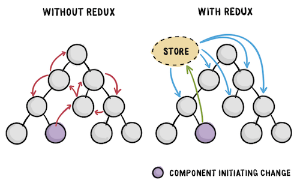
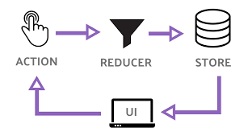
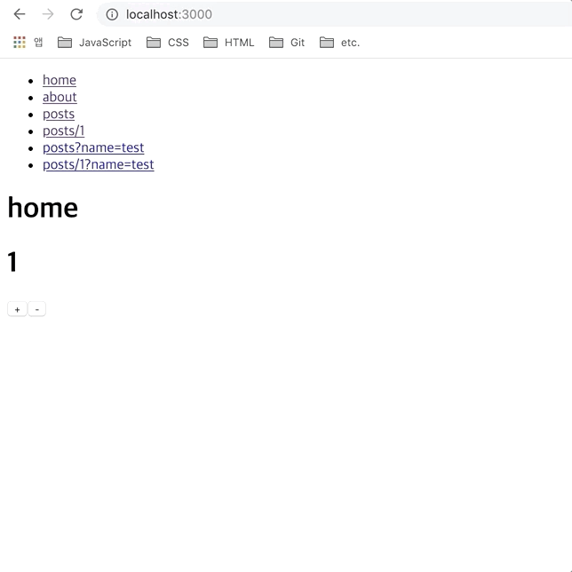
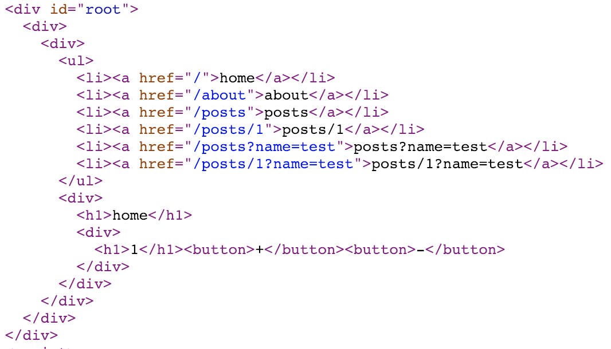
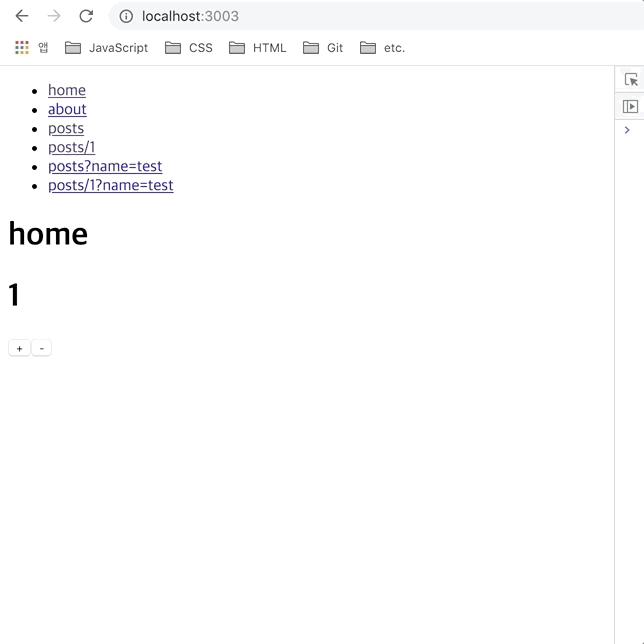
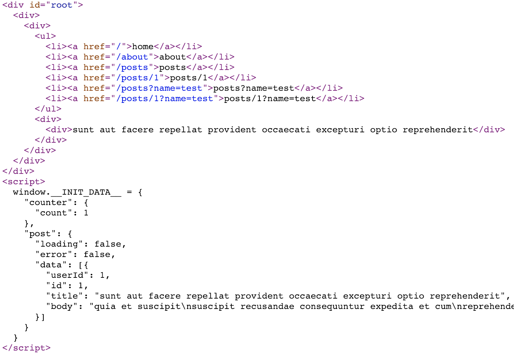
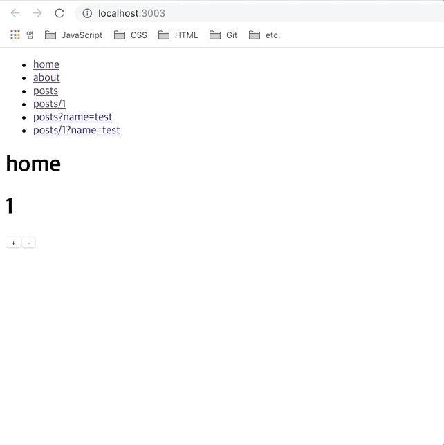

> 이번 파트는 전역 상태 관리 라이브러리인 `redux`를 활용한 내용을 정리했다. SPA 환경에서 전역 상태로 관리되는 데이터를 서버와 클라이언트 영역에서 어떻게 처리했는지에 대한 내용을 정리했다. <!-- end -->이번 글 역시 스스로의 학습 내용을 정리하는 글이기 때문에 편한 말투로 작성했다.

## redux

`redux`는 JavaScript 개발 환경에서 대표적으로 사용되는 상태 관리 라이브러리이다. 말 그대로 JavaScript 환경에서는 어디든지 사용할 수 있기 때문에 VanillaJS 환경뿐만 아니라 특정 프레임워크 및 라이브러리로 구성된 프로젝트에 상관없이 사용 가능하다.

그래서 react 뿐만 아니라 vue.js, angular 등의 환경에서도 사용 가능한 걸로 알고 있는데, 이번 글에는 `redux`의 간략한 개념정리 및 react 환경에서 `redux`를 어떻게 활용했는지에 대한 내용만 정리하려 한다. 나 또한 `redux`를 완벽히 다룬다고 생각하지 않으며 react 이외에 환경에서는 사용해보지 않아 설명할 내용도 없긴 하지만 나중에 공부해 보도록 하자

우선 react의 경우 컴포넌트 간 데이터 전달 시 부모로부터 자식 요소의 단방향 데이터 흐름을 강제한다. 이러한 구조는 순차적인 흐름으로써 사람이 갖고 있는 자연스러운 사고방식이기 때문에 데이터의 흐름을 쉽게 파악할 수 있고 관리하기도 편하다고 생각한다. 최근에는 `Context API`라는 기능을 통해 기본적인 데이터 흐름을 벗어나 전역 상태를 관리할 수 있지만 내가 아직 많이 사용해보지 않았기 때문에 이 번 글에서는 따로 설명하지 않겠다.

아무튼 이러한 단방향 데이터 흐름의 경우 앱의 규모가 커지고 컴포넌트의 양이 늘어날 경우, 컴포넌트에서 사용하지 않는 데이터를 전달받는다든가 아니면 전역 데이터를 특정 부모 컴포넌트에 의존해야만 하는 경우도 생기게 된다. 결국 불필요하게 전달받는 데이터가 많아지면 데이터 구조가 복잡해지며 결국 컴포넌트의 상태를 관리하기가 힘들어지게 된다.



이렇게 단향방 데이터의 흐름에서 벌어질 수 있는 단점을 보완하기 위해 위와 같이 상태 관리 라이브러리를 활용하여 컴포넌트의 종속되지 않고 데이터를 관리해 준다고 보면 될 것 같다(위 사진에는 `redux`만 설명되어 있지만 `mobx`도 같은 맥락으로 이해했다).



위와 같이 `redux`를 활용하면 흔히 `store`라고 표현하는 단 하나의 데이터 저장소를 통해 컴포넌트의 종속되지 않고 데이터를 전달하기 위해 `action`과 `reducer`로 표현되는 개념들을 활용하여 상태를 관리해준다. 그림과 같이 상태값을 업데이트하기 위해 컴포넌트에서 `action` 을 요청한 뒤 `reducer` 에서 상태값을 변경한 후 `store` 에 넘겨주게 되면 업데이트된 상태값을 통해 컴포넌트가 갱신되는 구조이다. 다만 이러한 개념을 이해하고 기본 설정부터 컴포넌트에 상태값을 연결하기 위해 `redux`에서 제공하는 기능들을 이해하는 과정이 복잡하다고 생각하며 나 역시 이러한 부분을 이해하기가 쉽지 않았다.

사실 `redux` 뿐만 아니라 `mobx` 또한 좀 더 이해한 후 자세히 설명하고 싶지만 현재로서는 개인적인 지식이 아직 많이 부족하기 때문에 이쯤에서 정리하려고 한다. 나중에 시간이 되면 정리하도록 하고 우선 `redux`를 어떻게 활용했는지 정리해보자.

## react-redux


앞서 설명한대로 `redux`는 JavaScript 환경에서 사용 가능하지만 react 개발 환경에서 좀 더 쉽게 사용할 수 있도록 `react-redux`라는 라이브러리를 사용했다. 그리고 `action` 구현을 쉽게 설정할 수 있는 `redux-actions` 라이브러리를 사용했다. 우선 관련 라이브러리를 설치하자.

```bash
yarn add --dev redux react-redux redux-actions
```

이제 `redux`를 활용하여 간단한 카운터를 만들어보려 한다. 우선 컴포넌트에서 요청에 필요한 `action` 과 `reducer`를 구현하도록 하자.

- `src/redux/reducers/counter.js`

```javascript
import { handleActions, createAction } from 'redux-actions'

const INCREMENT = 'INCREMENT'
const DECREMENT = 'DECREMENT'

export const increment = createAction(INCREMENT)
export const decrement = createAction(DECREMENT)

const initialState = {
  count: 1,
}

export default handleActions(
  {
    [INCREMENT]: state => ({ count: state.count + 1 }),
    [DECREMENT]: state => ({ count: state.count - 1 }),
  },
  initialState
)
```

우선 `redux-actions`에서 제공하는 `createAction` 함수를 통해 `increment`, `decrement`라는 `action`를 생성했다. 컴포넌트에서 요청한 `action`의 종류에 따라 기본 객체 프로퍼티인 `count` 값을 가감하도록 설정했다. 만들어진 `action` 은`createAction` 호출 시 인자로 넘겨받은 타입에 맞춰 `handleActions` 함수를 통해 상태값을 변경하도록 했다.

- `src/redux/reducers/index.js`

```javascript
import { combineReducers } from 'redux'
import counter from './counter'
export default combineReducers({
  counter,
})
```

생성된 `reducer`를 `store`에 전달하기 위한 파일을 생성했다. `combineReducers`라는 함수를 통해 `reducer`를 전달하도록 했다.

- `src/redux/store.js`

```javascript
import { createStore } from 'redux'
import reducers from './reducers'

export default () => {
  return createStore(reducers)
}
```

`reducer`를 통해 갱신된 데이터를 컴포넌트에 전달하는 `store`를 생생했다. 이제 생성된 `store`를 클라이언트 영역에서 전달받기 위한 작업을 진행해보자

### Client

- `src/index.js`

```javascript
// ...
import { Provider } from 'react-redux'
import store from './redux/store'

ReactDOM.render(
  <BrowserRouter>
    <Provider store={store()}>
      <App />
    </Provider>
  </BrowserRouter>,
  document.getElementById('root')
)
```

`react-redux` 에서 제공하는 `Provider` 컴포넌트를 통해 `store`로터 전달받은 상태 괸리 객체를 최상위 컴포넌트인 `App`에 전달하도록 했다. 이제 `App` 컴포넌트를 통해 설정된 전역 데이터를 활용하기 위한 컴포넌트 작업을 진행해보자.

- `src/components/Counter.jsx`

```javascript
import React, { Component } from 'react'
import { connect } from 'react-redux'
import { bindActionCreators } from 'redux'
import * as counterActions from '../redux/reducers/counter'

class Counter extends Component {
  render() {
    const { counter, CounterActions } = this.props

    return (
      <div>
        <h1>{counter.count}</h1>
        <button
          onClick={() => {
            CounterActions.increment()
          }}
        >
          +
        </button>
        <button
          onClick={() => {
            CounterActions.decrement()
          }}
        >
          -
        </button>
      </div>
    )
  }
}

export default connect(
  state => ({
    counter: state.counter,
  }),
  dispatch => ({
    CounterActions: bindActionCreators(counterActions, dispatch),
  })
)(Counter)
```

전달받은 카운터 데이터를 활용할 수 있도록 `Counter`라는 새로운 컴포넌트를 만들었다. `react-redux` 에서 제공하는 `connect` 함수를 통해 `store`로부터 전달받은 `counter` 객체와 해당 객체에 `action`을 요청할 수 있도록 `redux`에서 제공하는 `bindActionCreators` 함수를 통해 `CounterActions`이라는 새로운 객체를 `HoC` 패턴을 활용해 해당 컴포넌트의 주입했다.

컴포넌트 구조는 전달받은 `counter` 객체를 확인하기 위한 요소와 증가/감소 버튼으로 구성되었고 버튼 클릭 시 `CounterActions` 에 설정된 `action`을 호출하도록 했다. 이제 만들어진 컴포넌트를 사용하기 위해 `Home`, `About` 컴포넌트를 수정해보자.

- `src/components/Home.jsx`

```javascript
import React from 'react'
import withLayout from './withLayout'
import Counter from './Counter'

const Home = () => {
  return (
    <div>
      <h1>home</h1>
      <Counter />
    </div>
  )
}

export default withLayout(Home)
```

- `src/components/About.jsx`

```javascript
import React from 'react'
import withLayout from './withLayout'
import Counter from './Counter'

const About = () => {
  return (
    <div>
      <h1>About</h1>
      <Counter />
    </div>
  )
}

export default withLayout(About)
```

`Home`, `About` 컴포넌트 내부에 `Counter` 컴포넌트를 호출하도록 수정했다. 렌더링 시 컴포넌트를 호출하는 것 이외에 특별한 작업을 하지 않았다. 이제 화면을 동작시켜 결과를 확인해보자.



`action` 요청 후 업데이트되는 상태값을 컴포넌트에 종속되지 않고 정상적으로 전달받는 것을 확인했다. 이제 서버 영역에서도 `store`로부터 데이터를 전달받기 위한 작업을 진행해보자.

### Server

서버 렌더링 시에는 `store` 로부터 초기 전역 상태값을 전달받기 위한 작업이 필요하다. 해당 작업을 진행하기 위해 `renderer.js` 파일을 수정해보자.

- `src/lib/renderer.js`

```javascript
// ...
import { Provider } from 'react-redux'
import store from '../redux/store'

const renderer = async ({ req, html }) => {
  // ...

  const app = renderToString(
    <Loadable.Capture report={moduleName => modules.push(moduleName)}>
      <StaticRouter location={req.url} context={context}>
        <Provider store={store()}>
          <App />
        </Provider>
      </StaticRouter>
    </Loadable.Capture>
  )

  // ...
}

module.exports = renderer
```

이 전에 클라이언트 영역에서 구현했던 것처럼 서버측에서도 `Provider` 컴포넌트를 통해 `store` 로터 전달받은 상태 관리 객체를 최상위 컴포넌트인 `App`에 전달하도록 했다. 서버 측에서 필요한 구현은 끝났으니 실행 결과를 확인해보자.



서버 실행 후 페이지 소스를 확인해보니 정상적으로 서버 렌더링 시 전달받은 데이터를 화면에 그려주고 있다.

지금까지 활용한 예제는 동기적인 데이터이기 때문에 클라이언트 및 서버 영역에서의 `redux` 설정 방법은 생각보다 간단했다. 이제 이 전에 다룬 비동기 데이터를 `redux`를 활용하여 처리하는 방법에 대한 내용을 정리해보자.

## redux-thunk


`redux`를 사용하는 경우 전역 상태를 관리할때 동기적인 데이터의 경우 기본적인 기능을 통해 활용할 수 있지만 비동기 데이터를 처리하기 위해서는 미들웨어가 필요하다. 그러한 미들웨어 중 하나가 `redux-thunk`이며 이를 통해 `action` 호출 시 동기적으로 전달되는 객체를 함수 또는 `Promises`로 감싼뒤 비동기적으로 반환하게 해줄 수 있게 도와준다.

우선 `redux-thunk`를 설치하고 미들웨어를 연결하기 위한 작업을 진행하도록 하자.

```bash
yarn add --dev redux-thunk
```

- `src/redux/store.js`

```javascript
import { createStore, applyMiddleware } from 'redux'
import reducers from './reducers'
import ReduxThunk from 'redux-thunk'

export default () => {
  return createStore(reducers, applyMiddleware(ReduxThunk))
}
```

`redux`에서 제공하는 `applyMiddleware`라는 함수를 통해 `store` 생성 시 `redux-thunk`를 사용할 수 있도록 수정했다. 이제 비동기 액션을 처리하기 위한 `reducer`를 만들어보자.

- `src/redux/reducers/post.js`

```javascript
import { handleActions, createAction } from 'redux-actions'
import axios from 'axios'

const GET_POST_LOADING = 'GET_POST_LOADING'
const GET_POST_SUCCESS = 'GET_POST_SUCCESS'
const GET_POST_ERROR = 'GET_POST_ERROR'

const loading = createAction(GET_POST_LOADING)
const success = createAction(GET_POST_SUCCESS, res => res.data)
const error = createAction(GET_POST_ERROR)

export const getPost = path => dispatch => {
  dispatch(loading())
  axios.get(`https://jsonplaceholder.typicode.com${path}`).then(
    res => {
      dispatch(success(res))
    },
    () => {
      dispatch(error())
    }
  )
}

const initialState = {
  pending: false,
  error: false,
  data: [],
}

export default handleActions(
  {
    [GET_POST_LOADING]: () => {
      return {
        pending: true,
        error: false,
        data: [],
      }
    },
    [GET_POST_SUCCESS]: (_, action) => {
      let data = Array.isArray(action.payload)
        ? action.payload
        : [action.payload]

      return {
        pending: false,
        error: false,
        data,
      }
    },
    [GET_POST_ERROR]: () => {
      return {
        pending: false,
        error: true,
        data: [],
      }
    },
  },
  initialState
)
```

비동기 요청 시 반환 상태에 따른 `loading`, `success`, `error`라는 `action`을 생성했다. 비동기 데이터 요청 시 반환되는 `pending`, `resolve`, `reject` 상태에 따라 각 액션을 호출하도록 구현했다. 다만 비동기 요청 시 반환 상태에 따라 `dispatch` 함수를 통해 일일히 `action`을 요청해야 하기 때문에 기존에 사용했던 비동기 요청 함수를 사용하지 못하는 부분이 조금 아쉽다.

다행히도 이러한 비동기 상태에 따라 액션을 자동으로 생성히 주는 라이브러리가 있어 이를 활용했다. `redux-promise-middleware`라는 미들웨어를 활용하여 코드를 개선해보자.

우선 라이브러리를 사용하기 위해 설치부터 진행하도록 하자.

```bash
yarn add --dev redux-promise-middleware
```

설치한 미들웨어를 사용하기 위해 `store` 파일에 수정하도록 하자.

- `src/redux/store.js`

```javascript
import { createStore, applyMiddleware } from 'redux'
import reducers from './reducers'
import ReduxThunk from 'redux-thunk'
import promiseMiddleware from 'redux-promise-middleware'

export default () => {
  return createStore(
    reducers,
    applyMiddleware(
      ReduxThunk,
      promiseMiddleware({
        promiseTypeSuffixes: ['LOADING', 'SUCCESS', 'ERROR'],
      })
    )
  )
}
```

`applyMiddleware` 함수 호출 시 해당 미들웨어를 사용하도록 `promiseMiddleware` 함수의 반환 값을 인자에 추가했다. `promiseMiddleware`의 인자로는 액션 생성 시 연결할 문자열을 옵션으로 추가했다. 이를 통해 비동기 요청 상태에 따라 `_LOADING`, `_SUCCESS`, `_ERROR`라는 접미사가 추가된 액션이 생성하도록 설정했다.

이제 이 전에 구현했던 비동기 요청을 통해 액션을 요청하는 영역을 수정해보자.

- `src/redux/reducers/post.js`

```javascript
import { handleActions, createAction } from 'redux-actions'
import loadData from '../../lib/loadData'

const GET_POST = 'GET_POST'
const GET_POST_LOADING = 'GET_POST_LOADING'
const GET_POST_SUCCESS = 'GET_POST_SUCCESS'
const GET_POST_ERROR = 'GET_POST_ERROR'

export const getPost = createAction(
  GET_POST,
  async path => await loadData(path)
)

// ...
```

반환 상태에 따라 `createAction` 함수를 통해 생성한 액션 함수를 비동기 요청 시 직접 호출하지 않도록 수정했다. `GET_POST`라는 액션 생성 시 미들웨어를 통해 비동기 요청 상태에 따라 액션을 자동으로 생성하도록 요청했고 이를 통해 기존의 `loadData` 함수를 사용할 수 있도록 수정했다.

그럼 이제 구현한 `reducer`를 `store`에 전달하도록 하자.

- `src/redux/reducer/index.js`

```javascript
import { combineReducers } from 'redux'
import counter from './counter'
import post from './post'

export default combineReducers({
  counter,
  post,
})
```

새롭게 구현한 `post reducer`를 `store`에 주입하도록 설정했다. 이제 비동기 데이터를 활용하기 위해 컴포넌트 영역을 수정하도록 하자.

### Client

`redux-thunk`를 통한 비동기 데이터를 활용하기 위해 기존에 사용했던 `Posts` 컴포넌트를 수정했다.

- `src/components/Posts.jsx`

```javascript
import React, { Component } from 'react'
import withLayout from './withLayout'
import { connect } from 'react-redux'
import { bindActionCreators } from 'redux'
import * as postActions from '../redux/reducers/post'

class Posts extends Component {
  componentDidMount() {
    const { PostActions, match } = this.props
    PostActions.getPost(match.url)
  }

  render() {
    const { post } = this.props

    return (
      <div>
        {post.loading && '...loading'}
        {post.error && 'error!'}
        {post.data.map((item, i) => (
          <div key={i}>{item.title}</div>
        ))}
      </div>
    )
  }
}

export default connect(
  state => ({
    post: state.post,
  }),
  dispatch => ({
    PostActions: bindActionCreators(postActions, dispatch),
  })
)(withLayout(Posts))
```

우선 라우터를 통해 비동기 데이터를 활용하기 위해 구현했던 이 전 코드는 지우고 `redux-thunk`를 활용하기 위해 수정된 코드의 내용이다. `Counter` 컴포넌트를 구현할때와 마찬가지로 `connect` 함수를 통해 전역 상태와 `action` 함수를 전달받도록 수정했다. 이 후 `componentDidMount` 함수 호출 시 라우팅 정보에 따른 `action` 호출을 통해 비동기 데이터를 전달받도록 수정했다. 렌더링 시에는 요청 상태에 따른 화면 구성을 구분할 수 있도록 구현했다. 그럼 이제 해당 코드가 잘 동작하는지 확인해보자.



컴포넌트 렌더링 시 비동기적인 액션 호출을 통해 정상적으로 비동기 데이터를 전달받는 것을 확인했다.

### Server

이제 서버에서 비동기 데이터를 정상적으로 렌더링할 수 있도록 작업을 진행해보자. 우선 서버 측에서 라우터 주소에 따라 `action`을 호출하기 위한 작업이 필요하다.

- `src/lib/routes.js`

```javascript
// ...
import store from '../redux/store'
import * as postActions from '../redux/reducers/post'

// ...

const initStore = store()

const Routes = [
  // ...
  {
    path: '/posts/:id',
    component: Loadable({
      loader: () => import('../components/Posts'),
      loading,
    }),
    loadData: async path => {
      await initStore.dispatch(postActions.getPost(path))
      return initStore.getState()
    },
  },
  {
    path: '/posts',
    component: Loadable({
      loader: () => import('../components/Posts'),
      loading,
    }),
    loadData: async path => {
      await initStore.dispatch(postActions.getPost(path))
      return initStore.getState()
    },
  },
  // ...
]

export default Routes
```

기존 `loadData` 함수에서 비동기 요청에 대한 응답 데이터를 반환하지 않고 `store`를 생성한 뒤 해당 라우터 주소에 따라 새로운 전역 상태에 대한 데이터를 반환하도록 수정했다.

- `src/lib/renderer.js`

```javascript
// ...
import { Provider } from 'react-redux'
import store from '../redux/store'

const renderer = async ({ req, html }) => {
  const currentRoute = routes.find(route => matchPath(req.url, route)) || {}
  const initState = currentRoute.loadData
    ? await currentRoute.loadData(req.url)
    : {}
  const initStore = store(initState)

  const context = {}
  let modules = []

  const app = renderToString(
    <Loadable.Capture report={moduleName => modules.push(moduleName)}>
      <StaticRouter location={req.url} context={context}>
        <Provider store={initStore}>
          <App />
        </Provider>
      </StaticRouter>
    </Loadable.Capture>
  )

  let bundles = getBundles(stats, modules)

  return {
    html: html.replace(
      '<div id="root"></div>',
      `<div id="root">${app}</div>
      <script>window.__INIT_DATA__ = ${serialize(initStore.getState())}</script>
      ${bundles
        .filter(bundle => !bundle.file.includes('.map'))
        .map(bundle => `<script src="${bundle.publicPath}"></script>`)
        .join('\n')}
      `
    ),
    context,
  }
}

module.exports = renderer
```

서버 측 비동기 데이터 설정 시 기존에는 컴포넌트에 설정한 `loadData` 함수 요청 후 반환되는 비동기 데이터를 `context` 객체의 프로퍼티로 설정한 뒤 `StaticRouter`의 props로 전달해 주었다. 현재는 비동기 데이터를 포함한 전역 데이터를 새로운 `store` 함수 호출에 필요한 인자값으로 넘겨주고 있다. 이 후 새롭게 생성된 상태 객체를 `Provider` 컴포넌트이 props로 전달하도록 수정했다. 이 후 클라이언트에서 확인하기 위한 초기 전역 데이터 또한 `window.__INIT_DATA__`라는 새로운 객체를 통해 클라이언트에서 전달받을 수 있도록 수정했다.

다만 기존에 구현된 `store` 생성함수는 초기 데이터값에 대한 인자를 따로 받지 않았기 때문에 `store` 생성 시 초기 전역 데이터를 전달받을 수 있도록 수정해야 하며 서버 렌더링 이후 클라이언트 렌더링 시에도 초기 전역 데이터를 전달받기 위한 수정이 필요하다.

- `src/redux/store.js`

```javascript
import { createStore, applyMiddleware } from 'redux'
import reducers from './reducers'
import ReduxThunk from 'redux-thunk'
import promiseMiddleware from 'redux-promise-middleware'

export default (initialState = {}) => {
  return createStore(
    reducers,
    initialState,
    applyMiddleware(
      ReduxThunk,
      promiseMiddleware({
        promiseTypeSuffixes: ['LOADING', 'SUCCESS', 'ERROR'],
      })
    )
  )
}
```

기존 함수 호출 시 비어있던 인자를 `initialState`라는 초기 전역 데이터를 갖는 인자로 수정했다. 이 후 함수 호출 시 전달받은 초기 전역 데이터를 `createStore` 함수의 인자로 추가했다.

- `src/index.js`

```javascript
// ...
ReactDOM.render(
  <BrowserRouter>
    <Provider store={store(window.__INIT_DATA__ || {})}>
      <App />
    </Provider>
  </BrowserRouter>,
  document.getElementById('root')
)

// ...
```

서버 렌더링 이후 요청되는 클라이언트 측 `store` 생성 함수의 인자로 서버에서 설정한 `window.__INIT_DATA__` 객체를 인수로 전달할 수 있도록 수정했다. 이를 통하 최초 서버 렌더링 이후 클라이언트 렌더링 시 서버에서 전달받은 초기 데이터를 통해 `store` 함수를 호출할 수 있다. 이제 서버 렌더링 이 후 추가적인 라우터 호출 시 컴포넌트 영역에서 `window.__INIT_DATA__` 객체 존재 여부에 따라 액션 호출 조건만 수정하면 된다.

- `src/components/Counter.jsx`

```javascript
class Counter extends Component {
  // ...

  componentDidMount() {
    if (window.__INIT_DATA__) {
      window.__INIT_DATA__ = null
    }
  }

  // ...
}
```

`Counter` 컴포넌트에서 `componentDidMount` 함수 호출 시 `window.__INIT_DATA__` 객체가 존재할 경우 해당 객체를 비워주도록 설정했다. 최초 서버 렌더링 이후 클라이언트 영역에서 해당 객체를 참조하지 않기 위해서다

- `src/components/Posts.jsx`

```javascript
class Posts extends Component {
  // ...

  componentDidMount() {
    const { PostActions, match } = this.props

    if (window.__INIT_DATA__) {
      window.__INIT_DATA__ = null
    } else {
      PostActions.getPost(match.url)
    }
  }

  // ...
}
```

`Posts` 컴포넌트 또한 `componentDidMount` 함수 호출 시 `window.__INIT_DATA__` 객체가 존재할 경우 해당 객체를 비워주도록 설정했다. 서버 렌더링 이후 클라이언트 영역에서 컴포넌트 재호출 시에는 새롭게 액션 함수 호출을 통해 전역 상태를 갱신할 수 있도록 수정했다.

이제 서버 설정을 완료했으니 서버 실행 후 페이지 소스를 확인해보자.



`Posts` 컴포넌트 호출 시 서버 측에서 초기 전역 데이터를 정상적으로 렌더링하는 것을 확인할 수 있다. 이 후 클라이언트 렌더링 또한 이상없이 동작하는 것을 확인할 수 있다.

## redux-saga


`redux-saga`는 앞서 설명한 `redux-thunk`와 같이 `redux`에서 비동기 데이터를 활용할 수 있도록 도와주는 라이브러리이다. `redux-thunk`와 다른 점은 `redux`를 통해 생성한 `action`의 `side effect`를 생성하는 별도의 `task`를 활용한다고 볼 수 있다. 해당 `task`를 통해 동기적인 `action`을 비동기적으로 호출해줄 수 있다.

`redux-thunk` 를 사용할때는 `action` 호출의 반환 상태를 객체 대신 함수로 변경한 뒤 비동기 요청 상태에 따라 다른 `action`을 호출해 주었다. 비동기 상태에 따라 `action` 을 호출하다 보면 결국 호출이 여러 단계로 중첩될 수 있으며, 이는 비동기 데이터 처리 로직이 복잡해질수록 중첩된 `action` 호출에 의한 전역 상태의 디버깅 및 테스트가 어려워지게 된다.

`redux-saga`는 동기적인 `action`의 `side effect`를 통해 액션 호출을 비동기적으로 제어할 수 있기 때문에, `action` 자체가 가지고 있는 본연의 기능을 사용할 수 있으며 상태의 흐름 또한 쉽게 파악할 수 있기 때문에 전역 상태를 관리하는 입장에서 `redux-thunk` 보다 장점을 가지고 있다.

다만 비동기 액션 처리 시 `es6`의 `generator` 문법을 활용하며, `redux-saga`에서 제공하는 여러 기능의 사용법들은 사용자에 따라 높은 러닝커브를 요구하기도 한다. 나 역시 그 중 한명으로써 익숙하지 않은 `generator` 문법과 기본적인 활용법에 대해 아직 이해하지 못하는 부분이 많다.

그래도 내가 이해하는 범위 내에서 `redux-saga`를 활용한 내용을 간단히 정리했다. 그럼 우선 `redux-saga`를 설치하고 `action` 을 생성하는 부분을 수정해보자.

```bash
yarn add --dev redux-saga
```

- `src/redux/reducers/post.js`

```javascript
import { handleActions, createAction } from 'redux-actions'

const GET_POST = 'GET_POST'
const GET_POST_SUCCESS = 'GET_POST_SUCCESS'
const GET_POST_ERROR = 'GET_POST_ERROR'

export const getPost = createAction(GET_POST)
export const getPostSuccess = createAction(GET_POST_SUCCESS)
export const getPostError = createAction(GET_POST_ERROR)

const initialState = {
  loading: false,
  error: false,
  data: [],
}

export default handleActions(
  {
    [GET_POST]: () => {
      return {
        loading: true,
        error: false,
        data: [],
      }
    },
    [GET_POST_SUCCESS]: (_, action) => {
      let { data } = action.payload

      if (!Array.isArray(data)) {
        data = [data]
      }

      return {
        loading: false,
        error: false,
        data,
      }
    },
    [GET_POST_ERROR]: () => {
      return {
        loading: false,
        error: true,
        data: [],
      }
    },
  },
  initialState
)

// ...
```

이전에는 `GET_POST` 액션 요청에 따라 `GET_POST_LOADING`, `GET_POST_SUCCESS`, `GET_POST_ERROR` 라는 액션을 생성했다. 앞서 말했듯이 새롭게 생성된 액션은 `GET_POST`라는 액션 내부에 중첩된 액션이며 비동기 로직이 복잡해질 경우 해당 액션에 대한 테스트 및 디버깅이 어려워게 된다. 또한 액션 타입을 집적 설정하지 않기 때문에 코드 가독성도 떨어진다.

`redux-saga`의 경우 동기적인 액션을 활용하기 때문에 기본적으로 `redux`를 사용할때처럼 액션을 생성하도록 수정했다. `GET_POST` 액션 요청시 반환 상태에 따라 `GET_POST_SUCCESS`, `GET_POST_ERROR`라는 액션을 호출할 수 있도록 설정했다.

`redux-thunk`를 사용할때와 달리 다른 액션에 종속되지 않는 각각의 독립된 액션으로 사용되기 때문에 비동기 로직이 복잡해지더라도 테스트 및 디버깅에 보다 유리한 이점을 가지고 있다. 실제 비동기 로직이 복잡해질 경우 `redux-saga`를 통해 `task`를 수행하는 과정이 복잡해지겠지만, 기존에 `action` 내부에서 관리되었던 역할을 분리할 수 있다는 것만으로드 큰 장점이 된다고 생각한다.

이제 `GET_POST` 액션 호출 시 비동기적으로 `task`를 제어할 수 있도록 코드를 추가해 보자.

- `src/redux/saga/post.js`

```javascript
import { call, put, take } from 'redux-saga/effects'
import * as post from '../reducers/post'
import loadData from '../../lib/loadData'

export function* getPost() {
  while (true) {
    try {
      const { payload } = yield take(post.getPost)
      const data = yield call(loadData, payload)
      yield put(post.getPostSuccess({ data }))
    } catch (e) {
      yield put(post.getPostError())
    }
  }
}
```

앞서 설명했듯이 `redux-saga`는 `generator` 및 `redux-saga`에서 제공하는 기능을 활용하여 액션 호출에 대한 `effect`를 통해 비동기적인 액션 호출을 수행할 수 있게 해준다. `getPost`라는 `generator function`을 통해 동기적인 액션 함수 호출에 대한 비동기적인 `task`를 수행할 수 있도록 구현했다.

`try/catch` 문법을 활용하여 `take` 함수를 통해 `getPost` 액션 함수 호출 시 전달받게 되는 인자를 확인한 뒤 `call` 함수를 통해 비동기 요청에 대한 응답 데이터를 반환받도록 했다. 이 후 반환 데이터 여부에 따라 `put` 함수를 통해 `getPostSuccess` 또는 `getPostError` 액션 함수를 호출하도록 구현했다.

이제 구현된 `generator` 함수를 `store`에 연결하기 위한 엔트리 파일을 구현했다.

- `src/redux/saga/index.js`

```javascript
import { fork } from 'redux-saga/effects'
import { getPost } from './post'

export default function* rootSaga() {
  yield fork(getPost)
}
```

`fork` 함수를 통해 앞서 구현한 `getPost` 함수를 감지할 수 있도록 한다. 이제 `store` 생성 시 `redux-saga` 미들웨어를 통해 해당 함수를 전달받을 수 있도록 수정해보자.

- `src/redux/store.js`

```javascript
import { createStore, applyMiddleware } from 'redux'
import reducers from './reducers'
import createSagaMiddleware, { END } from 'redux-saga'

export default (initialState = {}) => {
  const sagaMiddleware = createSagaMiddleware()
  const store = createStore(
    reducers,
    initialState,
    applyMiddleware(sagaMiddleware)
  )

  store.runSaga = sagaMiddleware.run
  store.close = () => store.dispatch(END)

  return store
}
```

기존에 사용했던 `redux-thunk` 관련 코드는 지운 뒤, `redux-saga`를 활용하기 위해 미들웨어를 연결하는 부분을 수정했다. 이 후 앞서 구현한 `generator function`을 전달받고 액션 호출과 관련된 `task`를 제어하기 위해 `runSaga`, `close`라는 메서드를 `store`에 추가했다. 그럼 이제 클라이언트 영역에서 `redux-saga`를 사용할 수 있도록 수정해보자.

### Client

- `src/index.js`

```javascript
// ...
import store from './redux/store'
import rootSaga from './redux/sagas'

const initStore = store(window.__INIT_DATA__ || {})
initStore.runSaga(rootSaga)

ReactDOM.render(
  <BrowserRouter>
    <Provider store={initStore}>
      <App />
    </Provider>
  </BrowserRouter>,
  document.getElementById('root')
)
```

이 전에 바로 `store` 객체를 연결할 때와 달리 `runSaga` 메서드를 통해 `rootSaga`로 정의한 `generator function`을 인자로 넘겨준 뒤 `Provider` 컴포넌트에 props로 설정해주었다. 그밖의 구현내용은 이 전에 `redux-thunk`를 통해 기존에 사용했던 코드들을 활용하면 된다. 그럼 이제 클라이언트 영역에서 정상적으로 동작하는지 확인해보자



`redux-thunk`를 사용할때와 같이 `redux-saga`를 활용하여 동기적인 액션뿐만 아니라 비동기적인 액션 요청 또한 정상적으로 처리하는 것을 확인했다.

### Server

서버 설정은 기존에 구현했던 방식과 다르게 진행되기 때문에 적지 않은 부분에 대한 코드의 변경이 필요하다. 우선 서버 측 렌더링을 담당하는 영역을 수정해보자.

- `src/lib/renderer.js`

```javascript
// ...
import { Provider } from 'react-redux'
import store from '../redux/store'
import rootSaga from '../redux/sagas'
import pretty from 'pretty'

const renderer = ({ req, res, html }) => {
  const currentRoute = routes.find(route => matchPath(req.url, route)) || {}
  const initStore = store()
  const context = {}
  let modules = []

  initStore
    .runSaga(rootSaga)
    .toPromise()
    .then(() => {
      const app = renderToString(
        <Loadable.Capture report={moduleName => modules.push(moduleName)}>
          <StaticRouter location={req.url} context={context}>
            <Provider store={initStore}>
              <App />
            </Provider>
          </StaticRouter>
        </Loadable.Capture>
      )

      const bundles = getBundles(stats, modules)
      const renderHTML = html.replace(
        '<div id="root"></div>',
        `<div id="root">${app}</div>
        <script>window.__INIT_DATA__ = ${serialize(
          initStore.getState()
        )}</script>
        ${bundles
          .filter(bundle => !bundle.file.includes('.map'))
          .map(bundle => `<script src="${bundle.publicPath}"></script>`)
          .join('\n')}
        `
      )

      if (context.status === 404) {
        res.status(404)
      }

      if (context.status === 301) {
        return res.redirect(301, context.url)
      }

      res.send(pretty(renderHTML))
    })

  currentRoute.loadData && currentRoute.loadData(initStore, req.url)
  initStore.close()
}
```

이 전에는 비동기 데이터 요청 시 응답 데이터를 포함하는 초기 상태 객체를 통해 새로운 `store`를 생성한 후 해당 객체를 통한 서버 렌더링 결과를 반환하는 구조였지만 현재는 `redux-saga`에서 제공하는 함수를 통해 비동기 상태 데이터가 응답한 이후 서버 렌더링 데이터를 그려주도록 수정했다.

우선 클라이언트에서 구현했던 내용과 같이 `store`를 생성한 뒤 `rootSaga`로 정의한 `generator function`을 `runSaga`의 인자로 넘겨주었다. 다만 이 전과 달리 모든 `action` 호출은 동기적으로 수행되기 때문에 실제 비동기 데이터를 전달해주는 `action` 호출을 확인하기 위해 `runSaga` 함수 호출 이후 `toPromise().then()` 이라는 체이닝 함수를 활용했다. `then` 함수 호출 시 해당 인자에 대한 콜백 함수를 통해 이 후 렌더링 과정을 구현했다.

이 전과 달리 함수의 반환 값을 넘겨주지 않고 서버 렌더링을 수행하기 때문에 `renderer` 함수 호출 시 `res` 인자를 추가로 전달 받은 뒤 `server/index.js`에서 구현했던 내용을 `then` 함수의 콜백 인자 내부에서 수행할 수 있도록 했다. 이 전에는 `async/await` 문법을 활용하여 비동기 요청에 대한 응답 데이터를 반환했지만 현재 구조에서는 필요하지 않기 때문에 일반 함수의 구조로 수정했다.

이 후 현재 라우터 컴포넌트 요청 시 `loadData` 함수가 확인되는 경우 이 전과 같이 해당 함수를 호출하도록 했다. 다만 이 전과 다른 점은 `loadData` 함수 호출 시 서버에서 생성한 `store` 객체를 인자로 전달받게 했다. 이 후 전달받은 `store`를 통해 각 라우터 컴포넌트에 필요한 `action`를 호출하도록 했다. 중요한 점은 `loadData` 함수 호출 시점은 `runSaga` 함수 호출 이후가 되어야 한다. 그리고 마지막으로 `store` 객체 생성 시 만들어 주었던 `close` 함수를 호출하도록 했다.

사실 `redux-thunk`와 달리 `redux-saga`를 활용한 서버 렌더링 구조의 경우 아직까지 완벽히 이해가 되지 않는다. 이 후 깨달음을 얻게 된다면 내용을 보충할 수 있도록 하자.

이제 `renderer` 함수는 수정했으니 해당 함수가 정상적으로 동작하도록 라우터 컴포넌트에서 `action`을 요청하는 부분과 서버 실행 영역을 수정해보자.

- `src/lib/routes.js`

```javascript
// ...
import * as postActions from '../redux/reducers/post'

// ...

const Routes = [
  // ...
  {
    path: '/posts/:id',
    component: Loadable({
      loader: () => import('../components/Posts'),
      loading,
    }),
    loadData: (store, path) => {
      store.dispatch(postActions.getPost(path))
    },
  },
  {
    path: '/posts',
    component: Loadable({
      loader: () => import('../components/Posts'),
      loading,
    }),
    loadData: (store, path) => {
      store.dispatch(postActions.getPost(path))
    },
  },
  // ...
]

export default Routes
```

이 전과 달리 라우팅 영역에서 `store`를 직접 생성하지 않고 서버측에서 전달받은 `store`를 통해 `action`을 `dispatch` 하도록 수정했다. 렌더링 시와 마찬가지로 `async/await` 문법이 필요하지 않기 때문에 기본 함수 문법으로 수정했다.

- `server/index.js`

```javascript
// ...

app.all('*', (req, res) => {
  renderer({ req, res, html: indexHTML })
})

// ...
```

라우팅 처리 시에도 이 전과 달리 함수 호출 시 반환받은 데이터를 처리하지 않고 `res` 인자를 넘겨준 뒤 `renderer` 함수에서 처리하도록 수정해주었다. 서버 측 설정도 완료되었으니 서버 실행 후 렌더링 결과를 확인해보면 서버 측에서 정상적으로 동작되는 것을 확인할 수 있다.

## 다음 과제

지금까지 SPA 개발환경에서 `redux`를 활용하여 전역 상태 데이터를 처리하는 방법에 대한 내용들을 정리했다. 다음은 `mobx`를 SPA 환경에서 활용하는 방법에 대한 내용을 정리하고자 한다.
