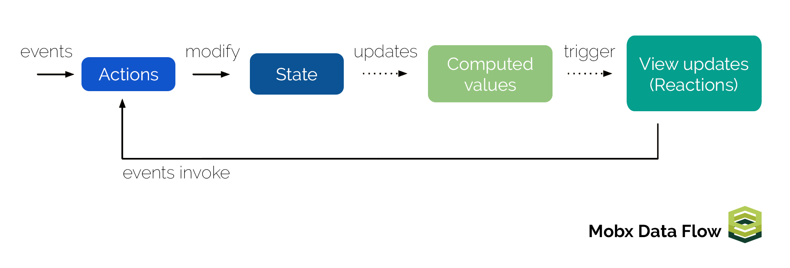
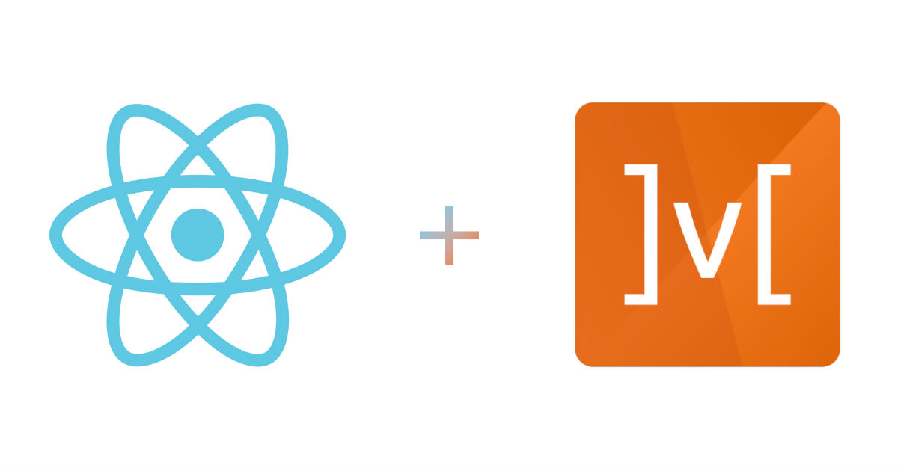

> 이번 파트는 전역 상태 관리 라이브러리인 `mobx` 를 활용한 내용을 정리했다. SPA 환경에서 전역 상태로 관리되는 데이터를 서버와 클라이언트 영역에서 어떻게 처리했는지에 대한 내용을 정리했다. <!-- end --> 이번 글 역시 스스로의 학습 내용을 정리하는 글이기 때문에 편한 말투로 작성했다.

## mobx

이 전 포스트에서 다룬 `redux`와 마찬가지로 `mobx` 또한 JavaScript 개발 환경에서 대표적으로 사용되는 상태 관리 라이브러리이다. 또한 이 전 글과 마찬가지로 `mobx`의 간략한 개념정리 및 react 환경에서 `mobx`를 어떻게 활용했는지에 대한 내용만 정리하려 한다.



`mobx`의 경우 `redux`와 비슷한 흐름으로 데이터를 관리한다고 볼 수 있지만 기본 설정 및 상태를 접근하는 방식에서 차이가 있다. 우선 객체지향적인 설계를 지원하기 때문에 `Class` 문법을 활용하여 생각보다 쉽게 설계와 구현이 가능했고, 컴포넌트와 상태값을 연결하기 위한 설정을 `Decorator` 문법을 활용하여 `redux`를 사용할때 보다 복잡한 과정을 거치지 않는다. 무엇보다 `observer`, `observable`이라는 개념을 통해 컴포넌트에서 요청하는 `action`에 따라 상태값의 변경하는 과정을 이해하는데 있어 `redux` 보다 좀 쉬웠다.

사실 `redux`와 `mobx`를 좀 더 이해한 후 자세히 설명하고 싶지만 현재로서는 개인적인 지식이 아직 많이 부족하기 때문에 이쯤에서 정리하려고 한다. 나중에 시간이 되면 정리하도록 하고 `redux` 와 `mobx`를 어떻게 활용했는지 정리해보자.

## mobx-react



앞서 설명한대로 `mobx` 또한 JavaScript 환경에서 사용 가능하지만 react 개발 환경에서 좀 더 쉽게 사용할 수 있도록 `mobx-react`라는 라이브러리를 같이 사용했다. 그리고 `mobx` 의 경우 `redux`와 달리 여러개의 `store`를 생성하여 전역 상태를 관리할 수 있다. `redux` 처럼 `reducer`, `action`을 따로 분리하지 않고 `store` 내에서 설정할 수 있다. 그래서 `store`의 개념 또한 `redux`와 조금 다르다고 생각한다.

또한 `mobx`의 경우 기본적인 문법으로 구현 가능하지만 `Class` 문법을 통해 좀 더 쉽게 구현할 수 있으며, 나 역시 `Class` 및 `Decotator` 문법을 활용했다. 다만 `Decorator` 문법을 활용할 경우 `babel` 플러그인 설정이 필요하기 때문에 관련 라이브러리도 추가했다.

그럼 우선 라이브러리를 설치하자.

```bash
yarn add --dev mobx mobx-react @babel/plugin-proposal-decorators
```

설치를 완료한 후 `mobx` 를 이용하여 `store`들을 생성해보자.

- `src/mobx/Counter.js`

```javascript
import { observable, action } from 'mobx'

class Counter {
  @observable
  count = 1

  @action
  increment = () => {
    this.count += 1
  }

  @action
  decrement = () => {
    this.count -= 1
  }
}

export default Counter
```

우선 `Counter` 컴포넌트에서 사용할 `Class`를 생성했다. 해당 `Class`를 하나의 `store`로 볼 수 있으며 이 후 `mobx`에서 제공하는 `decorator`을 통해 `Class`의 정의된 프로퍼티를 관리하도록 설정했다. 해당 `decorator`를 통해 `action`으로 명시된 메서드 호출 시 `observable`로 명시된 프로퍼티의 변경 상태를 감지할 수 있도록 구현했다.

- `src/mobx/Posts.js`

```javascript
import { observable, action, computed, toJS } from 'mobx'
import loadData from '../lib/loadData'

class Post {
  @observable
  state = {
    loading: false,
    error: false,
    data: [],
  }

  constructor(props) {
    this.state = props.post ? props.post.state : this.state
  }

  @action
  getPost = async path => {
    this.state = {
      ...this.state,
      loading: true,
      data: [],
    }

    try {
      const data = await loadData(path)
      this.state.loading = false
      this.state.data = Array.isArray(data) ? data : [data]
    } catch (e) {
      this.state.error = true
    }
  }

  @computed
  get data() {
    return toJS(this.state.data)
  }
}

export default Post
```

`Posts` 컴포넌트에서 사용할 `Post Class` 를 구현했다. 앞서 구현한 `Counter Class` 와 같이 `action`, `observable`를 활용했다. 액션 함수인 `getPost`의 경우 비동기 요청을 위해 `async/await` 문법을 활용했다.

그리고 생성자 함수 호출 시 전달받은 인자값에 따라 `state` 값을 변경할 수 있도록 했다. 생성자 함수 설정의 경우 비동기 응답 데이터에 대한 상태값을 전달받기 위한 작업이며 이 후 컴포넌트 영역에서의 `store` 설정과 연결되는 부분이다. 이 전에 `redux-thunk`를 활용하여 비동기 데이터를 처리할때와 비슷한 구조로 생각해도 되지 않을까 싶다.

또한 감시대상으로 설정된 `state` 객체 내 프로퍼티를 확인히기 위해 `computed`, `toJS` 함수를 사용했다. `mobx`의 경우 `observable`로 명시된 객체의 경우 자체적으로 **불변성(immutable)**을 관리해주기 때문에 일반 객체로 치환이 필요하다. 사실 `redux`를 사용할 때도 객체의 불변성을 관리해주어야 하지만 따로 구현하지 않았다. 해당 내용에 관해서는 나중에 따로 포스팅할 수 있도록 하자.

- `src/mobx/Store.js`

```javascript
import Counter from './Counter'
import Post from './Post'

class Store {
  constructor(props) {
    this.counter = new Counter()
    this.post = new Post(props)
  }
}

export function initStore(initState = {}) {
  return new Store(initState)
}
```

앞서 구현한 `store` 들에 대한 `root store`를 구현했다. 생성자 함수 실행 시 클래스 프로퍼터로 앞서 구현한 `store`들을 추가했으며 이 후 `initStore` 함수를 통해 `root store` 클래스의 인스턴스를 반환할 수 있도록 구현했다. 또한 인자로 초기 상태 값을 전달받아 프로퍼티로 설정된 `store` 호출 시 해당 값을 넘겨주도록 했다. 그럼 이제 구현된 코드를 클라이언트 환경부터 적용해보도록 하자.

### Client

- `src/index.js`

```javascript
// ...

import { Provider } from 'mobx-react'
import { initStore } from './mobx/Store'

ReactDOM.render(
  <BrowserRouter>
    <Provider {...initStore(window.__INIT_DATA__)}>
      <App />
    </Provider>
  </BrowserRouter>,
  document.getElementById('root')
)

// ...
```

`redux`와 마찬가지로 최상위 컴포넌트에 초기 상태값을 연결하기 위해 `mobx-react`에서 제공하는 `Provider` 컴포넌트를 활용했다. `redux`와 달리 `store` 라는 props를 기본 인자로 받지 않고 `root store`에 정의된 프로퍼티를 props로 넘겨주면 된다. 그럼 이제 `store`로 전달받은 상태 데이터를 컴포넌트에 적용할 수 있도록 수정해 보자

- `src/components/Counter.jsx`

```javascript
import React, { Component } from 'react'
import { observer, inject } from 'mobx-react'

@inject('counter')
@observer
class Counter extends Component {
  componentDidMount() {
    if (window.__INIT_DATA__) {
      window.__INIT_DATA__ = null
    }
  }

  render() {
    const { counter } = this.props

    return (
      <div>
        <h1>{counter.count}</h1>
        <button
          onClick={() => {
            counter.increment()
          }}
        >
          +
        </button>
        <button
          onClick={() => {
            counter.decrement()
          }}
        >
          -
        </button>
      </div>
    )
  }
}

export default Counter
```

- `src/components/Posts.jsx`

```javascript
```

### Server

## 다음 과제

지금까지 SPA 개발환경에서 `redux` 및 `mobx`를 활용하여 전역 상태 데이터를 처리하는 방법에 대한 내용들을 정리했다. 다음은 `<head/>` 태그 내에서 사용되는 여러가지 요소를 관리해 줄 수 있는 라이브러리인 `react-helmet`를 SPA 환경에서 활용하는 방법에 대한 내용을 정리하고자 한다.
