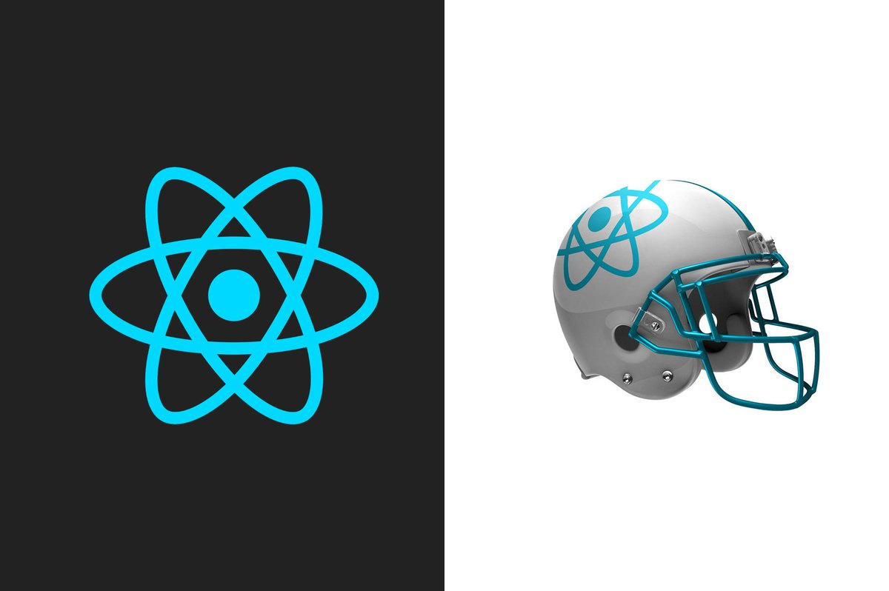

> 이번 파트는 페이지의 `head` 설정을 도와주는 라이브러리인 `react-helmet` 를 활용한 내용을 정리했다. 이번 글 역시 스스로의 학습 내용을 정리하는 글이기 때문에 편한 말투로 작성했다.

## Search Engine Optimization(SEO)

우선 맨 처음 글을 작성할 때로 돌아가 보자. 클라이언트 기반의 `SPA`의 경우 **검색엔진 최적화(SEO)**에 필요한 정적 렌더링 정보을 제공하지 않기 때문에(굳이 `SEO`만을 위한건 아니지만) 클라이언트 렌더링 뿐만 아니라 서버 렌더링 정보를 제공하는 `Isomorphic SPA`를 개발했다. 그 과정에서 라우팅, 코드 스플리팅, 비동기 데이터 및 `redux`, `mobx`를 활용한 전역 상태 데이터 처리에 대한 서버 측 렌더링 작업을 진행해왔다.

사실 `SEO`에 필요한 내용이 비단 정적 렌더링을 통한 페이지 정보뿐만 아니라 `보안 프로토콜(HTTPS)`, `Robots.txt`, `sitemap.xml` 설정 및 이외에도 필요한 설정들이 여러가지 있지만 위 방식을 설정하는 방법들은 잘 모르기도 하고 정적 페이지를 활용하는 방법.

그중에서 정적 페이지 정보 제공 시 검색엔진에 노출하기 위한 **타이틀 태그와 메타디스크립션 태그** 를 갖고 있어야 한다.

## react-helmet

### Client

### Server

## 글을 마치며
