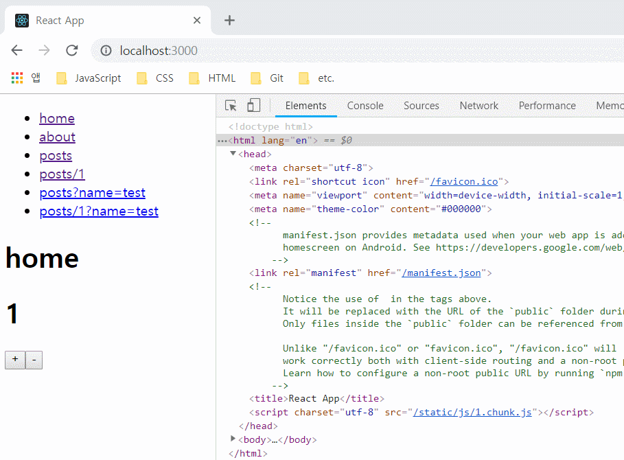

> 이번 파트는 페이지의 `head` 설정을 도와주는 라이브러리인 `react-helmet` 를 활용한 내용을 정리했다. 이번 글 역시 스스로의 학습 내용을 정리하는 글이기 때문에 편한 말투로 작성했다.

우선 맨 처음 글을 작성할 때로 돌아가 보자. 클라이언트 기반의 `SPA`의 경우 **검색엔진 최적화(SEO)**에 필요한 정적 렌더링 정보을 제공하지 않기 때문에(굳이 `SEO`만을 위한건 아니지만) 클라이언트 렌더링 뿐만 아니라 서버 렌더링 정보를 제공하는 `Isomorphic SPA`를 개발했다. 그 과정에서 라우팅, 코드 스플리팅, 비동기 데이터 및 `redux`, `mobx`를 활용한 전역 상태 데이터 처리에 대한 서버 측 렌더링 작업을 진행해왔다.

하지만 무엇보다 웹페이지가 검색엔진에 노출되기 위해서는 **타이틀 태그와 메타디스크립션 태그** 를 갖고 있어야 한다. 사실 `SEO`에 필요한 내용이 비단 정적 렌더링을 통한 페이지 정보뿐만 아니라 `보안 프로토콜(HTTPS)`, `Robots.txt`, `sitemap.xml` 설정 및 이외에도 필요한 설정들이 여러가지 있지만 위 방식을 설정하는 방법들은 잘 모르기 때문에 따로 정리하진 않았다.

우선 일반적인 클라이언트 기반의 `SPA` 의 경우 라우팅 영역의 페이지 접근 시 `body` 태그 내부에 선언된 특정 요소를 렌더링해준다. 지금까지 구현한 앱의 경우에도 페이지 요청 시 `<div id="root"/>` 요소 내부의 컨텐츠를 각 라우팅 영역에 맞게 렌더링해주고 있다. 하지만 이런 경우 `head` 요소를 포함한 정적인 영역에 대해서는 각 페이지에 필요한 요소를 그려주지 못하게 된다.

이런 경우 직접 `DOM` 구조에 접근하여 필요한 요소를 만들어주면 되지만 `head` 태그에 필요한 요소를 필요한 컴포넌트에서 만들어 줄 수 있는 `react-helmet`이라는 라이브러리를 사용했다. 이제 해당 라이브러리를 사용한 내용을 정리해보자.

## react-helmet


앞서 설명한대로 `react-helmet`을 통해 컴포넌트 영역에서 현재 페이지에 필요한 `head` 관련 요소를 설정해 줄 수 있다. `SEO`에 필요한 `title`, `meta` 요소뿐만 아니라 `link`, `script`, `style` 등 `head` 에 포함할 수 있는 태그들을 동적으로 설정할 수 있으며 서버 렌더링도 지원한다.

그럼 라이브러리를 사용하기 전 우선 지금까지 구현했던 앱의 `head` 정보를 살펴보자.



페이지를 이동하더라도 각 페이지별로 `head` 영역에 대한 설정은 해주지 않았기 때문에 라우팅 이동 시 동적으로 추가되는 `script` 를 제외한 `title`, `meta` 등의 요소에 대한 변경은 이루어지지 않는다.

그럼 이제 `react-helmet`를 사용하여 클라이언트 및 서버 렌더링을 작업을 진행해보자.

### Client

우선 라이브러리를 설치한 뒤 기본 베이스로 사용되는 `pubilc/index.html` 의 `head` 요소를 수정해보자.

```bash
yarn add --dev react-helmet
```

- `public/index.html`

```html
<!DOCTYPE html>
<html lang="en">
  <head>
    <meta charset="utf-8" />
    <link rel="shortcut icon" href="%PUBLIC_URL%/favicon.ico" />
    <meta
      name="viewport"
      content="width=device-width, initial-scale=1, shrink-to-fit=no"
    />
    <meta name="theme-color" content="#000000" />
    <link rel="manifest" href="%PUBLIC_URL%/manifest.json" />
  </head>
  <body>
    <noscript> You need to enable JavaScript to run this app. </noscript>
    <div id="root"></div>
  </body>
</html>
```

우선 기존에 있던 `title` 요소 및 주석들을 제거해주었다. 이 후 컴포넌트에서 각 페이지의 대한 타이틀을 포함한 `head` 요소를 추가하도록 하자.

그럼 우선 전체 페이지에 영역에서 공통으로 사용하게 될 `head` 정보를 설정하기 위해 `App` 컴포넌트를 수정해보자.

- `src/App.js`

```javascript
// ...
import { Helmet } from 'react-helmet'

class App extends Component {
  render() {
    return (
      <div>
        <Helmet>
          <title>My App</title>
          <meta name="description" content="my app" />
        </Helmet>
        <Switch>
          {routes.map((route, i) => (
            <Route key={i} {...route} />
          ))}
        </Switch>
      </div>
    )
  }
}
```

사용법은 어렵지 않다. 렌더링 시 `react-helmet`에서 제공하는 `Helmet` 컴포넌트의 자식 요소에 사용하고자 하는 태그를 설정해주면 된다.

### Server

## 글을 마치며
