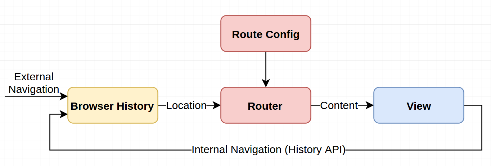
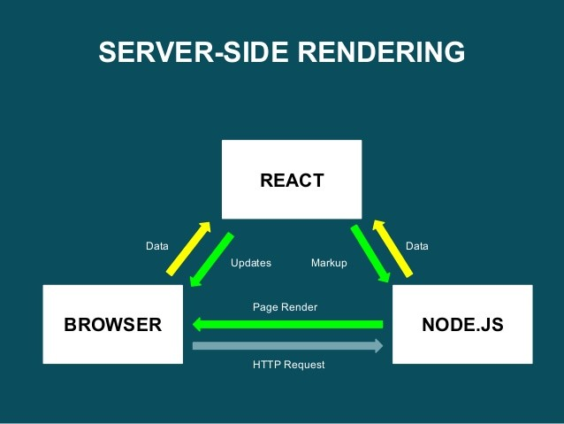

react 를 활용한 isomorphic SPA 개발에 대한 내용을 정리한 글입니다. 이 전에 개발했던 내용들을 정리하고자 하는 목적도 있고 react 를 활용해 무언가 새로운 SPA 프로젝트를 시작했을때 "전에는 이렇게 작업했었구나.." 하는 내용을 남기고자 합니다. 단순한 개발과정뿐만 아니라 isomorphic SPA 에 개념 또한 기존에 생각했던 내용을 정리해서 스스로 이해하려고 합니다. 의식의 흐름대로 정리하는 내용이라 부족한 부분도 있을꺼 같은데, 그건 그때 그때 정리하면서 업데이트하려고 합니다.

## Isomorphic JavaScript

isomorphic 란 사전적 의미로 _같은 모양의, 동일 구조의, 등정형(等晶形)의_ 라는 뜻은 가진 단어라고 네이버 사전에 나와있네요. 제가 생각하는 Isomorphic JavaScript 은 일반적으로 라우팅 기능, 정적 렌더링과 같이 주로 서버 영역에서 담당했던 기능들을 클라이언트 영역에서 처리함으로서 양쪽의 환경에서 같은 코드를 활용 할 수 있도록 하는 것이라고 생각했습니다. 이렇게 함으로써 백엔드 환경에서 처리해야 할 불필요하거나 반복적인 작업을 최소화해주는 것이죠. 프론트엔드 영역에서 작업한 환경 그대로 서버에서 사용 가능하기 때문이죠. 그걸 처리하는 언어는 JavaScript 가 될 것이구요.

"이미 node.js 를 활용하면 충분히 JavaScript 만으로 동작이 가능한데?"라고 말씀 하실수도 있지만 앞서 말씀드렸듯이 백엔드 영역에서 기존에 처리했던 기능들을 프론트엔드에서 처리하는 것이죠. 단순히 서버 환경을 JavaScript 로 구성했다고 해서 isomorphic 해지지는 않는다고 생각합니다. 이 글에서는 백엔드 환경에서만 처리했던 기능 중 하나인 라우팅 및 정적 렌더링의 기능을 프론트엔드 영역에서 처리하는 것으로 중점으로 말씀드려고 합니다.

## routing

제가 벡엔드 개발 경험이 많지 않아, 전문적으로 상세하기 말씀드릴 수는 없지만 일반적으로 서버 설정 시 요청된 주소에 따라 각 주소에 맞는 페이지를 호출해주도록 하는 작업을 하죠. 이러한 작업은 node.js 환경에서 주로 사용하는 express 의 라우팅 기능을 통해 처리해주었죠. 서버에서의 라우팅 설정의 경우 페이지가 몇개 없으면 상관없지만 웹 앱 규모가 커지면 커질수록 관리하기 어려워지겠죠. 이러한 작업을 이제는 서버에서 처리하지 않으려고 합니다.

그럼 이렇게 생각하시는 분들고 계실것 같습니다. "그럼 페이지 변경 시 마다 해당 페이지에 필요한 정적 리소스들은 어떻게 가져오지?" 이 전에 서버 환경에서의 라우팅 설정은 새로운 페이지를 요청할 때 마다 새로고침한 후 헤당 페이지에 필요한 리소스들을 전달받아 이러한 작업들을 처리해주었습니다. 하지만 Isomorphic JavaScript 에서는 그렇게 하지 않을 것입니다. Single Page Application(SPA) 으로 개발하면 되니까요.

## Single Page Applications(SPA)

SPA 라는 용어의 개념은 알고 계시는 분들이 많고 위에 언급한 내용도 있기 때문에 자세히 설명하지 않지 않으려 합니다. 처음 페이지 요청 시 필요한 정적 리소스를 모두 가져와서 페이지 새로고침 없이 서비스를 이용할 수 있는 웹 어플리케이션을 말하지 않나 싶네요.

하나의 화면이라면 페이지 주소가 하나일텐데, 보통 웹 서비스는 하나의 페이지로 이루어져 있지 않죠. 그리고 페이지를 이동할 경우 각각의 페이지에 맞는 여러가지 주소가 필요합니다. SPA 환경에서의 라우팅 설정은 앞서 말씀드린대로 처음 페이지 요청 시 렌더링에 필요한 정적 리소스를 모두 가져오게 됩니다. 그리고 페이지 이동 시 실제로 이동하는 것으로 보여지게 하는 것이죠. 미리 가져온 리소스의 JavaScript 에서 제공하는 History API 를 통해서요. 페이지 주소 변경 시 변경이 필요한 영역에 대한 DOM 구조를 변경시키는 것이죠. 그리고 저는 해당 작업을 클라이언트에서 쉽게 처리해줄 수 있는 라이브러리를 사용하려고 합니다.

기존에 많은 분들이 쓰고 계시는 react, angualr, vue.js 등에서 이러한 기능을 제공하고 있어서 그에 맞게 SPA 개발을 하는데, 저는 그나마 할 줄 아는데 react 여서 react 를 활용해서 SPA 개발을 시작했습니다.

## search engine optimization(SEO) & Server Side Rendering(SSR)

클라이언트에서 제공하는 라우팅 설정을 통해 SPA 를 개발하더라도 문제점이 있긴 합니다. 검색엔진 최적화를 위해서는 검색엔진에서는 웹 페이지 요청 시에 해당 페이지에 맞는 정적 렌더링 정보가 필요한데 기본적인 클라이언트 환경의 SPA 개발을 통해서는 정적 렌더링이 제공되지 않습니다. 정적 렌더링을 하려면 결국 서버 측 렌더링 작업이 필요합니다. 하지만 react 및 관련 서드파티 라이브러리를 통해 SPA 구조에서도 페이지 요청 시에 필요한 정적 렌더링 작업을 구현할 수 있습니다.

앞서 말씀드린대로 최초 페이지 로딩시에는 서버 렌더링을 통해 검색엔진 최적화에 필요한 정적 데이터를 제공해주는 것이죠. 이 후 페이지 요청시에는 클라이언트 렌더링을 통한 페이지 전환을 이루게 되구요. 이 전 웹 환경에서는 페이지 요청 시 서버 측에서 일일히 페이지 로딩을 통해 정적 렌더링 정보를 제공했지만 사용자 입장에서는 불필요한 동작이기도 했죠.

이제 사용자는 페이지 요청 시 일일히 새로고침을 할 필요가 없습니다. 최초 한번의 페이지 새로고침만 필요할 뿐이죠. 사실 사용자는 정적 렌더링에 관심이 없습니다. 사용자는 각 페이지 필요한 데이터를 매번 확인하지 않죠. 각각의 페이지에 대한 데이터들은 검색엔진에서만 관심이 있을 뿐입니다. 다만 관리자 페이지라던지 SSR 이 필요하지 않은 경우라면 굳이 설정하지 않아도 됩니다.

## create-react-app(CRA) 활용하기

처음 react 로 개발 시작할때 번들링 설정이나 라우팅 설정 등 직접 세팅하는게 여간 귀찮았는데, CRA 을 쓴 이후부터는 거의 대부분의 (사실상 전체) 프로젝트를 시작할때 CRA 를 쓰고 있습니다. CRA 를 쓰지 않고 개발환경을 설정할때는 그것대로 공부가 되긴 하는데 그러한 내용은 기회가 되면 정리하려고 합니다.

우선 `create-react-app my-project` 이런식으로 명령어를 통해 프로젝트를 만들어줍니다. 사실 SPA 를 개발하기 위한 환경설정은 CRA 를 통한 프로젝트 생성 시 거의 준비가 된다고 생각합니다. 그리고 `yarn start` 명령어로 프로젝트 개발 서버를 실행해줍니다. 기본적으로 설정되어 있는 웹 앱구조가 마련되는 것을 보실 수 있으실 겁니다.

