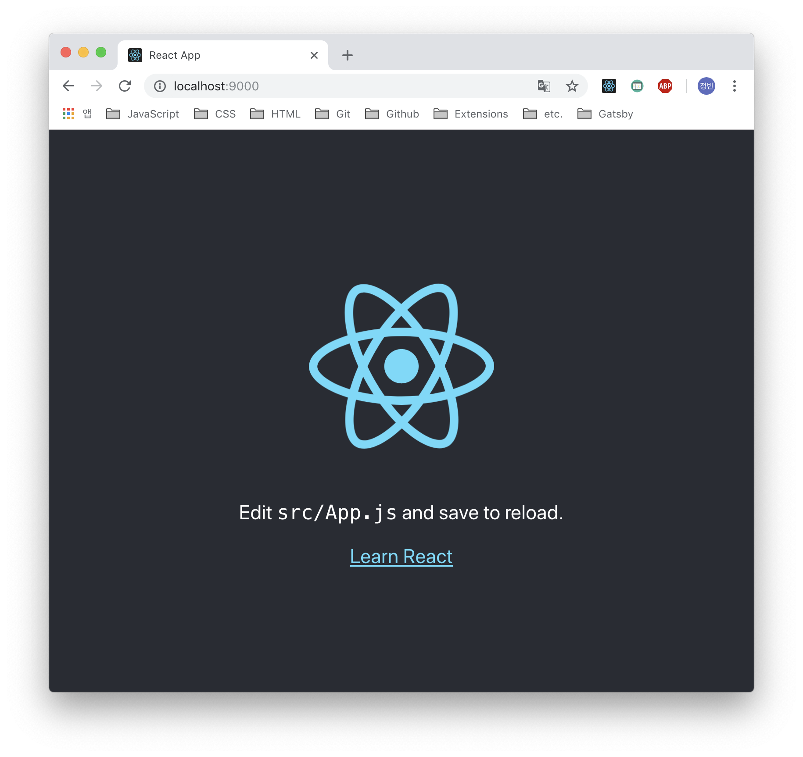

react 를 활용한 isomorphic SPA 개발에 대한 내용을 정리한 글입니다. 이 전에 개발했던 내용들을 정리하고자 하는 목적도 있고 react 를 활용해 무언가 새로운 SPA 프로젝트를 시작했을때 "전에는 이렇게 작업했었구나.." 하는 내용을 남기고자 합니다. 단순한 개발과정뿐만 아니라 isomorphic SPA 에 개념 또한 기존에 생각했던 내용을 정리해서 스스로 이해하려고 합니다. 의식의 흐름대로 정리하는 내용이라 부족한 부분도 있을꺼 같은데, 그건 그때 그때 정리하면서 업데이트하려고 합니다.

## Isomorphic JavaScript

isomorphic 란 사전적 의미로 _같은 모양의, 동일 구조의, 등정형(等晶形)의_ 라는 뜻은 가진 단어라고 네이버 사전에 나와있네요. 제가 생각하는 Isomorphic JavaScript 은 일반적으로 라우팅 기능, 정적 렌더링과 같이 주로 서버 영역에서 담당했던 기능들을 클라이언트 영역에서 처리함으로서 양쪽의 환경에서 같은 코드를 활용 할 수 있도록 하는 것이라고 생각했습니다. 이렇게 함으로써 백엔드 설정 시 불필요하거나 반복적인 작업을 최소화해주는 것이죠. 프론트엔드 영역에서 작업한 환경 그대로 서버에서 사용 가능하기 때문이죠. 그걸 처리하는 언어는 JavaScript 가 될 것이구요.

"이미 node.js 를 활용하면 충분히 JavaScript 만으로 동작이 가능한데?"라고 말씀 하실수도 있지만 앞서 말씀드렸듯이 백엔드 영역에서 기존에 처리했던 기능들을 프론트엔드에서 처리하는 것이죠. 단순히 서버 환경을 JavaScript 로 구성했다고 해서 isomorphic 해지지는 않는다고 생각합니다. 이 글에서는 백엔드 환경에서만 처리했던 기능 중 하나인 라우팅 및 정적 렌더링의 기능을 프론트엔드 영역에서 처리하는 것으로 중점으로 말씀드려고 합니다.

## routing & server side rendering(SSR)

제가 벡엔드 개발 경험이 많지 않아, 전문적으로 상세하기 말씀드릴 수는 없지만 일반적으로 서버 설정 시 요청된 주소에 따라 각 주소에 맞는 페이지를 호출해주도록 하는 작업을 하죠. 이러한 작업은 node.js 환경에서 express 의 라우팅 기능을 통해 처리해주었죠. 서버에서의 라우팅 설정의 경우 페이지가 몇개 없으면 상관없지만 웹 앱 규모가 커지면 커질수록 관리하기 어려워지겠죠. 이러한 작업을 이제는 서버에서 처리하지 않으려고 합니다.
그럼 이렇게 생각

## Single Page Applications(SPA)

뭐 SPA 라는 용어의 개념은 이제 알고 계시는 분들이 있고 위에 언급한 내용도 있기 때문에 길게 설명하지 않지 않으려 합니다. 처음 페이지 요청 시 필요한 정적 리소스를 모두 가져와서 페이지 새로고침 없이 서비스를 이용할 수 있는 웹 어플리케이션을 말하지 않나 싶네요.

현재 많은 분들이 react, angualr, vue.js 등 여러가지 라이브러리나 프레임워크를 써서 SPA 개발을 하는데, 저는 그나마 할 줄 아는데 react 여서 react 를 활용해서 SPA 개발을 시작했습니다.

## create-react-app(CRA) 활용하기

처음 react 로 개발 시작할때 번들링 설정이나 라우팅 설정 등 직접 세팅하는게 여간 귀찮았는데, CRA 을 쓴 이후부터는 거의 대부분의 (사실상 전체) 프로젝트를 시작할때 CRA 를 쓰고 있습니다. CRA 를 쓰지 않고 개발환경을 설정할때는 그것대로 공부가 되긴 하는데 그러한 내용은 기회가 되면 정리하려고 합니다.

우선 `create-react-app my-project` 이런식으로 명령어를 통해 프로젝트를 만들어줍니다. 사실 SPA 를 개발하기 위한 환경설정은 CRA 를 통한 프로젝트 생성 시 거의 준비가 된다고 생각합니다. 그리고 `yarn start` 명령어로 프로젝트 개발 서버를 실행해줍니다. 기본적으로 설정되어 있는 웹 앱구조가 마련되는 것을 보실 수 있으실 겁니다.

