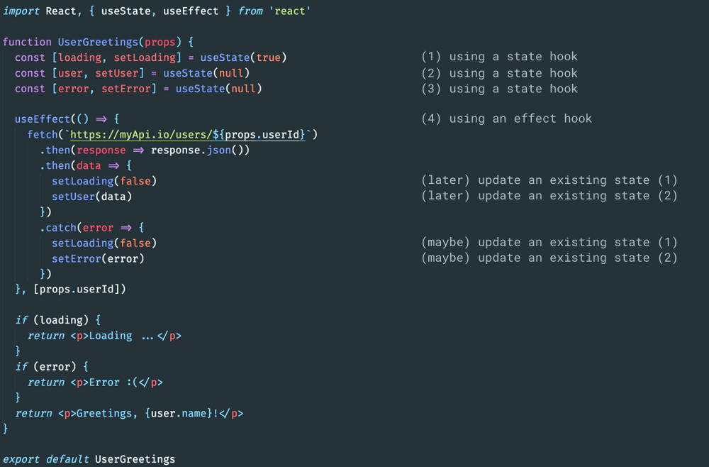

최근, React 는 **[16.7 출시 계획을 발표했다.](https://reactjs.org/docs/hooks-intro.html)** 이번 발표는 Stateless 한 기능의 컴포넌트(SFC)를 중심으로 한 새로운 접근 방식을 홍보하기 때문에 상당히 큰 의미를 지닌다.

그렇게 하기 위해, 이 새로운 버전의 library 는 개발자들이 상태를 저장하고, side effect 를 트리거하고 처리할 수 있는 도구인 "hooks"라고 불리는 것을 제공한다.

이러한 접근 방식이 확실히 (내 생각에) 개선되고 대응에 있어 큰 진전이지만, 개발자들이 처음에는 이해하기 어려울 수 있기 때문에 그것을 채택하는 것은 상당히 어려울 수 있다. 바라건대, 이 기사가 끝날 때까지 여러분은 hooks 와 그것들을 이용할 수 있는 방법에 대해 더 잘 이해할 수 있을 것입니다.

## hooks 작동 방식

작동 방식을 이해하기 위해 알아야 할 가장 큰 것은 hooks 가 구성 요소를 장착할 때 React 에 의해 **순서**대로 나열되고 업데이트 시 **동일한 순서**로 처리된다는 점입니다. 순서 부분은 여기서 결정적이지만, 그것이 무엇을 의미할까요?

사용자 ID 를 가져와서 프로필을 가져와서 이름을 사용하여 해당 사용자에게 인사하는 간단한 구성 요소가 있다고 가정해 보겠습니다.



React 는 이 구성 요소를 처음으로 렌더링할 때(즉, 구성 요소의 mounting 이 발생할 때) React hook 의 각 호출을 연속적으로 등록합니다. 즉, 다음과 같은 기능을 합니다.

- "초기 값이 `true` 인 새로운 state 를 만들 것입니다."
- "초기 값이 `null` 인 새로운 state 를 만들 것입니다.
- "초기 값이 `null` 인 새로운 state 를 만들 것입니다(이전 값과 다름).
- "나는 effect 를 만들고 즉시 그것을 요청할 것입니다." (프로세스 `userId` 가 동일하게 유지되는 한 이 effect 는 다시 생성되지 않습니다.)

이제 `fetch` function 이 일부 데이터를 반환하고 `setLoading` 및 `setUser` function 을 호출한다고 가정하겠습니다. 이러한 function 은 우리가 만든 첫 번째 및 두 번째 상태를 업데이트하고 구성 요소의 re-rendering 을 트리거합니다. 즉, 전체 코드를 다시 살펴본 후 React 는 다른 작업을 수행합니다.

- "이 구성 요소에 대한 첫 번째 state 가 있는데 값이 `false`입니다. 새 구성 요소를 생성하는 대신 다시 돌려 드리겠습니다."
- "이 구성 요소에 대한 두 번째 state 가 있는데, 그 값은 [api 에서 보낸 것이 무엇이든 간에] 새 구성 요소를 생성하는 대신 반환할 것입니다."
- "이 구성 요소에 대한 세 번째 state 가 있는데 그 값이 여전히 `false`입니다. 새 구성 요소를 생성하는 대신 다시 돌려 드리겠습니다."
- "이미 이 effect 를 등록했는데 props `userId` 가 변경되지 않았으므로 다시 호출할 필요가 없습니다."

React 는 hooks 에 대한 모든 호출을 등록함으로써 "state"를 내부적으로 저장하고 필요한 정보를 제공할 수 있습니다. 우리는 **React hooks 의 두 가지 규칙을 존중**하기 때문에 그렇게 할 수 있습니다.

- React 구성 요소 외부에 있는 hooks 를 호출할 수 없습니다(분명히 렌더링 단계에서 React 에 의해 처리되어야 하기 때문에 render function 에 넣어야 하며, 이 경우 SFC 에 해당합니다).

- hooks 의 순서와 목록은 변경할 수 없습니다. 구성 요소의 두 번째 `useState`를 제거한다고 가정해 보겠습니다. React 는 첫번째 것을 보고, 그것을 위해 저장한 상태를 돌려주고, 다른 것을 보지만 세 번째는 보지 않습니다. 어느 것이 사라졌는지 알 수 없고 실수를 저지를 것이다.

## lifecycle 방식에서 hooks 로 마이그레이션

### componentDidMount 에서 useMount 까지

`componentDidMount` 메서드는 일반적으로 구성 요소가 마운트될 때 한 번 side effect 가 트리거되는 방법입니다.

동등한 hook 는 SFC 가 처음으로 호출될 때 side effect 가 발생하며 이후 호출을 중단한다. 이를 위해 사용할 수 있는 hook 는 `useEffect` 라고 합니다. 기본적으로 구성 요소를 마운트 및 업데이트할 때마다 호출됩니다. 설명서를 자세히 살펴보면 일련의 값을 두 번째 인수로 전달하여 "memoized"할 수 있음을 알 수 있습니다. 또한 빈 배열을 통과하는 것은 React 에게 한 번 더 요청한 후 **다시는 요청하지 않습니다.** 빈 배열은 "이 기능이 변경될 때 오래된 결과를 가져올 값은 없습니다."라고 말하는 것과 같습니다. 따라서 `componentDidUpdate` 구현은 다음과 같습니다.

```javascript
import { useEffect } from 'react'

function useMount(fn) {
  useEffect(() => void fn(), [])
}
```
